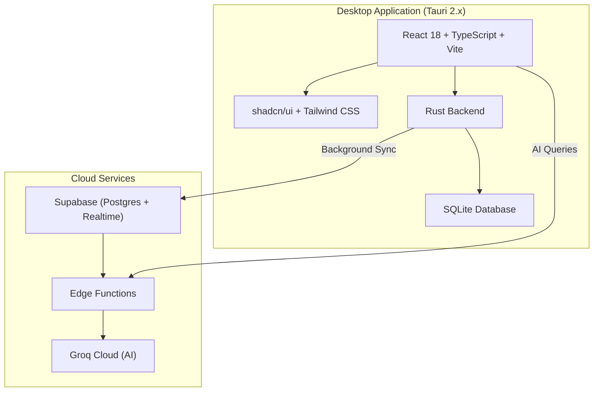

  

<h1 align="center">AT-IBA-PA MINIMART</h1>
<h3 align="center">Point of Sale & Inventory Management System</h3>

  A high-performance, offline-first desktop POS system with barcode scanning, real-time inventory tracking, LAN sync, cloud backup, AI-powered analytics, and digital QR receipts.

  <a href="#-features">Features</a> •
  <a href="#-download">Download</a> •
  <a href="#-installation">Installation</a> •
  <a href="#-documentation">Documentation</a> •
  <a href="#-system-requirements">System Requirements</a>

---

## ✨ Features

| Feature | Description |
|---------|-------------|
| 🔖 **Barcode Scanning** | Instant product lookup via USB barcode scanner — no focus required |
| 💰 **Sales Processing** | Fast checkout with Cash, Card, GCash & Maya payments, keyboard shortcuts for speed |
| 📦 **Inventory Management** | Add, edit, delete products with low-stock alerts and category filtering |
| 📊 **Reports & Analytics** | Daily/weekly/monthly sales reports, charts, CSV/XLSX export, printable Z-Reports |
| 🤖 **AI Analytics** | Groq-powered sales trend analysis and stock predictions (Admin only) |
| 🖥️ **Customer Display** | Second-screen support showing live cart and QR digital receipts |
| 🔄 **Local Network Sync** | Admin and Cashier sync over LAN when internet is unavailable |
| ☁️ **Cloud Backup** | Automatic background sync to Supabase when online |
| 🌙 **Dark Mode** | System-aware theme with manual toggle |
| ⚡ **Offline-First** | Fully operational without internet — zero downtime |

---

## 📥 Download

> Download the latest installers from the [**Releases**](https://github.com/BootlegYouki/at-iba-pa-pos/releases) page.

| App | Description | Download |
|-----|-------------|----------|
| **Admin IMS** | Inventory management, reports, analytics, settings | [Latest Release](https://github.com/BootlegYouki/at-iba-pa-pos/releases) |
| **Cashier POS** | Point-of-sale checkout terminal | [Latest Release](https://github.com/BootlegYouki/at-iba-pa-pos/releases) |

Both apps are built as standalone Windows `.exe` installers.

---

## 🚀 Installation

1. Download the **Admin IMS** and/or **Cashier POS** installer from [Releases](https://github.com/BootlegYouki/at-iba-pa-pos/releases)
2. Run the `.exe` installer and follow the setup wizard
3. Launch the app — on first run, sample data is automatically loaded
4. For multi-terminal setups, install **Admin IMS** on the manager's PC and **Cashier POS** on each checkout terminal

> **Networking:** Both apps must be on the same local network (LAN) for local sync. See the [Networking Guide](docs/04-networking.md) for firewall setup.

---

## 📸 Screenshots

Click to expand screenshots

### Admin System
  
  
  

### Cashier POS
  

### Customer Display & Receipt
<table>
  <tr>
    <td align="center" valign="top">
      <b>Customer Display</b> 
      
    </td>
    <td align="center" valign="top">
      <b>Digital QR Receipt</b> 
      
    </td>
  </tr>
</table>

---

## 📚 Documentation

| # | Document | Description |
|---|----------|-------------|
| 1 | [Product Overview](docs/01-overview.md) | Background, target users, features, scope |
| 2 | [System Architecture](docs/02-architecture.md) | Tech stack, dual-app design, data flow |
| 3 | [Database & Data Layer](docs/03-database.md) | SQLite schema, DAL pattern, stock algorithm |
| 4 | [Local Network Sync](docs/04-networking.md) | LAN WebSocket sync, auto-discovery protocol |
| 5 | [Cloud Sync](docs/05-cloud-sync.md) | Supabase sync algorithm, conflict resolution |
| 6 | [Barcode Scanner](docs/06-barcode-scanner.md) | Global keystroke hook, timing heuristics |
| 7 | [Customer Display & Receipts](docs/07-customer-display.md) | Multi-window, QR receipts, receipt website |
| 8 | [AI Analytics](docs/08-ai-analytics.md) | Groq integration, use cases, constraints |
| 9 | [Security](docs/09-security.md) | Authentication, encryption, RLS |
| 10 | [User Guide](docs/10-user-guide.md) | Installation, cashier guide, admin guide |
| 11 | [Performance](docs/11-performance.md) | Database tuning, indexes, batch ops, pagination |
| 12 | [Database Schema](docs/database_schema.md) | Full SQLite structure, tables, and fields |

---

## 💻 System Requirements

| Requirement | Minimum |
|-------------|---------|
| **OS** | Windows 10 (64-bit) or later |
| **RAM** | 2 GB |
| **Storage** | 200 MB |
| **Display** | 1280 × 720 |
| **Network** | LAN (for multi-terminal sync) |
| **Internet** | Optional (for cloud sync & AI features) |
| **Barcode Scanner** | Any USB HID scanner (keyboard emulation) |

---

## 🛠️ Tech Stack

---

## 📄 License

This project is proprietary software developed for AT-IBA-PA MINIMART.

---

## 📝 Changelog

See [CHANGELOG.md](CHANGELOG.md) for version history.
