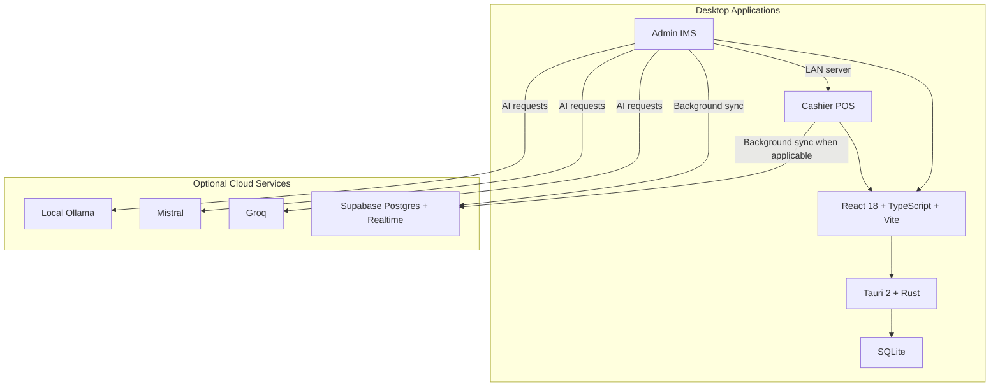

  

<h1 align="center">AT-IBA-PA MINIMART</h1>
<h3 align="center">Point of Sale & Inventory Management System</h3>

  Offline-first Windows desktop POS software with barcode scanning, live inventory updates, LAN sync, runtime-configured Supabase backup, an Admin AI assistant, and QR-based digital receipts.

  
  
  
  
  
  
   
  
  
  
  

  <a href="#features">Features</a> |
  <a href="#download">Download</a> |
  <a href="#installation">Installation</a> |
  <a href="#documentation">Documentation</a> |
  <a href="#system-requirements">System Requirements</a>

---

## Features

| Feature | Description |
|---------|-------------|
| **Fast checkout** | Barcode-first cashier flow with cart controls, keyboard shortcuts, and Cash, Card, GCash, and Maya payments |
| **Inventory management** | Product CRUD, category filtering, low-stock thresholds, archive support, and stock-aware reporting |
| **Offline-first operation** | Each Admin and Cashier terminal keeps a local SQLite database and continues working without internet |
| **LAN sync** | Cashier terminals auto-discover the Admin over UDP and sync through a local WebSocket server |
| **Cloud backup** | Optional Supabase sync runs in the background when credentials are configured at runtime |
| **Customer display** | Dedicated second-screen experience showing live cart, payment state, and receipt QR code |
| **Digital receipts** | Receipts are encoded into a QR URL that customers can open on their phones |
| **Reports and exports** | Admin dashboards, transaction history, and configurable XLSX workbook exports |
| **Admin AI assistant** | Sidebar assistant with Groq, Mistral, or local Ollama models, saved conversations, and file attachments |
| **Desktop-native packaging** | Tauri-based Windows apps with separate Admin IMS and Cashier POS builds |

---

## Download

Download the latest installers from the [Releases](https://github.com/BootlegYouki/at-iba-pa-pos/releases) page.

| App | Description |
|-----|-------------|
| **Admin IMS** | Inventory, reports, settings, user management, AI assistant, and LAN server |
| **Cashier POS** | Checkout, customer display, LAN client, and optional cloud connection |

---

## Installation

1. Download the installer you need from [Releases](https://github.com/BootlegYouki/at-iba-pa-pos/releases).
2. Run the Windows installer and complete setup.
3. Launch the app.
4. On first run, the app creates its local SQLite database, seeds default categories and store settings, and creates a default Admin account if none exists.

Default Admin credentials:

- Username: `admin`
- Password: `admin123`

For multi-terminal setups:

1. Install **Admin IMS** on the manager workstation.
2. Install **Cashier POS** on each checkout terminal.
3. Start the Admin app first so cashiers can auto-discover it on the LAN.

---

## Screenshots

Click to expand screenshots

### Admin System

### Cashier POS

### Customer Display & Receipt

---

## Documentation

| # | Document | Description |
|---|----------|-------------|
| 1 | [Product Overview](docs/01-overview.md) | Users, goals, feature scope, and product boundaries |
| 2 | [System Architecture](docs/02-architecture.md) | Dual-app layout, tech stack, IPC boundary, and startup flow |
| 3 | [Database & Data Layer](docs/03-database.md) | Local schema, DAL conventions, sync statuses, and stock handling |
| 4 | [Local Network Sync](docs/04-networking.md) | LAN discovery, WebSocket message flow, and cashier/admin coordination |
| 5 | [Cloud Sync](docs/05-cloud-sync.md) | Runtime Supabase configuration, sync loop, and offline/cloud behavior |
| 6 | [Barcode Scanner](docs/06-barcode-scanner.md) | Scanner heuristics, multiplier syntax, and input handling |
| 7 | [Customer Display & Receipts](docs/07-customer-display.md) | Customer-facing window, QR receipts, and receipt display flow |
| 8 | [AI Analytics](docs/08-ai-analytics.md) | Admin AI sidebar, provider options, conversations, and attachments |
| 9 | [Security](docs/09-security.md) | Authentication, hashing, encryption boundaries, and transport assumptions |
| 10 | [User Guide](docs/10-user-guide.md) | Setup, cashier workflow, admin workflow, and troubleshooting |
| 11 | [Performance](docs/11-performance.md) | SQLite tuning, batching, pagination, and runtime considerations |
| 12 | [Database Schema](docs/database_schema.md) | Table-by-table SQLite reference |
| 13 | [Export Reports](docs/12-export-reports.md) | Workbook layouts, export sections, filters, and file output behavior |

---

## System Requirements

| Requirement | Minimum |
|-------------|---------|
| **OS** | Windows 10 (64-bit) or later |
| **RAM** | 2 GB |
| **Storage** | 200 MB |
| **Display** | 1280 x 720 |
| **Network** | LAN for multi-terminal sync |
| **Internet** | Optional, used for cloud sync and hosted AI providers |
| **Barcode Scanner** | Any USB HID scanner |

---

## Tech Stack

---

## License

This project is proprietary software developed for AT-IBA-PA MINIMART.

---

## Changelog

See [CHANGELOG.md](CHANGELOG.md) for version history.
