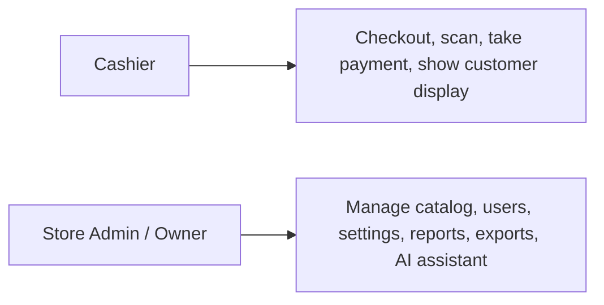

# Product Overview

## Background

AT-IBA-PA MINIMART needed a retail system that could keep checkout moving even when internet access was unreliable. The result is an offline-first POS and inventory platform built for day-to-day store operations on Windows desktops.

The system focuses on four practical goals:

1. Speed up checkout with barcode scanning and keyboard-driven cashier flows.
2. Keep stock levels current as sales happen.
3. Give the store owner better reporting, exports, and operational visibility.
4. Support multi-terminal use in one store through LAN sync, with optional cloud backup.

---

## Target Users

| User Type | Primary Responsibilities |
|-----------|--------------------------|
| **Cashier** | Process sales, scan items, accept payment, and assist customers at checkout |
| **Store Admin / Owner** | Manage inventory, users, settings, reports, exports, LAN/cloud configuration, and AI-assisted analysis |

---

## Core Capabilities

| Capability | What it does |
|------------|---------------|
| **Barcode scanning** | Detects scanner input globally and adds products quickly without needing mouse-heavy workflows |
| **Sales processing** | Supports Cash, Card, GCash, and Maya, including reference numbers for non-cash payments |
| **Inventory management** | Create, edit, archive, search, and categorize products with per-item low-stock thresholds |
| **Automatic stock updates** | Deducts stock locally when a sale is completed and syncs the updated inventory state later |
| **Transaction history** | Stores sales locally, shows line items, and supports reporting across date ranges |
| **Export reports** | Builds configurable XLSX workbooks from sales and inventory data |

---

## Advanced Features

| Feature | Description |
|---------|-------------|
| **Customer display** | Opens a dedicated customer-facing window with live cart state, payment status, and receipt QR code |
| **QR digital receipts** | Encodes completed receipts into a QR URL that customers can open on their phones |
| **LAN sync** | Admin and Cashier terminals synchronize on the local network using UDP discovery plus WebSocket messaging |
| **Cloud sync** | Optional runtime Supabase sync for backup and cross-device visibility |
| **Admin AI assistant** | Sidebar assistant with Groq, Mistral, or local Ollama support, saved conversations, and attachment-aware prompts |
| **Offline-first fallback** | Transactions continue locally when cloud or LAN connectivity is unavailable |

---

## Scope

The system is designed for a single store location with one or more cashier terminals.

Included in scope:

- Local product, user, settings, transaction, and inventory-log storage
- Admin and Cashier desktop apps from one shared codebase
- LAN-first cashier-to-admin transaction flow
- Optional Supabase synchronization
- Admin-only AI assistant and reporting/export features

Out of scope:

- Loyalty or rewards programs
- Supplier ordering workflows
- External accounting or ERP integration
- Online ordering or e-commerce storefronts
- Native mobile apps

---

## Practical Constraints

| Constraint | Current behavior |
|------------|------------------|
| **Platform** | Windows desktop only |
| **Scanning** | USB HID barcode scanners only |
| **Payments** | Payment methods are recorded, but no direct payment gateway is integrated |
| **Store model** | Built for one store environment, not multi-branch orchestration |
| **Cloud requirement** | Optional; the system still runs locally without Supabase |
