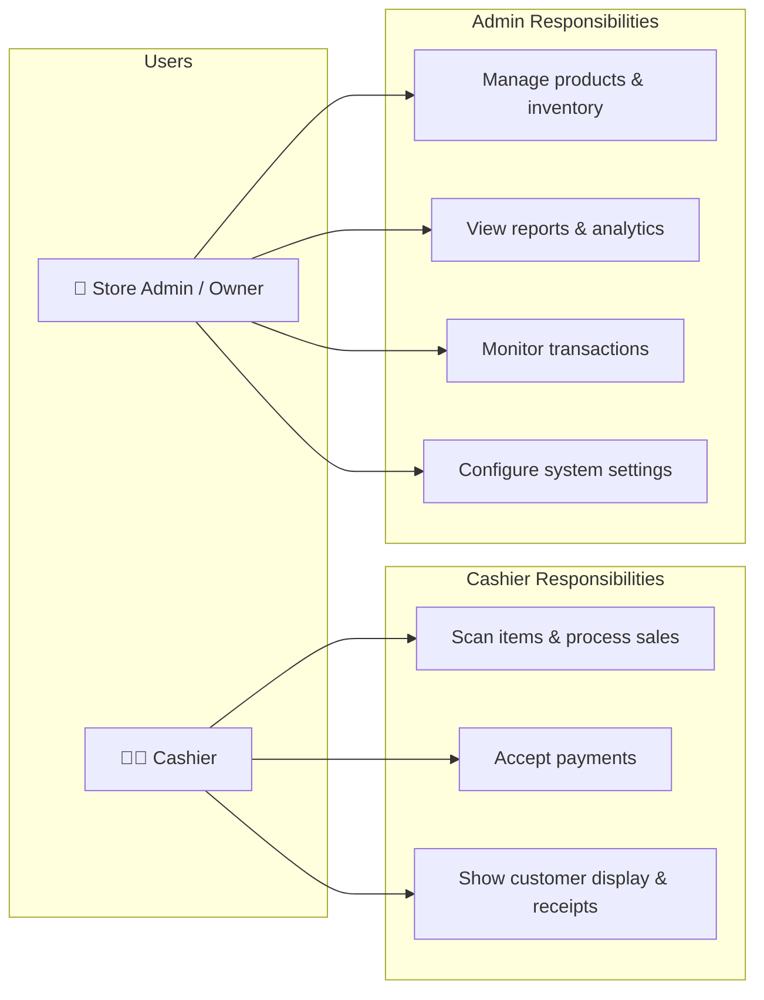

# Product Overview

## Background

**AT-IBA-PA MINIMART** is a growing retail store that previously relied on manual sales recording and inventory tracking. This led to frequent errors, inaccurate stock monitoring, and slow transaction processing.

The **Point of Sale & Inventory Management System** was developed to solve these problems by automating sales transactions with barcode scanning, updating inventory in real time, and generating sales reports — all while running entirely offline on low-cost hardware.

---

## Target Users

| User Type | Responsibilities | System Usage |
|-----------|-----------------|--------------|
| **Cashier** | Handles daily sales transactions | Scan items, process sales, accept payments, display receipts |
| **Store Admin / Owner** | Manages store operations | Manage products, monitor inventory, view reports, track transactions, AI analytics |

---

## Features

### Core Features

| Feature | Description |
|---------|-------------|
| **Barcode Scanning** | Scan product barcodes to instantly display product details and add items to the transaction |
| **Sales Transaction Processing** | Add/remove items, calculate totals, accept Cash, Card, GCash, or Maya payments, generate receipts |
| **Inventory Management** | Add, edit, delete, and search products — track stock levels per item |
| **Automatic Inventory Update** | Stock is automatically deducted when a sale is completed, in real time |
| **Low Stock Alerts** | Notifications when inventory falls below the configured threshold |
| **Reporting System** | Generate daily, weekly, and monthly sales reports with charts and export options |

### Advanced Features

| Feature | Description |
|---------|-------------|
| **Customer Display** | A second window on a customer-facing screen showing live cart, payment status, and QR receipts |
| **QR Digital Receipts** | Customers scan a QR code to view and download their receipt on their phone |
| **AI-Powered Analytics** | Groq-powered sales analysis, predictions, and product insights for the Admin |
| **Local Network Sync** | Admin and Cashier apps sync over LAN when internet is unavailable |
| **Cloud Sync** | Automatic background sync to Supabase for data backup and multi-device access |
| **Keyboard Shortcuts** | F-key shortcuts for cashiers to speed up transactions without a mouse |

---

## System Scope & Delimitations

### Objectives

1. Reduce manual input errors during sales transactions through barcode scanning
2. Provide a fast, intuitive cashier interface that captures and generates transaction details
3. Automatically adjust stock levels whenever a sale is recorded
4. Ensure secure, organized storage for product, transaction, and inventory data
5. Generate sales reports and maintain transaction history for business analysis

### Scope

- Store, view, and manage inventory items (add, edit, delete, search)
- Automatically update stock levels on sale or restock
- Monitor product availability and alert on low stock
- Securely store product, transaction, and inventory data
- Track transaction history and generate detailed reports
- Support barcode scanning for fast, accurate checkout

### Delimitations

| Constraint | Detail |
|------------|--------|
| **Payment methods** | Cash, Card, GCash, and Maya — card and e-wallet payments are recorded as the selected method with an optional reference number |
| **Scanning technology** | USB barcode scanners only — no RFID or QR code scanning for products |
| **Loyalty programs** | Not included — no customer loyalty or rewards system |
| **Third-party integrations** | No integration with external accounting software or ERP platforms |
| **Platform** | Windows desktop only |
| **Scale** | Designed for a single store location |
