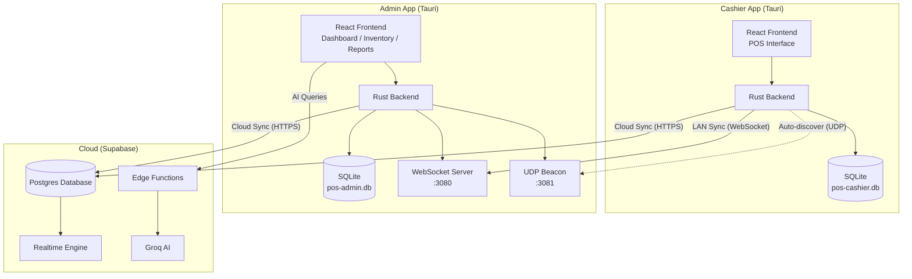
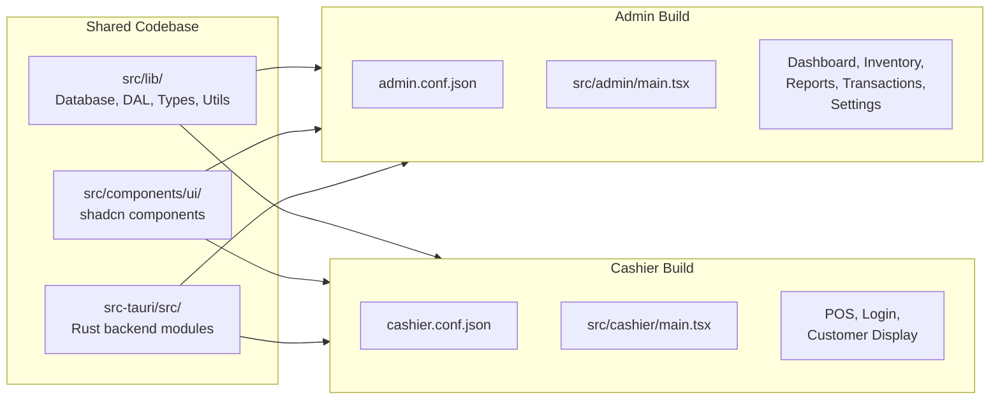
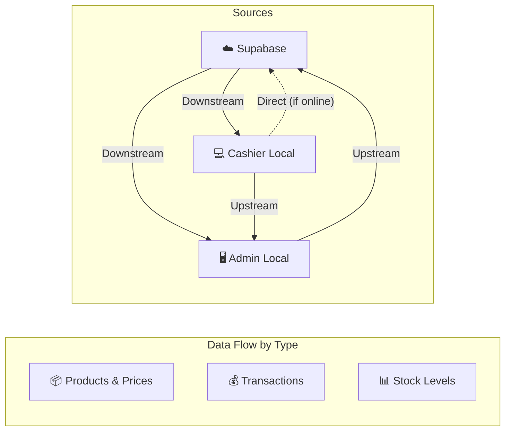
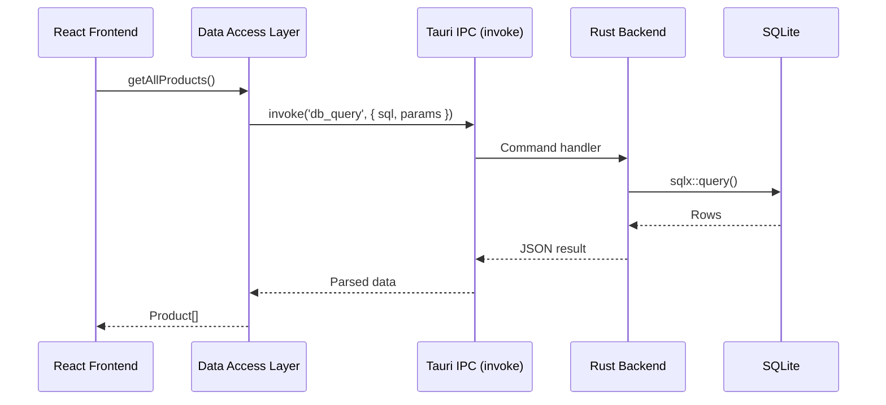
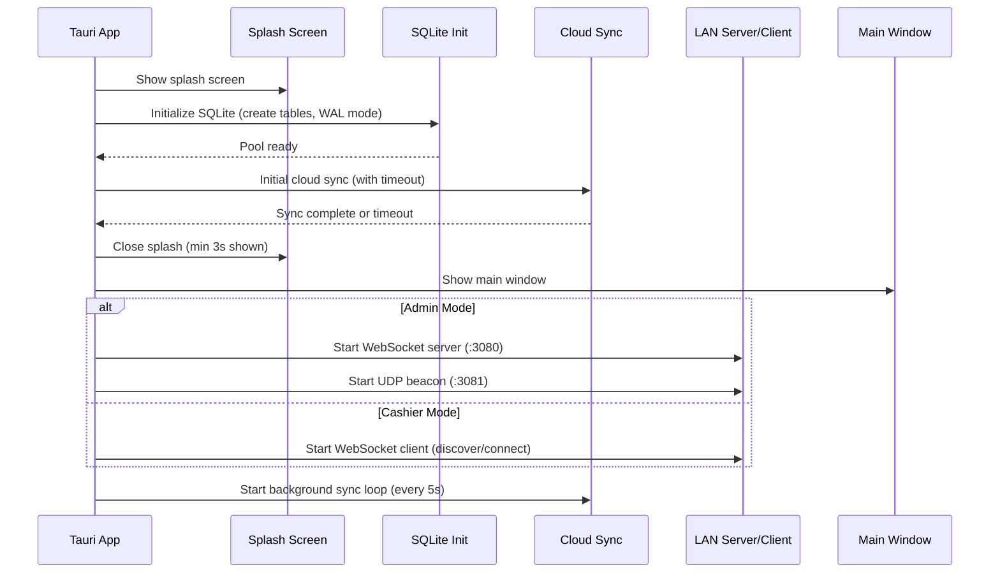

# System Architecture

## High-Level Overview

The system is built as an **offline-first desktop application** using a local-first architecture. Every terminal runs its own local database and can operate without any network connectivity. When available, data syncs — either over the local network (LAN) to the Admin, or over the internet to the cloud.

---

## Tech Stack

| Layer | Technology | Purpose |
|-------|-----------|---------|
| **Desktop Shell** | Tauri 2.x (Rust) | Native window management, system tray, IPC, file system |
| **Frontend** | React 18 + TypeScript | UI components, state management, routing |
| **Build Tool** | Vite 5 | Fast HMR development, production bundling |
| **UI Framework** | shadcn/ui + Tailwind CSS | Consistent, accessible component library |
| **Animations** | Framer Motion | 60FPS micro-interactions and transitions |
| **Charts** | Recharts | Sales trend visualizations, bar/line/pie charts |
| **Local Database** | SQLite (via sqlx) | Persistent local storage, WAL mode |
| **Cloud Database** | Supabase (Postgres) | Centralized data, Realtime subscriptions |
| **AI Engine** | Groq Cloud | Fast LLM inference for analytics |
| **Networking** | axum + tokio-tungstenite | WebSocket server/client for LAN sync |
| **Discovery** | socket2 (UDP broadcast) | Automatic Admin discovery on LAN |

---

## Dual-App Architecture

Both the Admin and Cashier apps are built from the **same codebase** but compiled with different configurations. The build system uses environment variables and separate Tauri config files to produce two distinct applications.

| Aspect | Admin App | Cashier App |
|--------|-----------|-------------|
| **Identifier** | `com.pos.admin` | `com.pos.cashier` |
| **Window Title** | Admin IMS | Cashier POS |
| **Entry Point** | `admin.html` → `src/admin/main.tsx` | `cashier.html` → `src/cashier/main.tsx` |
| **Pages** | Dashboard, Inventory, Transactions, Reports, Settings | POS, Login, Customer Display |
| **Network Role** | WebSocket server + UDP beacon broadcaster | WebSocket client + UDP listener |
| **Database File** | `pos-admin.db` | `pos-cashier.db` |
| **Cloud Sync** | Pulls products + pushes admin-received transactions | Pushes transactions + pulls products |

---

## Data Flow

| Data Type | Primary Source | Sync Direction |
|-----------|---------------|----------------|
| **Products / Prices** | Admin / Supabase | Supabase → Admin → Cashier (downstream) |
| **Transactions / Sales** | Cashier | Cashier → Admin → Supabase (upstream) |
| **Stock Levels** | Supabase (atomic) | Bidirectional across all terminals |
| **Users / Settings** | Admin | Admin → Cashier (via LAN initial sync) |

---

## IPC Boundary

The React frontend never accesses the database directly. All database operations flow through a strict boundary:

The **Data Access Layer (DAL)** encapsulates all SQL queries in TypeScript functions. Pages never write raw SQL — they call DAL functions like `getAllProducts()`, `createTransaction()`, and `getDailyRevenue()`.

---

## Application Startup Sequence

1. **Splash screen** appears with theme-aware background color
2. **Database initializes** — creates tables if first launch, enables WAL mode
3. **Initial sync** attempts to pull latest data from Supabase (max 10s timeout)
4. **Splash closes** after minimum 3 seconds
5. **LAN services start** — Admin launches WebSocket server + beacon; Cashier discovers and connects
6. **Background sync** runs every 5 seconds, pushing local changes and pulling remote updates
