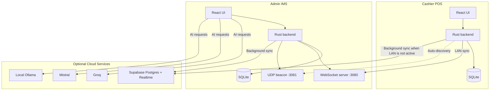
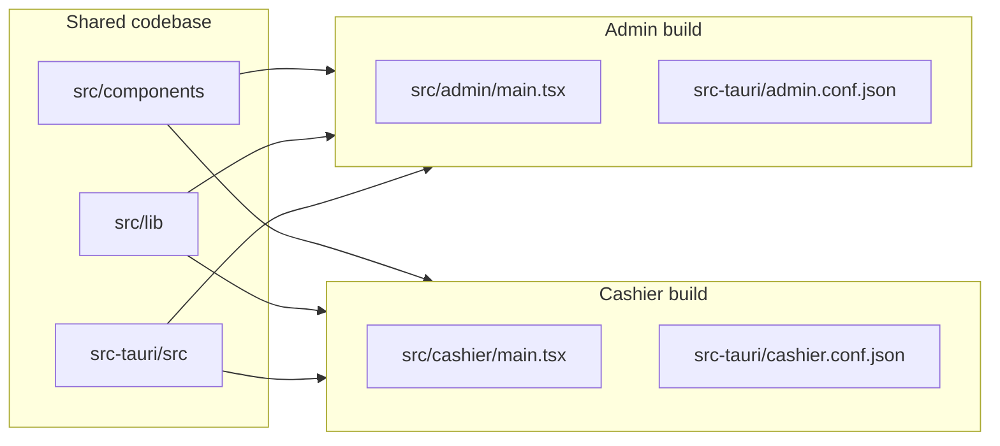
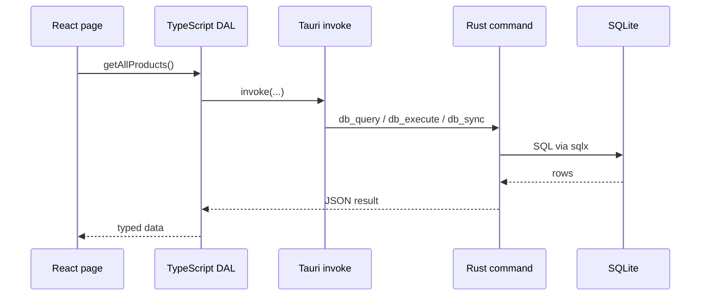
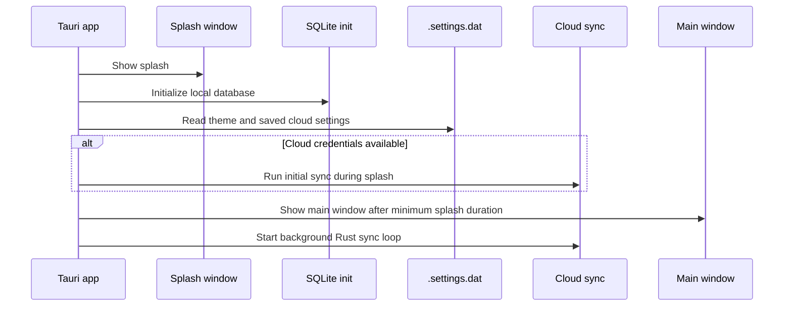

# System Architecture

## High-Level Overview

The application is a dual-build Tauri desktop system with a shared React and Rust codebase. Every terminal keeps its own local SQLite database. Cashiers primarily communicate with the Admin over LAN, while optional Supabase sync keeps local databases backed up and aligned.

---

## Tech Stack

| Layer | Technology | Purpose |
|-------|------------|---------|
| **Desktop shell** | Tauri 2.x + Rust | Native windows, IPC, store file access, file output, local networking |
| **Frontend** | React 18 + TypeScript + Vite | App UI, routing, and client-side state |
| **UI system** | shadcn/ui + Tailwind CSS | Reusable interface primitives |
| **Animation** | Framer Motion | View transitions and cashier/payment animations |
| **Charts** | Recharts | Admin dashboards and visual reports |
| **Local database** | SQLite via `sqlx` | Durable offline storage |
| **Cloud sync** | Supabase Postgres + Realtime broadcast | Backup, shared data, and sync triggers |
| **LAN transport** | `axum`, `tokio-tungstenite`, UDP broadcast | Admin server, cashier client, and discovery |
| **AI providers** | Groq, Mistral, local Ollama | Admin-only assistant models |
| **Excel export** | `exceljs` | Configurable workbook generation |

---

## Dual-App Build Strategy

Admin IMS and Cashier POS come from the same repository but compile into separate desktop applications with different entry points and Tauri config files.

| Aspect | Admin IMS | Cashier POS |
|--------|-----------|-------------|
| **Tauri identifier** | `com.pos.admin` | `com.pos.cashier` |
| **Product name** | Admin IMS | Cashier POS |
| **Frontend entry** | `src/admin/main.tsx` | `src/cashier/main.tsx` |
| **Primary pages** | Dashboard, Inventory, Transactions, Reports, Settings | POS, Login, Customer Display |
| **LAN role** | Server and broadcaster | Client and listener |
| **AI availability** | Yes | No |
| **Customer display** | No | Yes |

---

## Data Flow

The system does not treat every entity the same way. Data movement depends on the business role of the record.

| Data Type | Normal Source of Truth | Typical Direction |
|-----------|------------------------|-------------------|
| **Products** | Admin and cloud | Admin pushes changes, all apps pull updates |
| **Transactions** | Cashier at time of sale | Cashier -> Admin over LAN, then Admin -> cloud when online |
| **Inventory logs** | Local app that changed stock | Local -> cloud when sync runs |
| **Users** | Admin | Admin -> cashier over LAN and cloud |
| **Settings** | Admin, except local-only settings | Admin -> cashier and cloud; local-only settings stay local |
| **AI conversations** | Admin local database only | No LAN or cloud sync |

Two important runtime rules:

1. If a cashier has an active LAN connection to the Admin, it skips pushing transactions directly to cloud.
2. AI provider settings are stored as local-only settings and are intentionally excluded from cloud overwrite behavior.

---

## IPC Boundary

The React UI does not talk to SQLite directly. All database access crosses a Tauri IPC boundary.

This keeps SQL centralized in DAL and Rust command layers instead of scattering raw queries across pages.

---

## Startup Sequence

Observed runtime behavior:

- Minimum splash duration is 3 seconds.
- Initial cloud sync gets up to 10 seconds before the app continues with local data.
- Admin starts the WebSocket server and UDP beacon after boot.
- Cashier starts discovery/connect logic after boot.

---

## Supporting Storage

Besides SQLite, both apps use a Tauri store file named `.settings.dat`.

Typical store usage:

- Theme and UI preferences
- Saved cloud URL and encrypted committed cloud anon key
- Pending LAN-delivered cloud credentials on cashier terminals

SQLite remains the main application database. The store file is used for device-scoped configuration.
