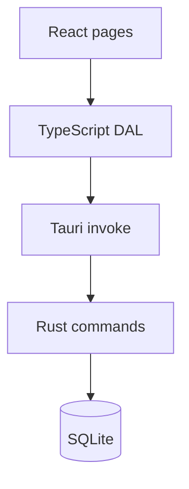
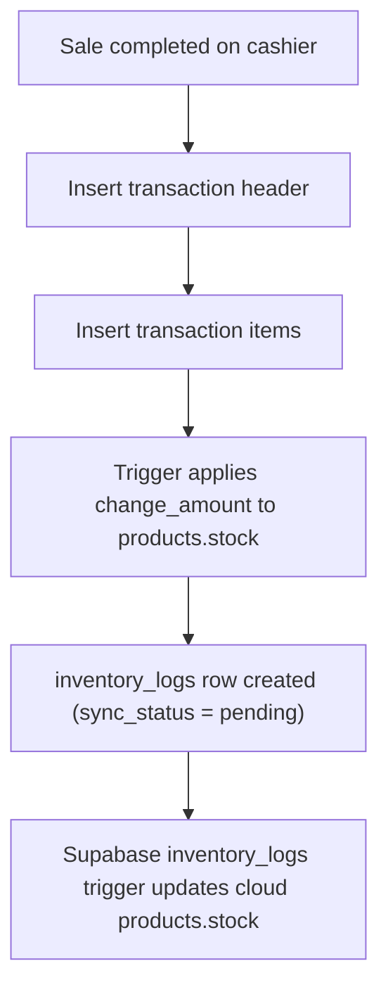

# Database & Data Layer

## Overview

Each app instance uses its own local SQLite database managed by the Rust backend through `sqlx`. Admin and Cashier share the same logical schema, with a few Admin-only tables for AI conversations.



The UI never writes raw SQL directly. Pages call DAL helpers, which call Tauri commands, which execute SQL in Rust or through the shared database layer.

---

## Schema ERD

> **Engine**: SQLite (WAL mode, FK enforcement on)  
> **Databases**: `pos-admin.db` (full schema) · `pos-cashier.db` (subset — no AI tables)

```mermaid
erDiagram

    products {
        TEXT id PK "UUID v4"
        TEXT barcode UK "NOT NULL, UNIQUE"
        TEXT name "NOT NULL"
        REAL price "NOT NULL"
        INTEGER stock "DEFAULT 0 - maintained by trigger"
        TEXT category "DEFAULT Uncategorized"
        TEXT sku "nullable - auto-generated if missing"
        INTEGER low_stock_threshold "DEFAULT 10"
        TEXT created_at "ISO-8601"
        TEXT updated_at "ISO-8601 - updated by trigger"
        TEXT sync_status "pending|synced|failed|deleted|lan_synced"
        INTEGER is_active "1=active 0=archived"
    }

    categories {
        TEXT name PK "Local-only master list"
    }

    transactions {
        TEXT id PK "UUID v4"
        REAL total "NOT NULL"
        TEXT cashier "Denormalized name - no FK to users"
        TEXT payment_method "NOT NULL"
        REAL amount_paid "NOT NULL"
        TEXT reference_number "nullable"
        TEXT created_at "ISO-8601"
        TEXT sync_status "pending|synced|failed|deleted|lan_synced"
        TEXT lan_status "none|pending|acked"
    }

    transaction_items {
        TEXT id PK "UUID v4"
        TEXT transaction_id FK "-> transactions.id CASCADE"
        TEXT product_id "Soft-FK -> products.id no hard constraint"
        TEXT product_name "Denormalized snapshot at sale time"
        TEXT category "Denormalized/backfilled from products"
        INTEGER quantity "NOT NULL"
        REAL price_at_sale "NOT NULL - frozen at time of sale"
    }

    inventory_logs {
        TEXT id PK "UUID v4"
        TEXT product_id FK "-> products.id CASCADE"
        INTEGER change_amount "Signed delta negative=sale"
        TEXT reason "SALE|RESTOCK|MANUAL_ADJUSTMENT|INITIAL_CREATION|AI"
        TEXT reference_id "nullable - txn ID for SALE rows"
        TEXT created_at "ISO-8601"
        TEXT sync_status "pending|synced|failed|deleted|lan_synced"
    }

    users {
        TEXT id PK "UUID v4"
        TEXT username UK "nullable UNIQUE"
        TEXT password "bcrypt hash nullable"
        TEXT name "NOT NULL display name"
        TEXT initials "nullable"
        TEXT pin "bcrypt hash nullable"
        TEXT role "admin|cashier"
        TEXT status "active|inactive DEFAULT active"
        TEXT created_at "ISO-8601"
        TEXT updated_at "ISO-8601"
        TEXT sync_status "pending|synced|failed"
    }

    product_deletions {
        TEXT id PK "Mirrors products.id"
        TEXT deleted_at "ISO-8601"
        TEXT sync_status "pending|synced"
    }

    user_deletions {
        TEXT id PK "Mirrors users.id"
        TEXT deleted_at "ISO-8601"
        TEXT sync_status "pending|synced"
    }

    settings {
        TEXT key PK "e.g. store_name system_instance_id"
        TEXT value "NOT NULL"
        TEXT updated_at "ISO-8601"
        TEXT sync_status "pending|synced|local"
    }

    ai_conversations {
        TEXT id PK "UUID v4"
        TEXT title "DEFAULT New Chat"
        TEXT created_at "ISO-8601"
        TEXT updated_at "ISO-8601"
    }

    ai_messages {
        TEXT id PK "UUID v4"
        TEXT conversation_id FK "-> ai_conversations.id CASCADE"
        TEXT role "user|assistant"
        TEXT content "NOT NULL"
        INTEGER is_error "0|1"
        TEXT created_at "ISO-8601"
    }

    transactions         ||--o{ transaction_items   : "contains"
    products             ||--o{ inventory_logs       : "tracked-by"
    transactions         ||--o{ inventory_logs       : "references via reference_id"
    ai_conversations     ||--o{ ai_messages          : "holds"

    products             ||--o{ transaction_items    : "sold-as soft-ref"
    products             }o--o| product_deletions    : "tombstone"
    users                }o--o| user_deletions       : "tombstone"
```



---

## Main Tables

### `products`

Catalog of sellable products.

| Column | Type | Notes |
|--------|------|-------|
| `id` | TEXT | UUID primary key |
| `barcode` | TEXT | Unique barcode, required |
| `name` | TEXT | Product display name |
| `price` | REAL | Selling price |
| `stock` | INTEGER | Maintained by trigger `trg_apply_inventory_log_to_product_stock` |
| `category` | TEXT | Plain-text category name (DEFAULT `'Uncategorized'`) |
| `sku` | TEXT | Auto-generated `{NAME}-{CAT}-{XXXX}` on startup if missing |
| `low_stock_threshold` | INTEGER | Per-product low stock alert boundary (DEFAULT `10`) |
| `sync_status` | TEXT | Sync lifecycle field |
| `is_active` | INTEGER | Archive flag: `1` = active, `0` = archived/soft-deleted |

**Indexes**: `idx_products_barcode`, `idx_products_sync_status`

### `product_deletions`

Tombstone table used to synchronize product removals to cloud without hard-deleting immediately from every device.

| Column | Notes |
|--------|-------|
| `id` | Mirrors `products.id` |
| `deleted_at` | ISO-8601 |
| `sync_status` | `pending\|synced` |

**Index**: `idx_product_deletions_sync_status`

### `user_deletions`

Tombstone table for cloud sync. Mirrors user hard-deletes for cloud propagation.

| Column | Notes |
|--------|-------|
| `id` | Mirrors `users.id` |
| `deleted_at` | ISO-8601 |
| `sync_status` | `pending\|synced` |

**Index**: `idx_user_deletions_sync_status`

### `inventory_logs`

Immutable audit ledger of all stock movements. Every stock change — sale, restock, manual adjustment, AI batch — writes a row here. The trigger `trg_apply_inventory_log_to_product_stock` automatically applies the delta to `products.stock`.

| Column | Purpose |
|--------|---------|
| `product_id` | Related product (FK → `products.id` CASCADE) |
| `change_amount` | Positive or negative stock adjustment (negative = sold) |
| `reason` | `SALE`, `RESTOCK`, `MANUAL_ADJUSTMENT`, `INITIAL_CREATION`, `AI_*` |
| `reference_id` | Transaction UUID for `SALE` rows; AI batch ref for AI rows |
| `sync_status` | Pending or synced status for cloud flow |

Important operational detail:

- `inventory_logs` are the canonical stock event stream for cloud reconciliation.
- For LAN-delivered sales, the Admin preserves the original log identifiers from the cashier so cloud retries stay idempotent.
- Rows inserted with `sync_status = 'synced'` (cloud pull) bypass the trigger to avoid double-counting.

**Indexes**: `idx_inventory_logs_product_id`, `idx_inventory_logs_created_at`, `idx_inventory_logs_sync_status`

**Trigger — `trg_apply_inventory_log_to_product_stock`**:

```sql
AFTER INSERT ON inventory_logs
FOR EACH ROW
WHEN COALESCE(NEW.sync_status, 'pending') != 'synced'
-- Applies: products.stock = MAX(0, stock + change_amount)
-- Also updates products.updated_at to the newer of existing or new.created_at
```

### `transactions`

Header row for each completed sale.

| Column | Purpose |
|--------|---------|
| `cashier` | Cashier display name (denormalized string — no FK) |
| `payment_method` | Cash, Card, GCash, or Maya |
| `amount_paid` | Tendered amount |
| `reference_number` | Optional for non-cash payments |
| `sync_status` | Used for cloud sync tracking |
| `lan_status` | LAN cashier push state: `none\|pending\|acked` |

**Indexes**: `idx_txn_created_at`, `idx_txn_sync_status`, `idx_txn_lan_status`

### `transaction_items`

Line items for each transaction.

| Column | Notes |
|--------|-------|
| `transaction_id` | FK → `transactions.id` CASCADE |
| `product_id` | **Soft-FK** to `products.id` — no hard constraint |
| `product_name` | Denormalized snapshot at time of sale |
| `category` | Denormalized; backfilled from `products` on migration |
| `quantity` | Units sold |
| `price_at_sale` | Price frozen at time of sale |

Important implementation detail:

- `transaction_id` remains a foreign key to `transactions`.
- `product_id` is **not** a foreign key to `products`.

That is intentional. Old transaction history must remain readable even if a product is renamed, archived, or deleted later.

**Index**: `idx_txn_items_txn_id`

### `users`

Shared account table for Admin and Cashier users.

| Column | Meaning |
|--------|---------|
| `username` / `password` | Admin login pair (password is bcrypt hash) |
| `name` / `initials` | Display fields |
| `pin` | bcrypt hash used for cashier PIN auth |
| `role` | `admin` or `cashier` |
| `status` | `active` or `inactive` |

**Index**: `idx_users_sync_status`

**Seed**: One `admin` user (`username=admin`, `password=admin123` hashed) is auto-created on first run.

### `settings`

Key-value configuration table. Some settings are cloud-synced, while some are intentionally local-only.

Examples:

- Cloud/shared: `store_name`, `store_subtitle`, `system_instance_id`
- Local-only: AI provider keys and model preferences (stored with `sync_status = 'local'`)

### `categories`

Local-only master list of categories used by inventory UI helpers and defaults. Not synced to cloud. When a category is deleted, all products are reassigned to `'Uncategorized'`.

### `ai_conversations` and `ai_messages`

Admin-only tables for the AI sidebar. These are local history tables and are not part of LAN or cloud sync.

`ai_messages` has a FK → `ai_conversations.id` with CASCADE delete.

**Index**: `idx_ai_messages_convo`

---

## Sync Status Conventions

`sync_status` is used across several tables, but not every value means the same thing in every workflow.

Common values used in the current codebase:

| Value | Meaning |
|-------|---------|
| `pending` | Local change waiting to be pushed |
| `synced` | Confirmed as synchronized |
| `failed` | Push failed and needs retry |
| `lan_synced` | Arrived from LAN snapshot or LAN message flow |
| `deleted` | Soft-deleted transaction; excluded from normal queries |
| `local` | Intentionally local-only setting that cloud pull should not overwrite |

Two practical examples:

1. Cashier transactions start as `pending`, then become `synced` after Admin acknowledgment or successful cloud push.
2. AI provider settings are stored as `local`, so cloud pull logic skips overwriting them.

---

## Data Conventions

| Convention | Why it matters |
|------------|----------------|
| **UUID primary keys** | Safe local creation across multiple terminals |
| **ISO-like text timestamps** | Easy ordering and cross-language handling |
| **Denormalized sale data** | Keeps receipts and transaction history stable after catalog changes |
| **Plain-text categories** | Simpler filtering and editing for a single-store system |
| **Archive flag on products** | Lets the UI hide products without destroying history |
| **Tombstone tables** | Enables cloud propagation of hard deletes without relying on CASCADE in Supabase |

---

## Key Design Decisions

| Decision | Rationale |
|----------|-----------|
| **Denormalized `cashier` in transactions** | User accounts can be deleted; historical transaction data stays intact |
| **Soft-FK on `transaction_items.product_id`** | Products can be deleted/archived without breaking transaction history |
| **Tombstone tables** (`product_deletions`, `user_deletions`) | Enables cloud propagation of hard deletes without relying on CASCADE in Supabase |
| **Trigger-driven stock updates** | `inventory_logs` is the source of truth; `products.stock` is a derived cache |
| **Trigger bypass on `sync_status = 'synced'`** | Prevents double-counting when cloud rows are pulled and inserted locally |
| **`is_active` soft-delete on products** | Products with sales history can't be hard-deleted — they're archived instead |
| **AI tables admin-only** | Reduces cashier DB size; AI assistant is an admin-only feature |

---

## Performance Notes

The local database is tuned for desktop POS responsiveness.

### SQLite mode

- WAL mode is enabled for better concurrent read/write behavior.
- Foreign keys are enabled.

### Important indexes

| Index | Purpose |
|-------|---------|
| `idx_products_barcode` | Fast scanner lookup |
| `idx_products_sync_status` | Find pending product sync work |
| `idx_product_deletions_sync_status` | Push deletion tombstones |
| `idx_inventory_logs_product_id` | Product stock history queries |
| `idx_inventory_logs_created_at` | Date-range inventory log queries |
| `idx_inventory_logs_sync_status` | Push pending inventory logs |
| `idx_txn_created_at` | Reporting and date-range filters |
| `idx_txn_sync_status` | Pending transaction sync lookup |
| `idx_txn_lan_status` | LAN push state queries |
| `idx_txn_items_txn_id` | Load transaction line items quickly |
| `idx_users_sync_status` | Push/pull user changes |
| `idx_user_deletions_sync_status` | Push user deletion tombstones |
| `idx_ai_messages_convo` | Load conversation threads efficiently |

---

## Stock Handling

Stock is reduced locally at sale time inside the same SQLite transaction that writes the sale.



Key detail:

- Local SQLite remains responsible for the instant stock deduction that the cashier or Admin sees immediately.
- Supabase now applies cloud-side stock changes from incoming `inventory_logs` through a trigger.
- Sale sync no longer relies on pushing product stock as the authoritative stock mutation for cloud sales.

---

## Seed Behavior

Current first-run initialization seeds only foundational data:

- Default category list
- Default settings (`store_name`, `store_subtitle`)
- Default Admin user if no Admin exists
- `system_instance_id` UUID (admin only)

Default seeded Admin credentials:

- Username: `admin`
- Password: `admin123`

The app does **not** currently seed sample products or sample transaction history.

---

## Database Locations

| Environment | Path pattern |
|-------------|--------------|
| **Production Admin** | `%APPDATA%/com.pos.admin/pos-admin.db` |
| **Production Cashier** | `%APPDATA%/com.pos.cashier/pos-cashier.db` |
| **Development** | `src-tauri/databases/pos-{mode}.db` |
