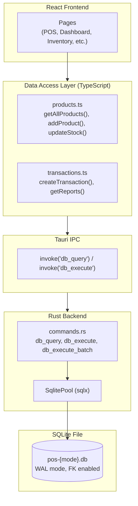
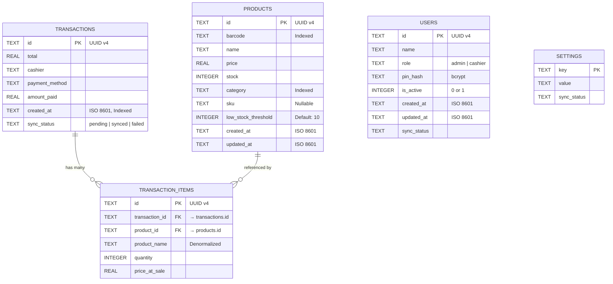
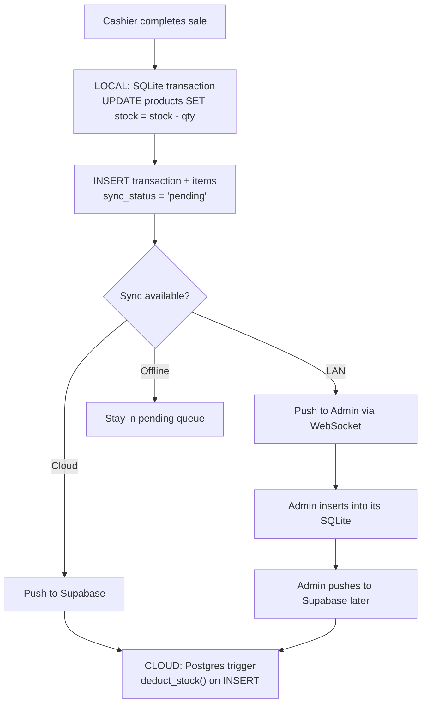
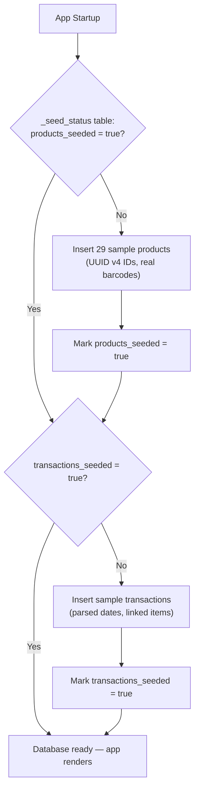

# Database & Data Layer

## Overview

The system uses **SQLite** as the local database engine, accessed from the Rust backend via `sqlx`. Each app instance (Admin and Cashier) maintains its own separate database file. Data is synchronized between them via LAN WebSockets or cloud sync.



---

## Database Schema

### Entity Relationship Diagram



---

### Products Table

Stores all inventory items. Each product has a unique barcode and UUID.

| Column | Type | Constraints | Description |
|--------|------|-------------|-------------|
| `id` | TEXT | PRIMARY KEY | UUID v4 |
| `barcode` | TEXT | NOT NULL, INDEXED | Product barcode (scanned by hardware) |
| `name` | TEXT | NOT NULL | Display name |
| `price` | REAL | NOT NULL | Current selling price |
| `stock` | INTEGER | NOT NULL, DEFAULT 0 | Current stock level |
| `category` | TEXT | NOT NULL, INDEXED | Product category string |
| `sku` | TEXT | NULLABLE | Stock Keeping Unit identifier |
| `low_stock_threshold` | INTEGER | NOT NULL, DEFAULT 10 | Alert when stock falls below this |
| `created_at` | TEXT | NOT NULL | ISO 8601 timestamp |
| `updated_at` | TEXT | NOT NULL | ISO 8601 timestamp |

### Transactions Table

Records every completed sale. The `sync_status` field tracks whether this transaction has been synced to the cloud.

| Column | Type | Constraints | Description |
|--------|------|-------------|-------------|
| `id` | TEXT | PRIMARY KEY | UUID v4 |
| `total` | REAL | NOT NULL | Total sale amount |
| `cashier` | TEXT | NOT NULL | Name of the cashier who processed the sale |
| `payment_method` | TEXT | NOT NULL | "Cash" or "GCash" |
| `amount_paid` | REAL | NOT NULL | Amount tendered by customer |
| `created_at` | TEXT | NOT NULL, INDEXED | ISO 8601 timestamp |
| `sync_status` | TEXT | NOT NULL, INDEXED | `pending`, `synced`, or `failed` |

### Transaction Items Table

Line items for each transaction. `product_name` is denormalized so receipts remain readable even if a product is later deleted or renamed.

| Column | Type | Constraints | Description |
|--------|------|-------------|-------------|
| `id` | TEXT | PRIMARY KEY | UUID v4 |
| `transaction_id` | TEXT | FK → transactions(id) | Parent transaction |
| `product_id` | TEXT | FK → products(id) | Product reference |
| `product_name` | TEXT | NOT NULL | Denormalized product name |
| `quantity` | INTEGER | NOT NULL | Number of units sold |
| `price_at_sale` | REAL | NOT NULL | Price at time of sale (historical) |

---

## Data Conventions

| Convention | Value | Rationale |
|------------|-------|-----------|
| **Primary Keys** | UUID v4 | Globally unique, safe for offline generation across multiple terminals |
| **Timestamps** | ISO 8601 strings | Human-readable, sortable, compatible with JavaScript `Date` |
| **Sync Status** | `pending` → `synced` → `failed` | State machine for tracking cloud sync progress |
| **Denormalization** | `product_name` on transaction items | Ensures transaction history is readable even after product changes |
| **Categories** | Plain strings on products | No separate categories table — simplicity over normalization |

---

## Performance Optimizations

### WAL Mode

SQLite is configured with **Write-Ahead Logging (WAL)** mode on startup:

```
PRAGMA journal_mode=WAL
```

WAL mode allows concurrent reads during writes, which is critical for the POS where the UI must remain responsive while transactions are being saved.

### Foreign Keys

Foreign key enforcement is explicitly enabled:

```
PRAGMA foreign_keys=ON
```

This ensures cascading deletes (e.g., deleting a transaction also removes its items) and referential integrity.

### Indexes

Strategic indexes are created on frequently-queried columns:

| Index | Table | Column(s) | Purpose |
|-------|-------|-----------|---------|
| `idx_products_barcode` | products | barcode | Fast barcode lookups during scanning |
| `idx_products_category` | products | category | Category-filtered product lists |
| `idx_transactions_created_at` | transactions | created_at | Date-range queries for reports |
| `idx_transactions_sync_status` | transactions | sync_status | Finding pending sync items |
| `idx_txn_items_transaction_id` | transaction_items | transaction_id | Loading items for a transaction |
| `idx_txn_items_product_id` | transaction_items | product_id | Product-level sales aggregation |

---

## Data Access Layer (DAL)

The DAL provides a clean TypeScript API over raw SQL. No page component writes SQL directly.

### Product Operations

| Function | Description |
|----------|-------------|
| `getAllProducts()` | List all products, ordered by name |
| `getProductById(id)` | Fetch a single product by UUID |
| `getProductByBarcode(barcode)` | Look up a product by barcode (for scanning) |
| `searchProducts(query)` | Search products by name or barcode (LIKE query) |
| `getProductsByCategory(category)` | Filter products by category |
| `getCategories()` | Get distinct category list |
| `addProduct(product)` | Insert a new product |
| `updateProduct(id, fields)` | Update product details |
| `updateStock(id, delta)` | Adjust stock by a delta value (+/-) |
| `getLowStockProducts()` | Get products where stock ≤ threshold |

### Transaction Operations

| Function | Description |
|----------|-------------|
| `createTransaction(txn, items)` | Create a transaction + items + deduct stock (single SQL transaction) |
| `getAllTransactions(filters?)` | List transactions with optional filters |
| `getTransactionWithItems(id)` | Get a transaction with its line items |
| `getTransactionsPaginated(page, perPage)` | Paginated listing with LIMIT/OFFSET |
| `getDailyRevenue(days)` | Revenue per day for the last N days |
| `getHourlyDistribution()` | Transaction count by hour of day |
| `getTopProducts(limit)` | Best-selling products by quantity/revenue |
| `getPaymentMethodBreakdown()` | Cash vs GCash split |
| `getTodaySummary()` | Today's transaction count and total revenue |
| `getPendingSyncTransactions()` | Transactions waiting to be synced |

---

## Stock Deduction Algorithm

Stock is deducted at two levels to ensure correctness in both offline and online scenarios:



### Local Stock Deduction

When a sale is completed, the DAL's `createTransaction()` function wraps everything in a single SQLite transaction:

1. `INSERT INTO transactions (...)`
2. For each item: `INSERT INTO transaction_items (...)`
3. For each item: `UPDATE products SET stock = stock - quantity WHERE id = product_id`
4. `COMMIT`

This ensures atomicity — either all items are saved and stock is decremented, or nothing happens.

### Cloud Stock Deduction

On the Supabase side, a Postgres trigger (`deduct_stock()`) fires `AFTER INSERT ON transaction_items`, automatically decrementing `products.stock`. This handles cases where the Admin pushes locally-received cashier transactions to the cloud.

---

## Seed Strategy

On the very first launch of each app, sample data is loaded from a built-in seed module:



The `_seed_status` table acts as a simple flag store. Once seeded, subsequent launches skip seeding entirely.

---

## Database File Locations

| Environment | Location |
|-------------|----------|
| **Production (Admin)** | `%APPDATA%/com.pos.admin/pos-admin.db` |
| **Production (Cashier)** | `%APPDATA%/com.pos.cashier/pos-cashier.db` |
| **Development** | `{project-root}/src-tauri/databases/pos-{mode}.db` |

To reset the database, simply delete the `.db` file. The next launch will recreate and re-seed it.
