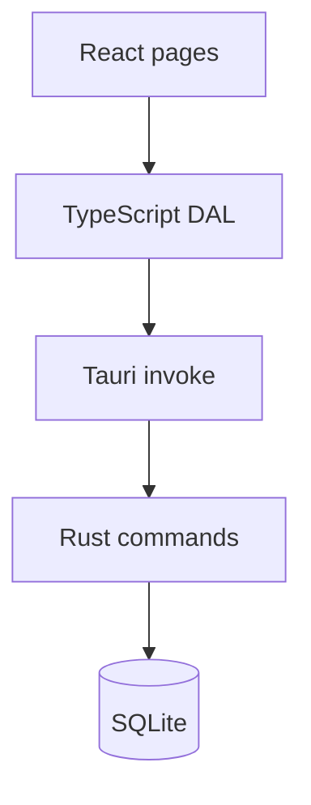
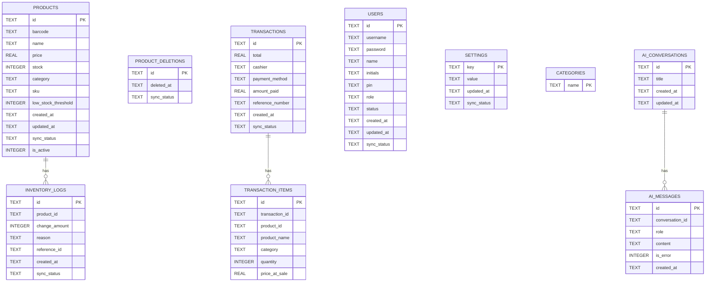
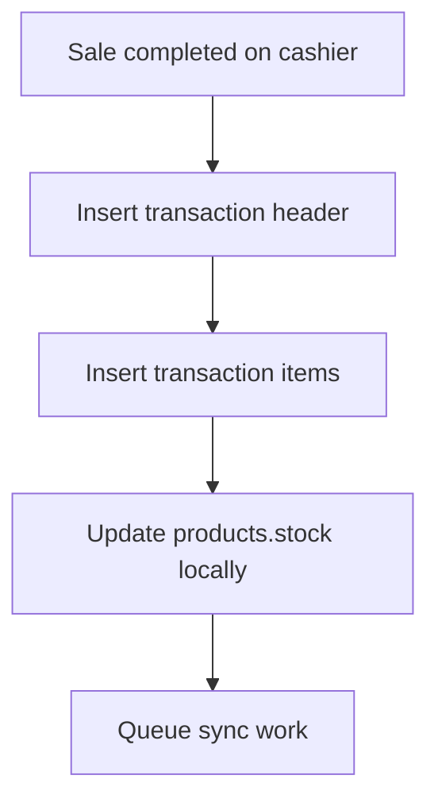

# Database & Data Layer

## Overview

Each app instance uses its own local SQLite database managed by the Rust backend through `sqlx`. Admin and Cashier share the same logical schema, with a few Admin-only tables for AI conversations.

The UI never writes raw SQL directly. Pages call DAL helpers, which call Tauri commands, which execute SQL in Rust or through the shared database layer.

---

## Schema Summary

---

## Main Tables

### `products`

Catalog of sellable products.

| Column | Notes |
|--------|-------|
| `id` | UUID primary key |
| `barcode` | Unique barcode, required |
| `name` | Product display name |
| `price` | Selling price |
| `stock` | Current local stock |
| `category` | Plain-text category name |
| `sku` | Optional SKU |
| `low_stock_threshold` | Per-product threshold |
| `sync_status` | Sync lifecycle field |
| `is_active` | Archive flag |

### `product_deletions`

Tombstone table used to synchronize product removals to cloud without hard-deleting immediately from every device.

### `inventory_logs`

Audit-style record of stock changes.

| Column | Purpose |
|--------|---------|
| `product_id` | Related product |
| `change_amount` | Positive or negative stock adjustment |
| `reason` | Why the stock changed |
| `reference_id` | Optional related record |
| `sync_status` | Pending or synced status for cloud flow |

### `transactions`

Header row for each completed sale.

| Column | Purpose |
|--------|---------|
| `cashier` | Cashier display name |
| `payment_method` | Cash, Card, GCash, or Maya |
| `amount_paid` | Tendered amount |
| `reference_number` | Optional for non-cash payments |
| `sync_status` | Used for LAN/cloud sync tracking |

### `transaction_items`

Line items for each transaction.

Important implementation detail:

- `transaction_id` remains a foreign key to `transactions`.
- `product_id` is **not** a foreign key to `products`.

That is intentional. Old transaction history must remain readable even if a product is renamed, archived, or deleted later.

### `users`

Shared account table for Admin and Cashier users.

| Column | Meaning |
|--------|---------|
| `username` / `password` | Admin login pair |
| `name` / `initials` | Display fields |
| `pin` | Hashed cashier PIN |
| `role` | `admin` or `cashier` |
| `status` | `active` or `inactive` |

### `settings`

Key-value configuration table. Some settings are cloud-synced, while some are intentionally local-only.

Examples:

- Cloud/shared: `store_name`, `store_subtitle`
- Local-only: AI provider keys and model preferences

### `categories`

Local-only master list of categories used by inventory UI helpers and defaults.

### `ai_conversations` and `ai_messages`

Admin-only tables for the AI sidebar. These are local history tables and are not part of LAN or cloud sync.

---

## Sync Status Conventions

`sync_status` is used across several tables, but not every value means the same thing in every workflow.

Common values used in the current codebase:

| Value | Meaning |
|-------|---------|
| `pending` | Local change waiting to be pushed |
| `synced` | Confirmed as synchronized |
| `failed` | Push failed and needs retry |
| `lan_synced` | Arrived from LAN snapshot or LAN message flow |
| `local` | Intentionally local-only setting that cloud pull should not overwrite |

Two practical examples:

1. Cashier transactions start as `pending`, then become `synced` after Admin acknowledgment or successful cloud push.
2. AI provider settings are stored as `local`, so cloud pull logic skips overwriting them.

---

## Data Conventions

| Convention | Why it matters |
|------------|----------------|
| **UUID primary keys** | Safe local creation across multiple terminals |
| **ISO-like text timestamps** | Easy ordering and cross-language handling |
| **Denormalized sale data** | Keeps receipts and transaction history stable after catalog changes |
| **Plain-text categories** | Simpler filtering and editing for a single-store system |
| **Archive flag on products** | Lets the UI hide products without destroying history |

---

## Performance Notes

The local database is tuned for desktop POS responsiveness.

### SQLite mode

- WAL mode is enabled for better concurrent read/write behavior.
- Foreign keys are enabled.

### Important indexes

| Index | Purpose |
|-------|---------|
| `idx_products_barcode` | Fast scanner lookup |
| `idx_products_sync_status` | Find pending product sync work |
| `idx_product_deletions_sync_status` | Push deletion tombstones |
| `idx_inventory_logs_product_id` | Product stock history queries |
| `idx_inventory_logs_sync_status` | Push pending inventory logs |
| `idx_txn_created_at` | Reporting and date-range filters |
| `idx_txn_sync_status` | Pending transaction sync lookup |
| `idx_txn_items_txn_id` | Load transaction line items quickly |
| `idx_users_sync_status` | Push/pull user changes |
| `idx_ai_messages_convo` | Load conversation threads efficiently |

---

## Stock Handling

Stock is reduced locally at sale time inside the same SQLite transaction that writes the sale.

Key detail:

- The current system does **not** rely on a Supabase stock trigger.
- Instead, local stock changes are reflected to cloud through normal product and inventory-log sync behavior.

---

## Seed Behavior

Current first-run initialization seeds only foundational data:

- Default category list
- Default settings (`store_name`, `store_subtitle`)
- Default Admin user if no Admin exists

Default seeded Admin credentials:

- Username: `admin`
- Password: `admin123`

The app does **not** currently seed sample products or sample transaction history.

---

## Database Locations

| Environment | Path pattern |
|-------------|--------------|
| **Production Admin** | `%APPDATA%/com.pos.admin/pos-admin.db` |
| **Production Cashier** | `%APPDATA%/com.pos.cashier/pos-cashier.db` |
| **Development** | `src-tauri/databases/pos-{mode}.db` |
