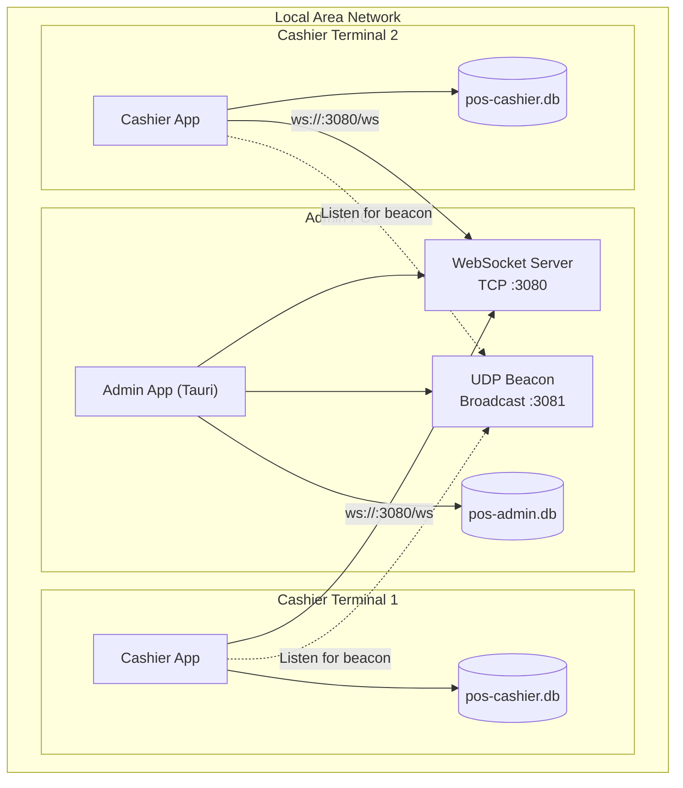
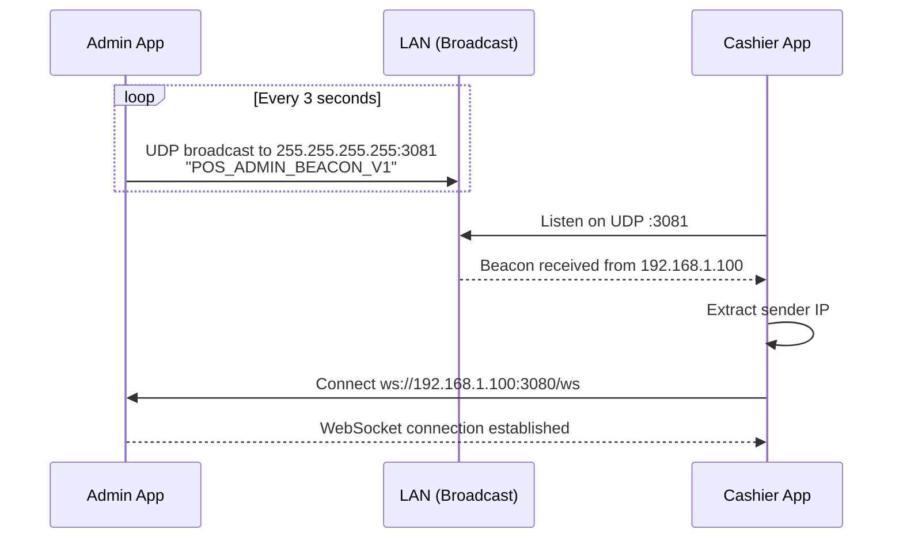
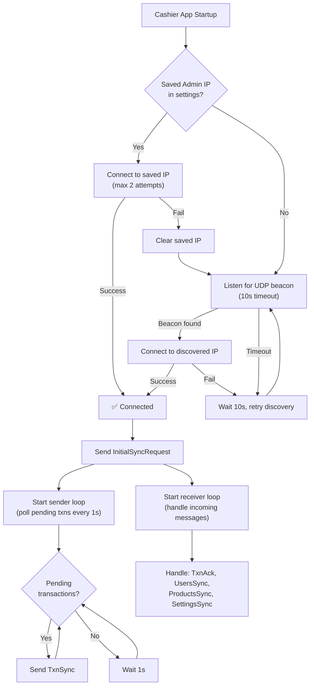
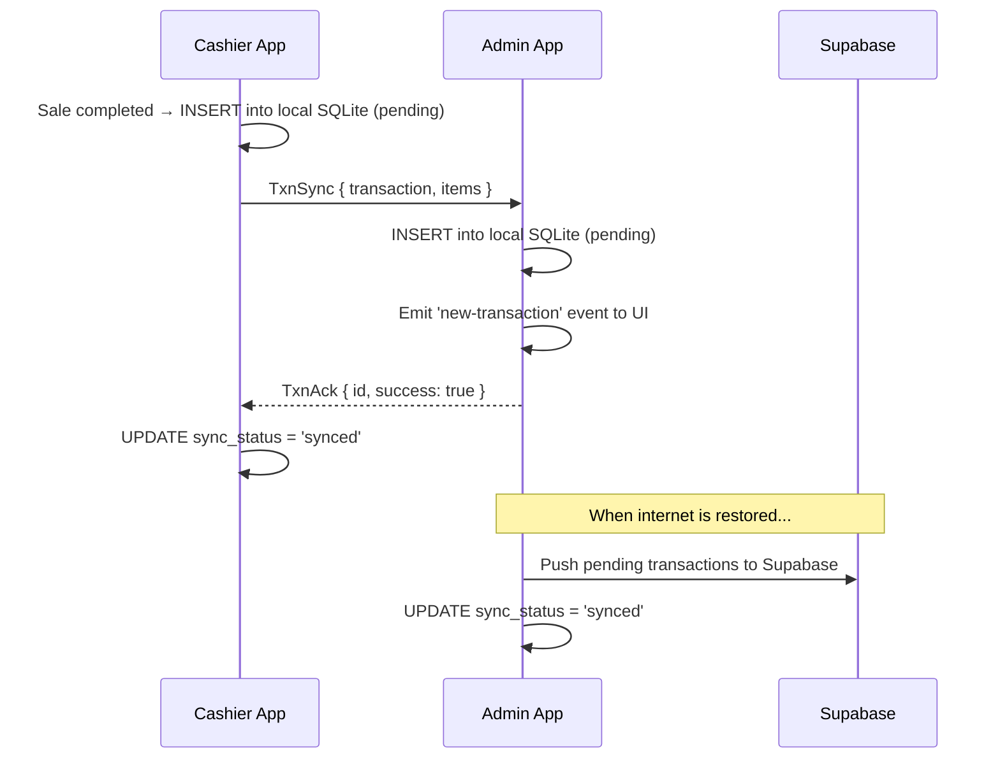
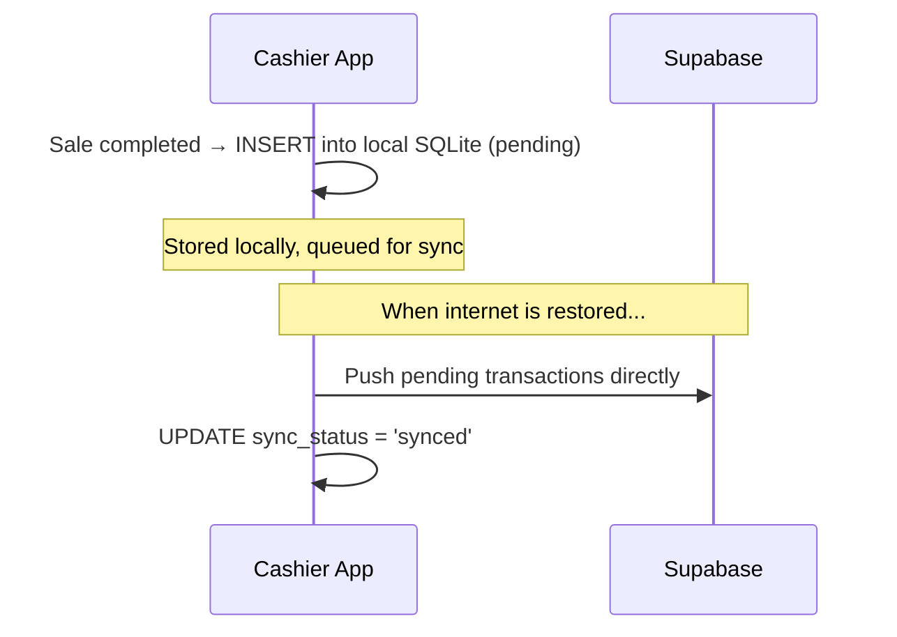
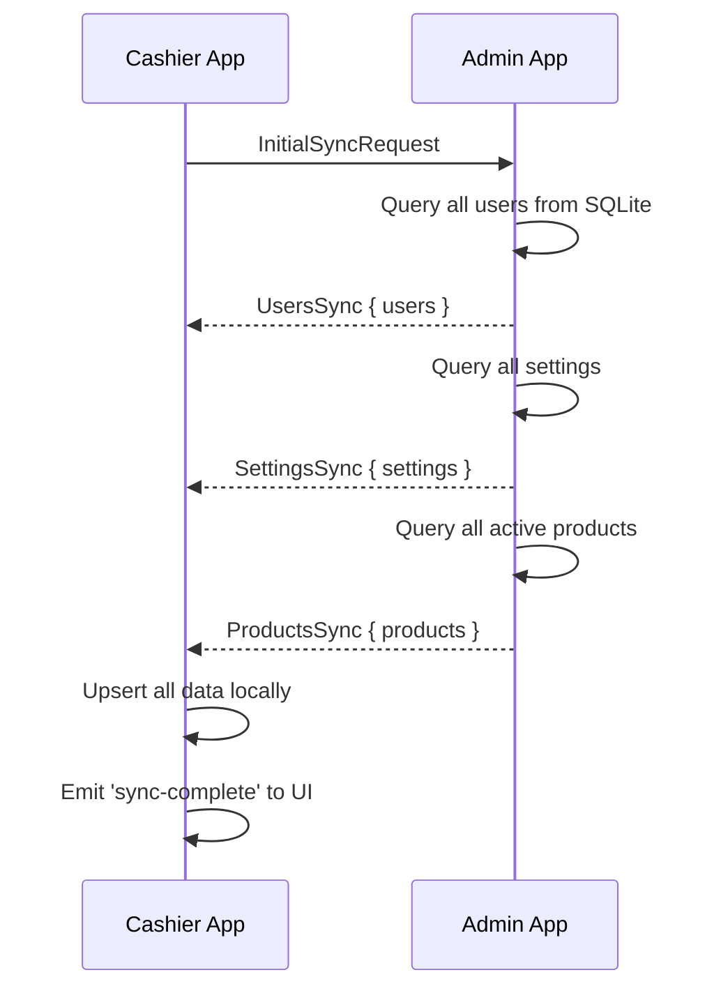
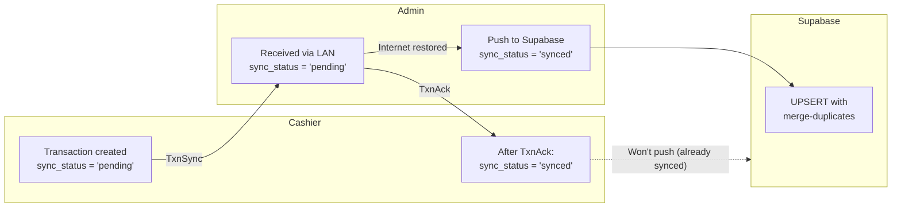

# Local Network Sync

## Problem Statement

A retail POS system **cannot afford downtime**. If the internet goes down, the store must continue operating — cashiers need to process sales, and the Admin needs to see what's happening.

The system solves this with a **local network (LAN) sync layer** that keeps the Admin and all Cashier terminals synchronized over the local network, completely independent of cloud connectivity.

---

## Architecture



### Key Components

| Component | Role | Location |
|-----------|------|----------|
| **WebSocket Server** | Admin hosts on port 3080, accepts cashier connections | `local_server.rs` |
| **WebSocket Client** | Cashier connects to Admin, pushes transactions | `local_client.rs` |
| **Message Protocol** | Shared message types for the WS protocol | `local_sync.rs` |
| **UDP Discovery** | Auto-discovery of Admin IP on the LAN | `discovery.rs` |
| **Sync Indicator** | Visual status indicator in the UI | UI component |
| **Cashier Settings** | Manual IP override configuration | Settings dialog |

---

## Sync Modes

The system operates in one of three modes, displayed as a status indicator in both apps:

| Mode | Indicator | Condition |
|------|-----------|-----------|
| **Online** | 🟢 Cloud | Supabase cloud sync is active |
| **Local Network** | 🟡 Server | Cloud is down, connected to Admin via LAN |
| **Offline** | 🔴 CloudOff | No cloud, no LAN — fully offline |

> Even in "Offline" mode, all sales are saved locally and queued for sync when connectivity is restored.

---

## Message Protocol

All messages between Admin and Cashier are JSON-serialized and tagged with a `type` field for routing.

```mermaid
classDiagram
    class LocalSyncMessage {
        <<enumeration>>
        TxnSync
        TxnAck
        StockUpdate
        InitialSyncRequest
        UsersSync
        ProductsSync
        SettingsSync
        CashierLogin
        CashierLogout
        Ping
        Pong
    }

    class TxnSync {
        Transaction transaction
        TransactionItem[] items
    }

    class TxnAck {
        String id
        Boolean success
    }

    class StockUpdate {
        Product product
    }

    class InitialSyncRequest {
        (no fields)
    }

    class UsersSync {
        User[] users
    }

    class ProductsSync {
        Product[] products
    }

    class SettingsSync {
        Setting[] settings
    }

    LocalSyncMessage --> TxnSync
    LocalSyncMessage --> TxnAck
    LocalSyncMessage --> StockUpdate
    LocalSyncMessage --> InitialSyncRequest
    LocalSyncMessage --> UsersSync
    LocalSyncMessage --> ProductsSync
    LocalSyncMessage --> SettingsSync
```

### Message Descriptions

| Message | Direction | Purpose |
|---------|-----------|---------|
| `TxnSync` | Cashier → Admin | Send a completed transaction with its line items |
| `TxnAck` | Admin → Cashier | Acknowledge successful receipt of a transaction |
| `StockUpdate` | Admin → Cashier | Push a product stock change |
| `InitialSyncRequest` | Cashier → Admin | Request full initial data (users, products, settings) |
| `UsersSync` | Admin → Cashier | Bulk push all users (response to InitialSyncRequest) |
| `ProductsSync` | Admin → Cashier | Bulk push all active products |
| `SettingsSync` | Admin → Cashier | Bulk push all settings |
| `CashierLogin` | Cashier → Admin | Notify that a cashier has logged in |
| `CashierLogout` | Cashier → Admin | Notify that a cashier has logged out |
| `Ping` / `Pong` | Both | Connection keep-alive |

---

## Auto-Discovery Protocol (UDP Beacon)

Instead of requiring cashiers to manually enter the Admin's IP address, the system uses UDP broadcast for automatic discovery.



### Beacon Details

| Property | Value |
|----------|-------|
| **Port** | UDP 3081 |
| **Magic bytes** | `POS_ADMIN_BEACON_V1` |
| **Interval** | Every 3 seconds |
| **Method** | Broadcast to `255.255.255.255` |

### IP Change Detection

If the Admin's IP changes (e.g., DHCP renewal), the Cashier's background listener detects the new beacon source IP and automatically reconnects to the new address.

---

## Connection Flow



---

## Transaction Sync Flow

### Scenario A: Cashier → Admin via LAN (no internet)



### Scenario B: Cashier fully offline



### Scenario C: Initial sync on connection



---

## Double-Sync Prevention

When a cashier sends a transaction to Admin via LAN, there's a risk of **double-sync** — both the Cashier and Admin might try to push the same transaction to Supabase.



**How it works:**

1. Cashier creates a transaction → `sync_status = 'pending'`
2. Cashier sends `TxnSync` to Admin over LAN
3. Admin receives, inserts into its DB as `sync_status = 'pending'`
4. Admin sends `TxnAck` → Cashier marks its copy as `'synced'`
5. Only `'pending'` transactions are pushed to Supabase
6. Since Cashier marked it `'synced'`, it won't re-push
7. Admin is responsible for pushing to Supabase when internet returns
8. Supabase `UPSERT` with `merge-duplicates` acts as a safety net

---

## Admin Server — Event Notifications

When the Admin receives a transaction from a cashier over LAN, it emits events to the Admin UI:

| Event | Purpose | Payload |
|-------|---------|---------|
| `db-changed` | Triggers data refresh on Transactions/Reports pages | — |
| `sync-complete` | Updates sync status indicator | — |
| `new-transaction` | Shows a toast notification on the Admin dashboard | `{ cashier, total }` |

The Admin UI shows a toast like:
> **New Transaction** — Juan completed a ₱150.00 sale

---

## Ports & Firewall

| Port | Protocol | Direction | Purpose |
|------|----------|-----------|---------|
| **3080** | TCP | Inbound on Admin | WebSocket server |
| **3081** | UDP | Broadcast | Auto-discovery beacon |

Both ports must be open in Windows Firewall on the Admin PC for LAN sync to work. Cashier PCs only need outbound access (no inbound ports required).

---

## Reconnection & Resilience

| Scenario | Behavior |
|----------|----------|
| Admin goes offline | Cashier retries every 10 seconds |
| Admin IP changes (DHCP) | Cashier detects new beacon, auto-reconnects |
| Cashier disconnects | Admin removes from active client list |
| WebSocket drops mid-message | Transaction stays `'pending'` locally, re-sent on reconnect |
| Multiple cashiers connect | Admin handles each on separate async tasks (broadcast channel) |
