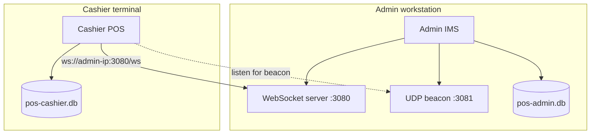
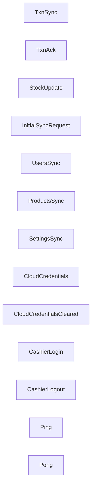
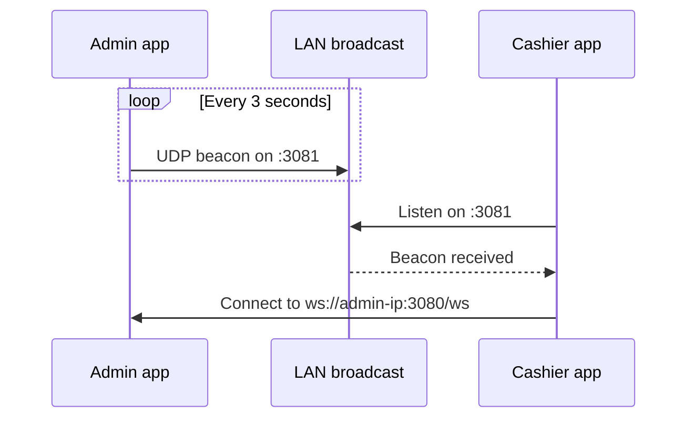
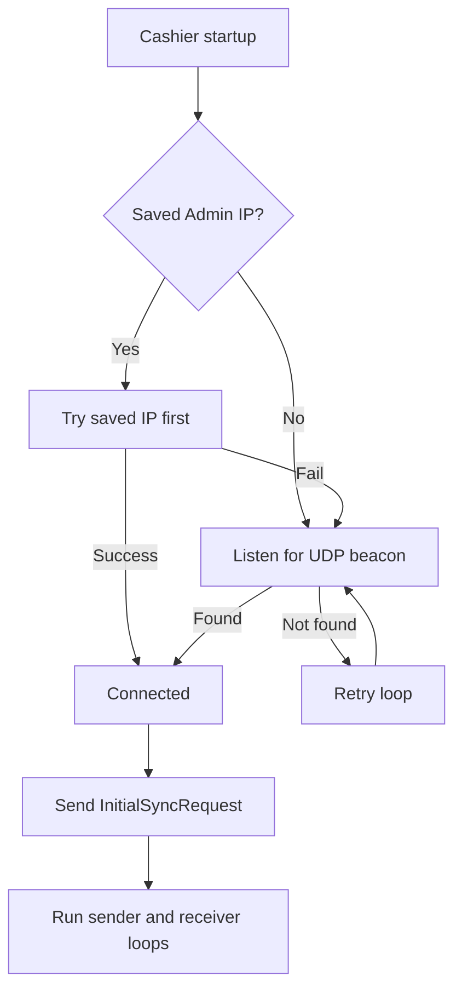
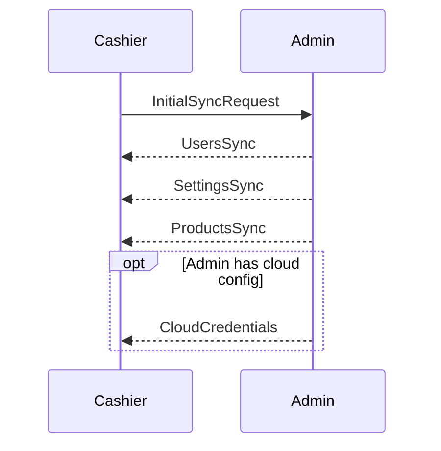
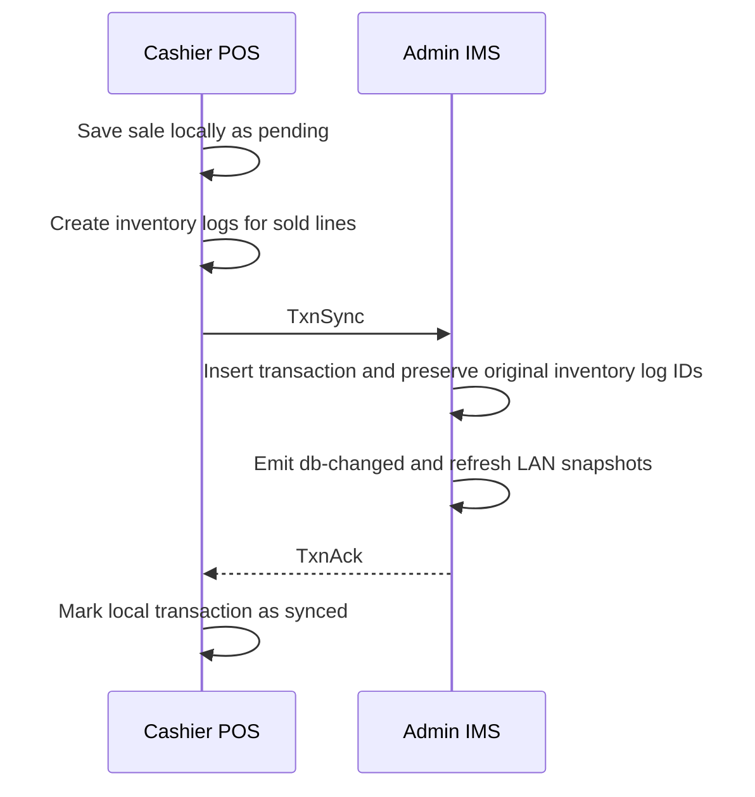
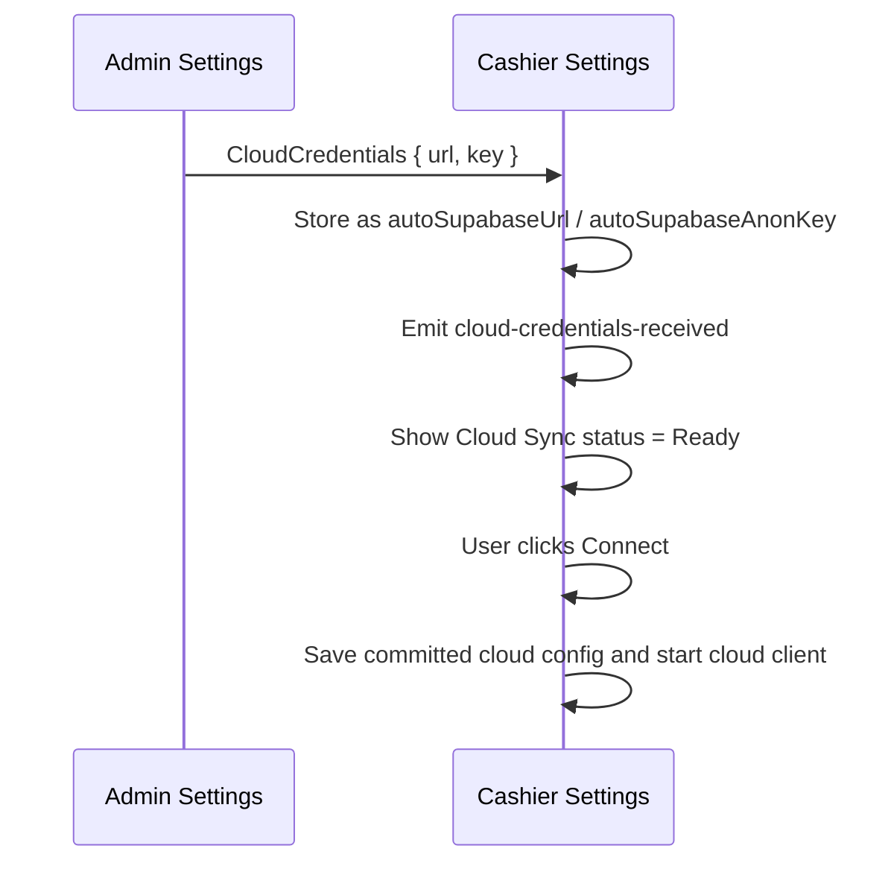

# Local Network Sync

## Why LAN Sync Exists

Cashiers cannot stop selling just because the internet is unstable. The LAN layer lets Cashier POS terminals keep sending sales to the Admin IMS over the local network, even when cloud sync is unavailable.

---

## Architecture

---

## Main Components

| Component | Role |
|-----------|------|
| `local_server.rs` | Admin-side WebSocket server and LAN broadcaster |
| `local_client.rs` | Cashier-side discovery and connection loop |
| `local_sync.rs` | Shared message enum for LAN protocol |
| `discovery.rs` | UDP beacon broadcaster and listener logic |
| Cashier Settings dialog | Manual scan/connect/disconnect UI on cashier terminals |

---

## Sync Modes

The UI exposes three practical connection states:

| Mode | Meaning |
|------|---------|
| **Online** | Cloud sync is active |
| **Local Network** | Cashier is connected to the Admin over LAN |
| **Offline** | No cloud and no LAN connection |

Even in Offline mode, transactions still save locally and wait for later sync.

---

## Message Protocol

| Message | Direction | Purpose |
|---------|-----------|---------|
| `TxnSync` | Cashier -> Admin | Send completed transaction, line items, and original inventory logs |
| `TxnAck` | Admin -> Cashier | Confirm Admin accepted the transaction |
| `StockUpdate` | Admin -> Cashier | Push updated product stock snapshot |
| `InitialSyncRequest` | Cashier -> Admin | Request a fresh users/products/settings snapshot |
| `UsersSync` | Admin -> Cashier | Push users |
| `ProductsSync` | Admin -> Cashier | Push active products |
| `SettingsSync` | Admin -> Cashier | Push shared settings |
| `CloudCredentials` | Admin -> Cashier | Share pending cloud credentials |
| `CloudCredentialsCleared` | Admin -> Cashier | Tell cashier to drop active cloud state |
| `CashierLogin` | Cashier -> Admin | Presence notification when cashier logs in |
| `CashierLogout` | Cashier -> Admin | Presence notification when cashier logs out |
| `Ping` / `Pong` | Both directions | Keep-alive traffic |

---

## Auto-Discovery

The cashier does not need a hard-coded Admin IP by default.

Current behavior:

- Beacon interval: 3 seconds
- Discovery port: UDP `3081`
- WebSocket port: TCP `3080`
- Cashier retries discovery if the Admin is unavailable

---

## Connection Flow

Manual IP entry is still available in Cashier Settings for networks where broadcast discovery is blocked.

---

## Initial Sync Snapshot

When a cashier connects, it asks the Admin for a fresh operational snapshot.

What the cashier does with that snapshot:

- Upserts users with `lan_synced`-style semantics
- Upserts shared settings
- Upserts products
- Updates the UI by emitting sync-complete style events

---

## Transaction Flow

### Normal cashier-to-admin sale flow

Why this matters:

- Cashier gets a fast acknowledgment from the Admin.
- Admin becomes responsible for forwarding that transaction to cloud later.
- Cashier avoids double-pushing the same LAN-delivered transaction.
- Inventory log identifiers stay stable across cashier -> Admin -> cloud flow, so retries do not double-apply stock.
- Other connected cashier terminals can see stock refresh sooner because the Admin emits a fresh database-change event as soon as the sale is accepted.

---

## Live Snapshot Pushes

The Admin also reacts to local database changes by broadcasting fresh users/settings/products snapshots to connected cashiers.

That means cashier terminals do not rely only on first-connect sync. They also receive follow-up LAN updates when the Admin changes operational data.

This also applies immediately after the Admin accepts a LAN sale, so stock-sensitive cashier screens do not have to wait for an unrelated later sync cycle.

---

## Cloud Credential Propagation

Cloud credentials are shared from Admin to Cashier over LAN, but the cashier treats them as **pending credentials** first.

Important implementation detail:

- LAN receipt does **not** immediately force the cashier into active cloud sync.
- The cashier first shows a **Ready** state in the settings UI.
- When the cashier connects those credentials, the app writes committed cloud config and updates the frontend cloud client.

When the Admin clears cloud config:

- Admin broadcasts `CloudCredentialsCleared`
- Cashier drops active cloud connection state and notifies the UI

---

## Manual Disconnect Behavior

If a cashier user manually disconnects from the Admin in the settings dialog:

- Auto-connect is paused
- The cashier remains disconnected until the user explicitly reconnects or restarts the app

This prevents unwanted immediate reconnects during troubleshooting.

---

## Firewall Ports

On the Admin workstation, allow:

| Port | Protocol | Purpose |
|------|----------|---------|
| `3080` | TCP inbound | WebSocket LAN sync server |
| `3081` | UDP inbound/broadcast | Admin discovery beacon |

---

## Practical Failure Cases

| Problem | What to check |
|---------|---------------|
| Cashier cannot discover Admin | Same LAN, firewall rules, broadcast not blocked |
| Cashier cannot connect after manual disconnect | Reconnect manually or restart the app |
| Products do not appear on cashier | Check LAN connection and allow time for initial/live snapshot sync |
| Cashier shows Offline | Either LAN is down, cloud is down, or both |
