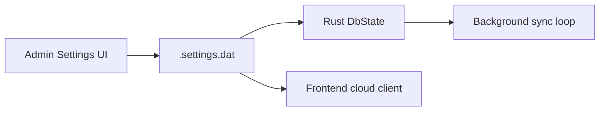
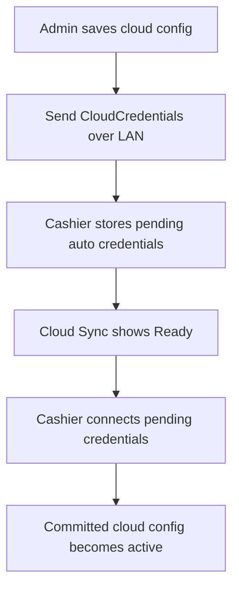
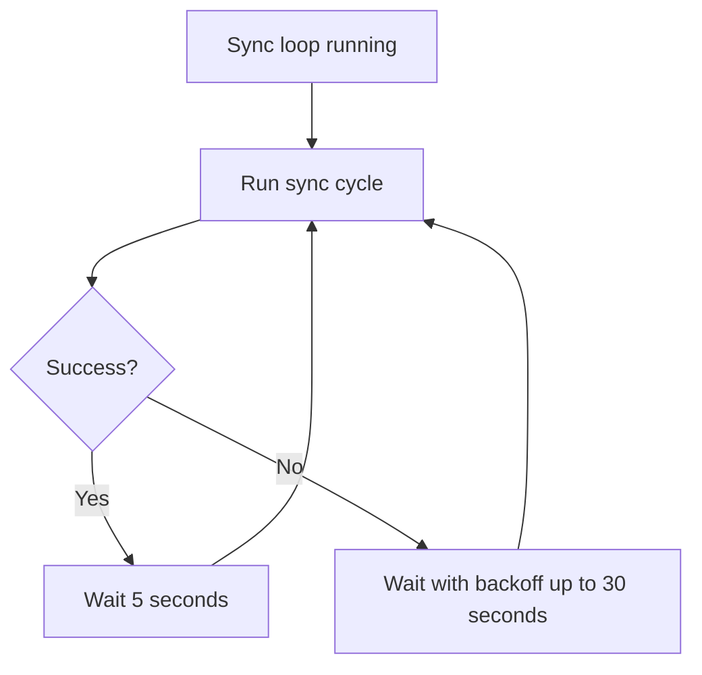
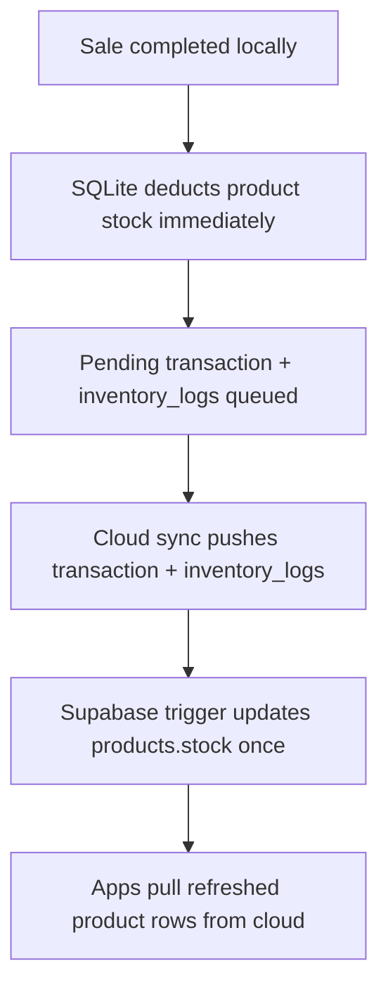
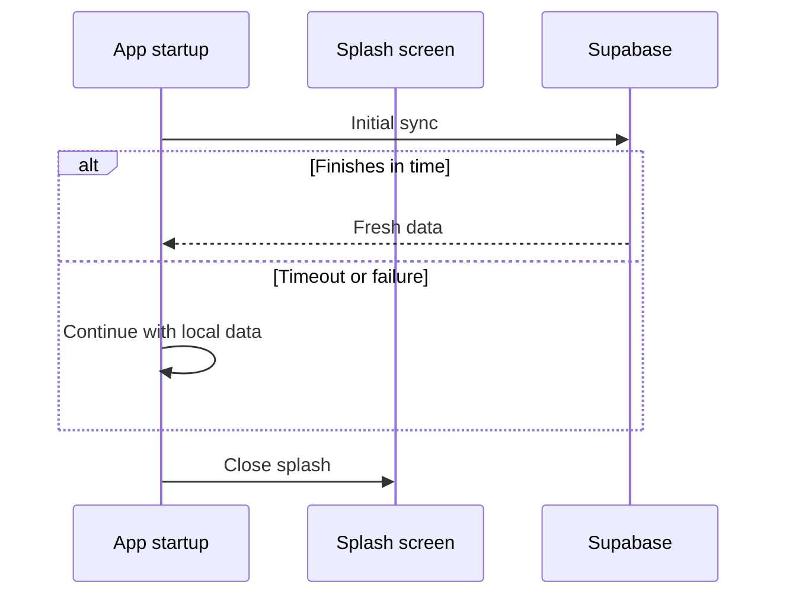

# Cloud Sync

## Overview

Cloud sync is optional. When Supabase credentials are configured, a Rust background loop pushes and pulls operational data between the local SQLite database and Supabase Postgres.

If no credentials are configured, the apps continue in local-only mode.

---

## Runtime Cloud Configuration

Supabase credentials are not compiled into the app. They are entered at runtime from the Admin Settings UI.

Committed cloud settings currently use:

| Store key | Purpose |
|-----------|---------|
| `supabaseUrl` | Supabase project URL |
| `supabaseAnonKey` | Encrypted committed anon key |

Admin Settings behavior:

- Validates URL and anon key format
- Can test connectivity against the `products` table
- Detects missing tables and shows setup SQL
- Saves committed credentials
- Calls `update_cloud_config` so Rust updates the running sync engine

---

## Fresh Project Setup

If the target Supabase project does not have the required tables yet, the Admin UI enters a `tables_missing` state and offers:

- A copyable SQL migration
- A shortcut to the Supabase SQL editor

The generated SQL currently creates:

- `products`
- `transactions`
- `transaction_items`
- `users`
- `settings`
- `inventory_logs`

The setup SQL also creates the stock-application trigger used by cloud sales:

- `apply_inventory_log_to_product_stock()`
- `trg_apply_inventory_log_to_product_stock`

It also enables permissive RLS policies for the anon role so the app can operate with the configured anon key.

---

## Cashier Credential Propagation

When the Admin is already connected to cashiers over LAN, cloud credentials can be shared downstream.

Pending cashier keys:

| Store key | Meaning |
|-----------|---------|
| `autoSupabaseUrl` | Pending LAN-delivered cloud URL |
| `autoSupabaseAnonKey` | Pending LAN-delivered anon key |

Operational flow:

1. Admin broadcasts `CloudCredentials`.
2. Cashier stores them as pending auto credentials.
3. Cashier UI receives `cloud-credentials-received` and shows a Ready state.
4. When cashier activates them, the app writes committed `supabaseUrl` plus encrypted `supabaseAnonKey`, updates Rust state, and reinitializes the frontend cloud client.

---

## Background Sync Loop

The main sync engine runs in Rust, not in the React UI.

Current timing:

| State | Delay |
|-------|-------|
| Healthy sync | 5 seconds |
| Failing sync | `5 * (failures + 1)` seconds, capped at 30 |

The loop also updates sync mode:

- `online` when cloud is healthy
- `local` when LAN is active and more relevant to the user
- `offline` when cloud sync fails and LAN is not active

---

## What Gets Pushed

Push behavior depends on app role and LAN state.

| Entity | Admin | Cashier |
|--------|-------|---------|
| `products` | Pushes pending changes | Does not push products |
| `users` | Pushes pending changes | Does not push users |
| `settings` | Pushes pending shared settings | Does not push settings |
| `transactions` | Pushes when pending | Pushes only when LAN is not active |
| `inventory_logs` | Pushes when pending | Pushes only when LAN is not active |

Important rule:

- If a cashier is connected to the Admin over LAN, it skips direct cloud pushes for transactions and inventory logs so the Admin stays the single upstream source for those sales.
- Stock changes from sales are no longer treated as authoritative product-row pushes. The authoritative cloud stock mutation is the synced `inventory_logs` insert.

---

## What Gets Pulled

Both apps pull the same main entity sets from cloud:

- Products
- Transactions
- Transaction items
- Inventory logs
- Users
- Settings

Pull safeguards in the current implementation:

- Products only overwrite local rows when the local row is not `pending` and the incoming `updated_at` is newer.
- Users only overwrite local rows when the incoming `updated_at` is newer than the local row.
- Settings skip overwrite when local `sync_status` is `pending` or `local`, and also require the incoming `updated_at` to be newer.
- LAN-originated synced rows are naturally protected from cloud deletion cleanup because cleanup only targets cloud-synced rows.

---

## Pagination and Pull Strategy

The sync layer avoids embedded PostgREST queries for large transaction pulls. Instead, it fetches flat pages.

Current pull sizes:

| Entity | Page size / cap |
|--------|------------------|
| Products | 500 per page |
| Transactions | 1000 per page |
| Transaction pages | Up to 50 pages on Admin, 5 on Cashier |
| Transaction items | Up to 50,000 items on Admin, 10,000 on Cashier |

This keeps pull behavior predictable and avoids heavy server-side JSON aggregation.

---

## Stock Synchronization

Cloud stock is now driven by `inventory_logs`, not by pushing product stock as part of sale sync.

Current flow:

Why this model is used:

- Local SQLite still gives instant in-store stock feedback at sale time.
- The cloud trigger makes Supabase stock deterministic from accepted inventory events.
- Mixed LAN + cloud retries remain safe because the same sale keeps the same inventory log identifiers upstream.
- This avoids double-decrement behavior that can happen when both LAN and direct cloud paths race the same stock change.

---

## Initial Sync During Splash

When committed cloud credentials are available at startup, the app attempts one sync cycle during the splash screen.

Current startup timing:

- Minimum splash duration: 3 seconds
- Initial cloud sync timeout budget: 10 seconds

---

## Realtime Broadcast Trigger

The frontend also uses a Supabase Realtime broadcast channel named `pos-sync`.

Purpose:

- When one app finishes a relevant operation, it can broadcast `sync-triggered`.
- Other clients can respond by requesting a targeted sync cycle.

This is a trigger mechanism, not the main source of truth. The Rust sync loop remains the primary cloud synchronization engine.

---

## Conflict Handling

The current design keeps most conflict cases simple:

| Data type | Strategy |
|-----------|----------|
| Transactions | Append-only upstream records |
| Products | Prefer newer cloud row unless local row is still pending |
| Settings | Preserve local-only settings and pending local edits |
| Users | Admin-managed rows flow downstream and upstream through sync status rules |
| Inventory logs | Stable IDs and reference IDs keep retries idempotent |
| Deletions | Use tombstones or deletion cleanup against synced rows |

---

## Practical Summary

Cloud sync is designed to be:

- Optional
- Background-only
- Safe to ignore during checkout
- Coordinated with LAN behavior so cashiers do not race the Admin
- Deterministic for stock because cloud product stock is derived from accepted inventory log events
