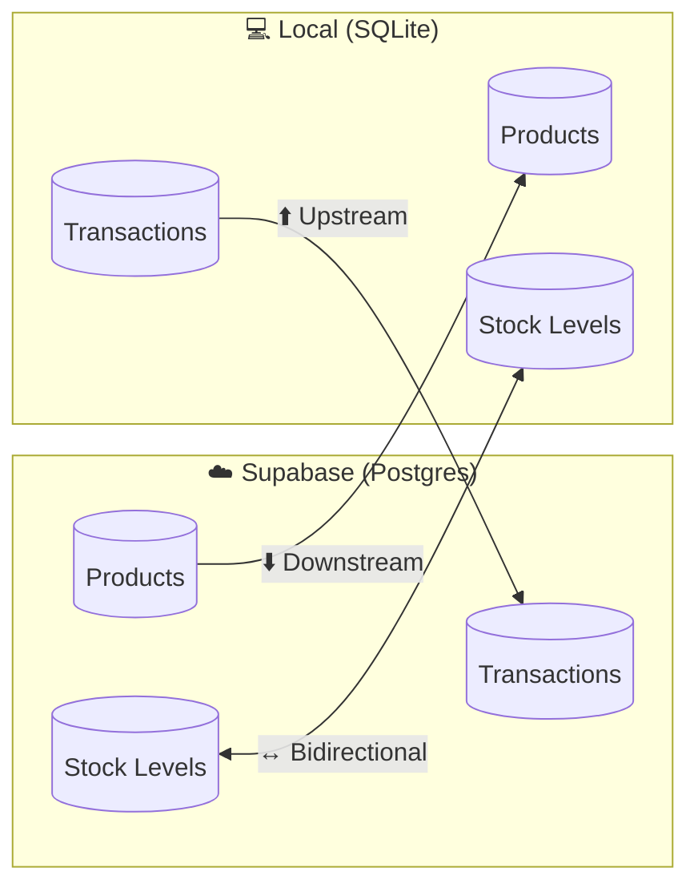
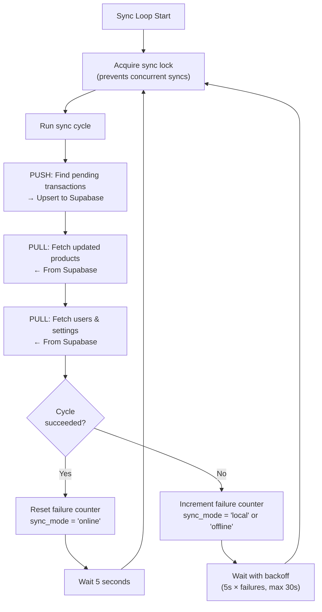
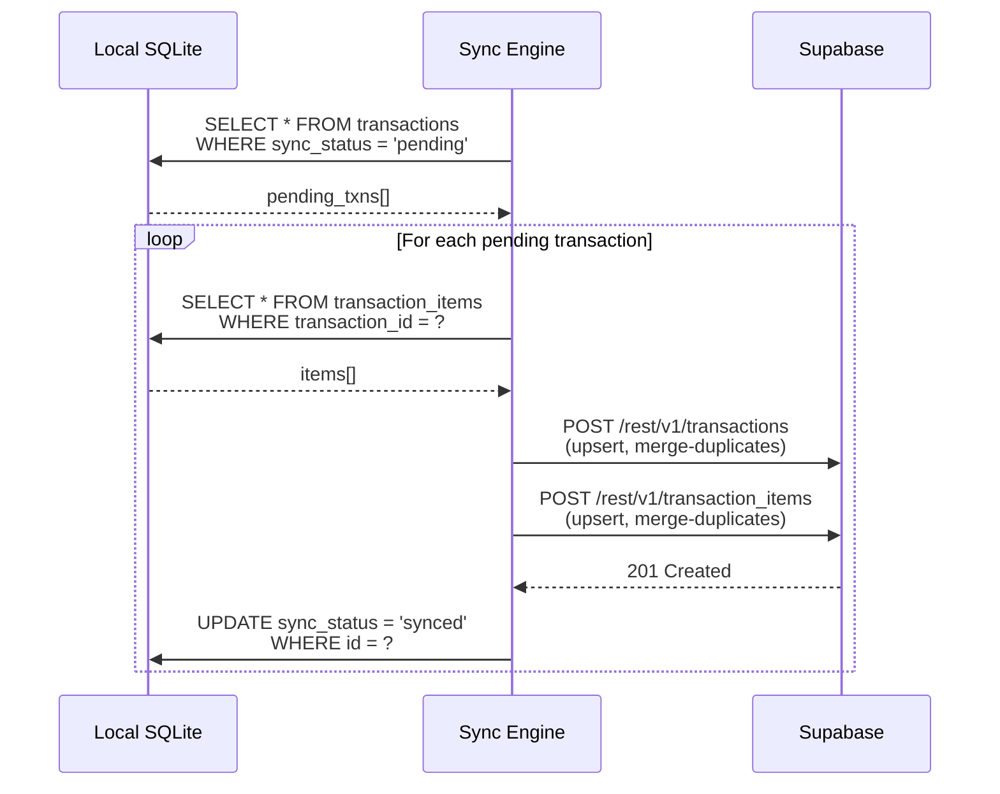
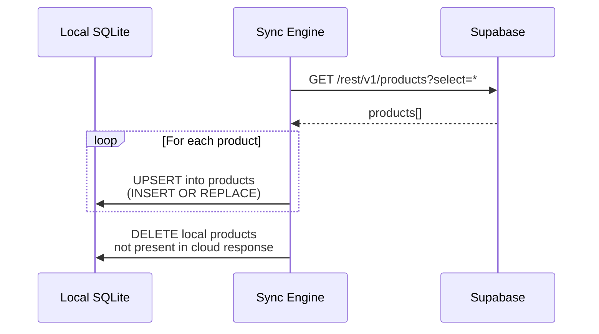
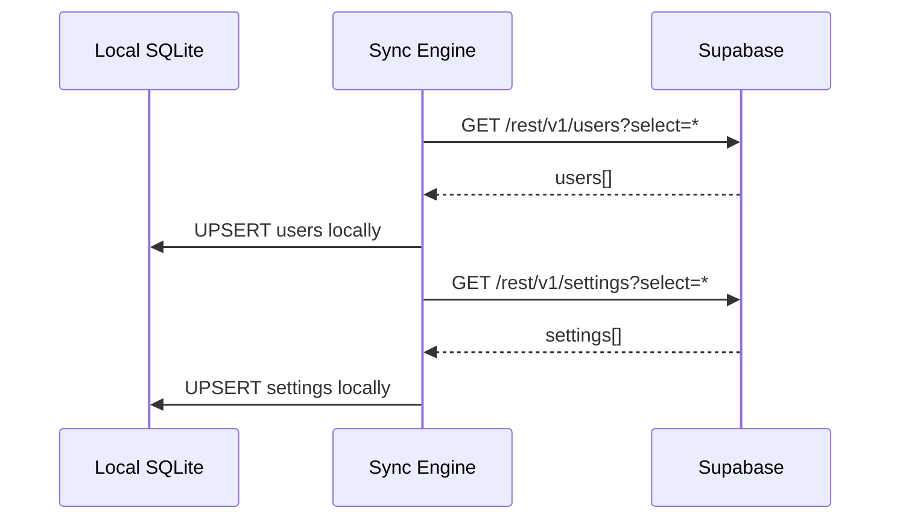
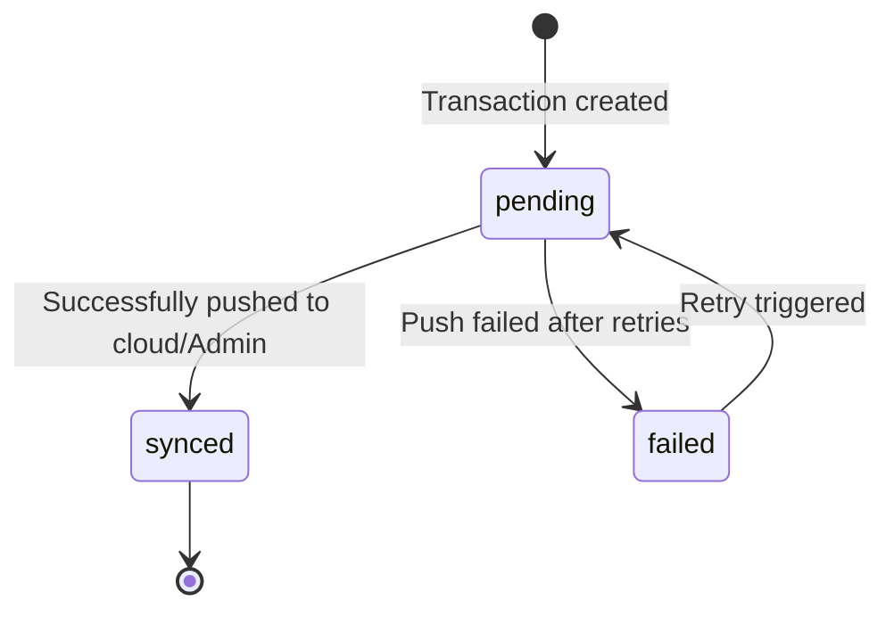
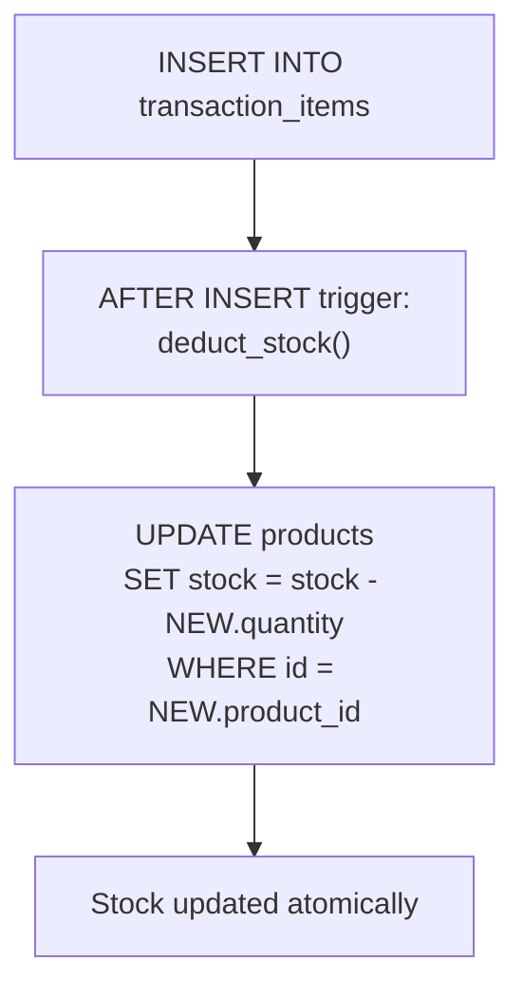
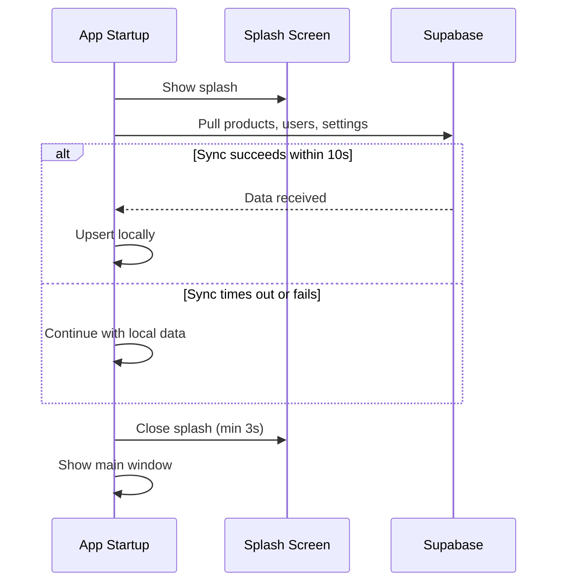
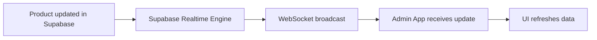

# Cloud Sync Algorithm

## Overview

When internet connectivity is available, the system syncs data with **Supabase** — a cloud Postgres database that serves as the "Global Truth." This enables data backup, cross-device visibility, and cloud-powered features like AI analytics.

Cloud sync is a **background process** that runs alongside normal POS operations. It never blocks the UI or interrupts transactions.

---

## Sync Direction by Data Type

| Data Type | Direction | Description |
|-----------|-----------|-------------|
| **Products & Prices** | Downstream (Cloud → Local) | Admin manages products in Supabase; terminals pull updates |
| **Transactions & Sales** | Upstream (Local → Cloud) | Sales are created locally and pushed to the cloud |
| **Stock Levels** | Bidirectional | Local deduction on sale + cloud trigger on sync |
| **Users & Settings** | Downstream on first sync | Pulled during initial bootstrap |

---

## Background Sync Loop

### Timing

| State | Interval |
|-------|----------|
| **Online** | Every 5 seconds |
| **Failing** | Exponential backoff: `min(5 × (failures + 1), 30)` seconds |
| **Max backoff** | 30 seconds |

### Logging Strategy

- **First failure:** Logged at `warn` level
- **Subsequent failures:** Logged at `debug` level to reduce noise
- **Recovery:** Logged at `info` level with failure count

---

## Sync Cycle Detail

Each sync cycle consists of three sequential phases:

### Phase 1: Push Transactions (Upstream)

### Phase 2: Pull Products (Downstream)

### Phase 3: Pull Users & Settings (Downstream)

---

## Sync Status State Machine

Every transaction carries a `sync_status` field that tracks its sync lifecycle:

| Status | Meaning |
|--------|---------|
| `pending` | Created locally, waiting to be pushed |
| `synced` | Successfully stored in Supabase (or acknowledged by Admin) |
| `failed` | Push attempt failed — will be retried |

---

## Cloud Stock Deduction (Postgres Trigger)

When transactions are pushed to Supabase, a **Postgres trigger** automatically deducts stock from the products table:

This ensures that stock deduction happens server-side regardless of which terminal pushed the transaction. The trigger is atomic — concurrent transactions are handled safely by Postgres.

---

## Initial Sync (During Splash Screen)

On app startup, a **one-time initial sync** runs during the splash screen:

- **Minimum splash duration:** 3 seconds (ensures smooth visual transition)
- **Maximum sync timeout:** 10 seconds (prevents blocking on slow connections)
- **On failure:** App continues with whatever local data is available

---

## Admin vs Cashier Sync Behavior

| Behavior | Admin | Cashier |
|----------|-------|---------|
| **Push transactions** | Yes (its own + LAN-received cashier transactions) | Yes (its own) |
| **Pull products** | Yes | Yes |
| **Pull users** | Yes | Yes |
| **Offline mode label** | "Local Network" (always serves cashiers) | "Offline" (unless LAN-connected) |
| **LAN-received transactions** | Stored as `pending`, pushed to cloud | N/A |

---

## Conflict Resolution

Since data flows are mostly **unidirectional** (transactions up, products down), conflicts are rare. The strategies for each case:

| Data Type | Strategy | Detail |
|-----------|----------|--------|
| **Transactions** | No conflict possible | Always created locally, pushed upstream, never modified |
| **Products** | Cloud wins | Cloud is the master for product data; local edits are pushed to cloud first |
| **Stock** | Atomic deduction | Both local (SQLite transaction) and cloud (Postgres trigger) deduct atomically |
| **Users** | Cloud wins | User data is managed in Supabase, pulled downstream |
| **Duplicate pushes** | Upsert with merge | Supabase `UPSERT` with `resolution=merge-duplicates` ignores duplicate inserts |

---

## Supabase Realtime

The Supabase Postgres tables `products` and `transactions` have **Realtime** enabled. This allows the Admin dashboard to receive live updates without polling:

This is used for:
- Live product price/stock updates reflected in the Admin UI
- Real-time transaction notifications when other terminals sync
