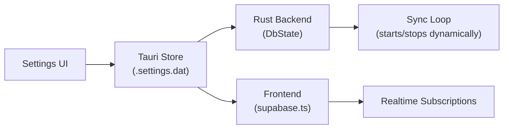
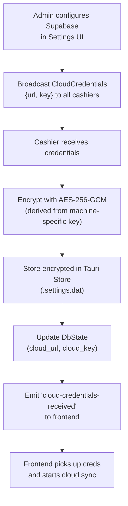
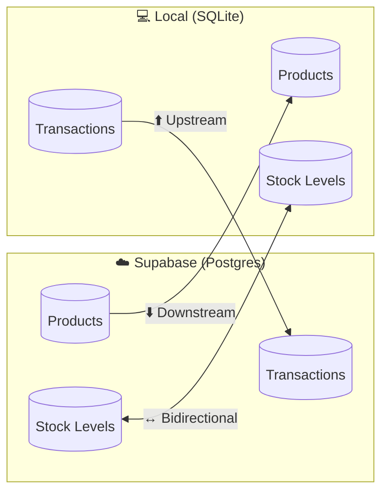
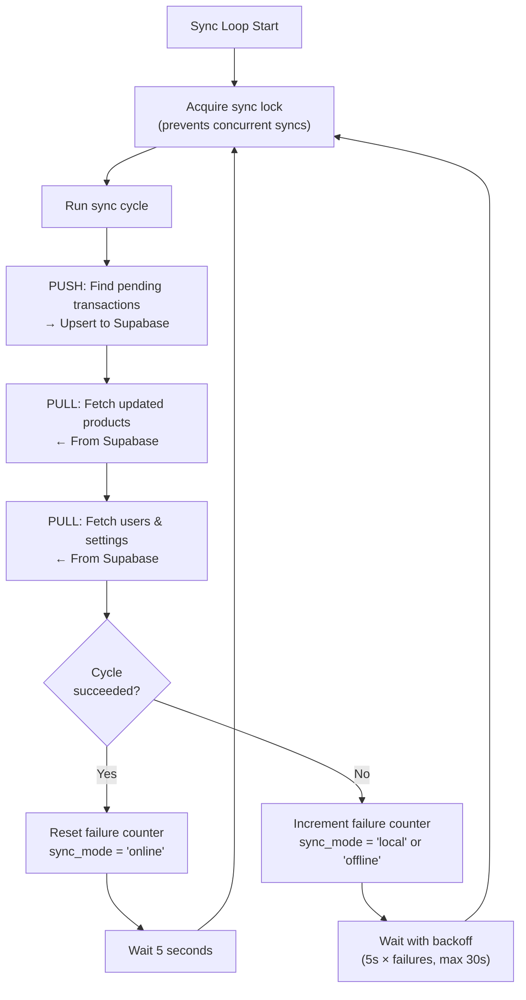
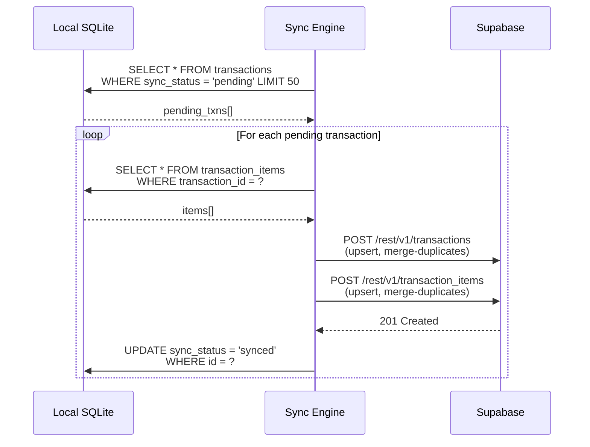
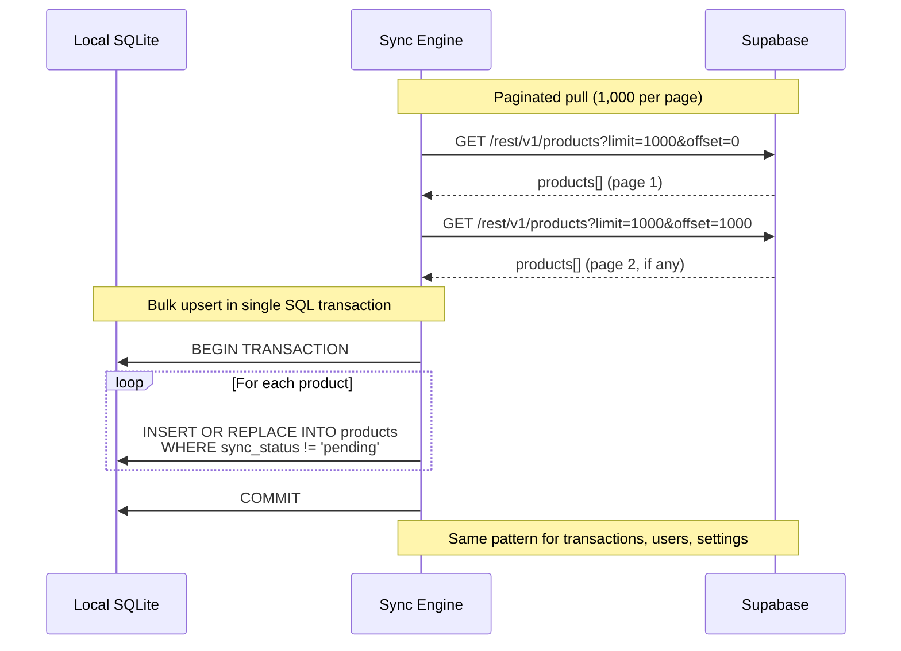
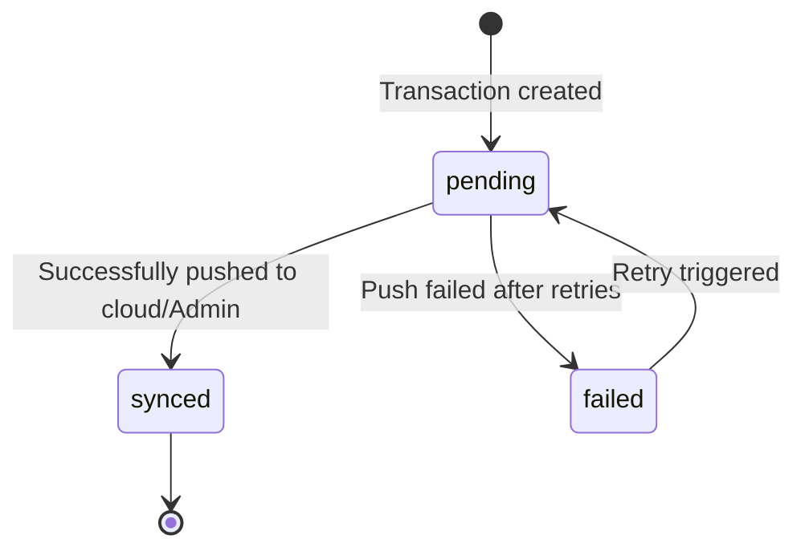
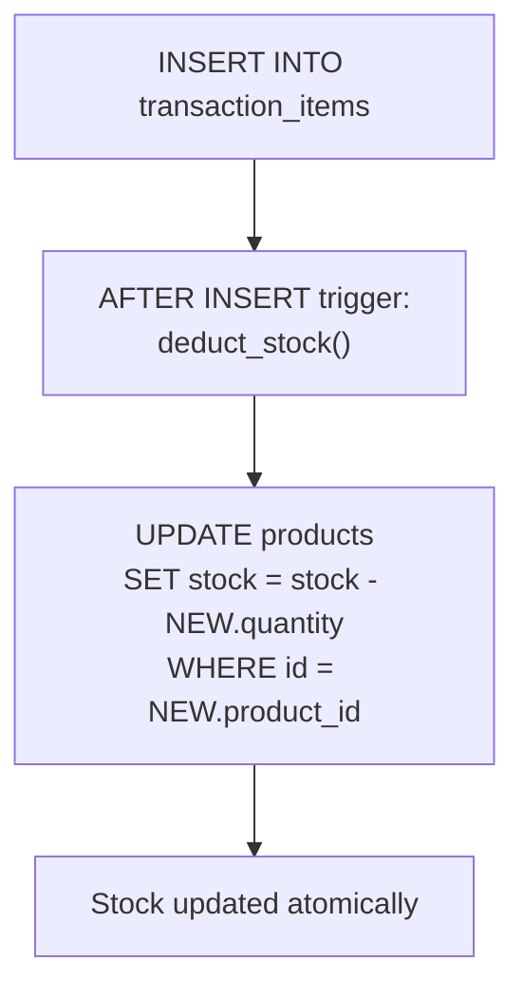
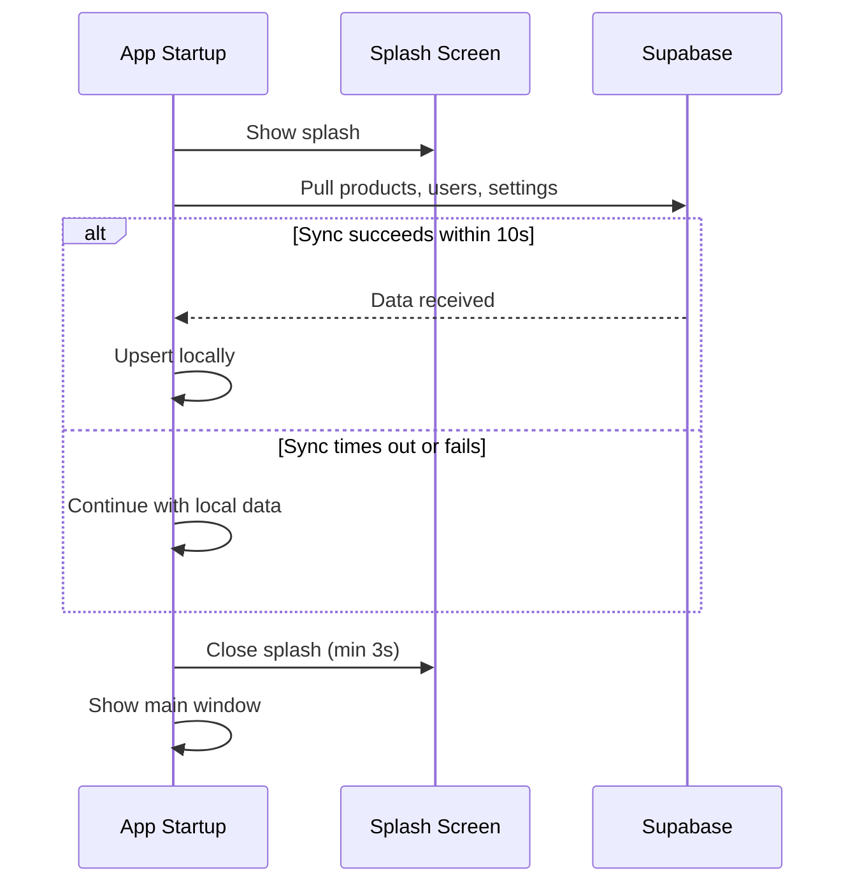
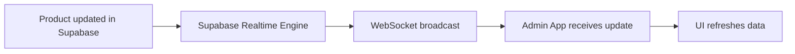

# Cloud Sync Algorithm

## Overview

When internet connectivity is available, the system syncs data with **Supabase** — a cloud Postgres database that serves as the "Global Truth." This enables data backup, cross-device visibility, and cloud-powered features like AI analytics.

Cloud sync is a **background process** that runs alongside normal POS operations. It never blocks the UI or interrupts transactions.

---

## Runtime Cloud Configuration

Supabase credentials are **not compiled into the binary**. Instead, each store owner configures their own Supabase project at runtime through the Settings UI.

### Credential Storage

| Key | Storage | Description |
|-----|---------|-------------|
| `supabaseUrl` | `.settings.dat` (JSON) | The Supabase project URL (e.g., `https://xxxxx.supabase.co`) |
| `supabaseAnonKey` | `.settings.dat` (JSON) | The Supabase anon/public key |

Credentials are read from the Tauri Store on app startup. If none are configured, the app starts in **offline mode** and cloud sync is skipped entirely.

### Runtime Commands

| Command | Description |
|---------|-------------|
| `update_cloud_config(url, key)` | Saves new credentials, cancels the existing sync loop, starts a new one, and **broadcasts `CloudCredentials` to all connected cashiers via LAN** |
| `clear_cloud_config()` | Removes credentials, stops the sync loop, and **broadcasts `CloudCredentialsCleared` to all connected cashiers via LAN** |
| `db_sync(entity?)` | Triggers a manual sync cycle (reads credentials from `DbState`) |

### Auto-Provisioning

When a user connects to a fresh Supabase project, the app detects missing tables (HTTP `42P01` error) and shows a **copyable SQL migration** that the user pastes into the Supabase SQL Editor. Once the tables exist, sync starts automatically.

---

## Cloud Credential Propagation via LAN

Cashier terminals do not need to be individually configured with Supabase credentials. When the Admin is connected to cashiers via LAN, cloud credentials are **automatically propagated**.

### How It Works

### Propagation Triggers

| Trigger | Message Sent | Behavior |
|---------|-------------|----------|
| Cashier sends `InitialSyncRequest` | `CloudCredentials` | Admin checks if cloud config exists and includes it in the initial sync response |
| Admin updates cloud config | `CloudCredentials` | Broadcast to all currently-connected cashiers immediately |
| Admin clears cloud config | `CloudCredentialsCleared` | Broadcast to all cashiers; each clears stored creds, aborts active cloud sync, and emits `'cloud-credentials-cleared'` to frontend |

### Credential Storage on Cashier

| Field | Storage Key | Encryption |
|-------|------------|------------|
| Supabase URL | `cloud_url` in Tauri Store | AES-256-GCM |
| Supabase Anon Key | `cloud_key` in Tauri Store | AES-256-GCM |

Credentials are encrypted at rest using AES-256-GCM with a machine-derived key before being written to the Tauri Store. On app startup, if encrypted credentials exist, they are decrypted and loaded into `DbState` for use by the sync loop.

> **Important:** Cashiers never expose the Supabase credentials in their Settings UI. The cloud configuration section shows only the connection status and is read-only — all configuration is managed centrally from the Admin.

---

## Sync Direction by Data Type

| Data Type | Direction | Description |
|-----------|-----------|-------------|
| **Products & Prices** | Downstream (Cloud → Local) | Admin manages products in Supabase; terminals pull updates |
| **Transactions & Sales** | Upstream (Local → Cloud) | Sales are created locally and pushed to the cloud |
| **Stock Levels** | Bidirectional | Local deduction on sale + cloud trigger on sync |
| **Users & Settings** | Downstream on first sync | Pulled during initial bootstrap |

---

## Background Sync Loop

### Timing

| State | Interval |
|-------|----------|
| **Online** | Every 5 seconds |
| **Failing** | Exponential backoff: `min(5 × (failures + 1), 30)` seconds |
| **Max backoff** | 30 seconds |

### Logging Strategy

- **First failure:** Logged at `warn` level
- **Subsequent failures:** Logged at `debug` level to reduce noise
- **Recovery:** Logged at `info` level with failure count

---

## Sync Cycle Detail

Each sync cycle consists of sequential push and pull phases. The Admin pushes products, users, settings, and transactions; the Cashier pushes only transactions. Both pull everything.

### Push Phase (Upstream)

All entities with `sync_status = 'pending'` are pushed in **batches of 50** per cycle:

The Admin also pushes products, users, and settings with `sync_status = 'pending'` — these are changes made locally (e.g., adding a product, creating a user).

> **LAN-aware optimization:** When a Cashier has an active LAN connection to the Admin, it **skips pushing transactions to the cloud**. The Admin receives them via WebSocket and pushes them to the cloud on the Cashier's behalf. This prevents race conditions where cloud sync marks transactions as `synced` before the LAN send task picks them up.

### Pull Phase (Downstream)

Data is pulled from Supabase using **paginated flat queries** (1,000 records per page) instead of embedded resources. This avoids the slow JSON aggregation that PostgREST performs for embedded resources.

**Smart conflict avoidance:** The `WHERE sync_status != 'pending'` clause ensures cloud data never overwrites local pending changes.

| Mode | Max Pages per Entity | Max Records |
|------|---------------------|-------------|
| Admin | 50 | 50,000 |
| Cashier | 5 | 5,000 |

---

## Sync Status State Machine

Every transaction carries a `sync_status` field that tracks its sync lifecycle:

| Status | Meaning |
|--------|---------|
| `pending` | Created locally, waiting to be pushed |
| `synced` | Successfully stored in Supabase (or acknowledged by Admin) |
| `failed` | Push attempt failed — will be retried |

---

## Cloud Stock Deduction (Postgres Trigger)

When transactions are pushed to Supabase, a **Postgres trigger** automatically deducts stock from the products table:

This ensures that stock deduction happens server-side regardless of which terminal pushed the transaction. The trigger is atomic — concurrent transactions are handled safely by Postgres.

---

## Initial Sync (During Splash Screen)

On app startup, a **one-time initial sync** runs during the splash screen:

- **Minimum splash duration:** 3 seconds (ensures smooth visual transition)
- **Maximum sync timeout:** 10 seconds (prevents blocking on slow connections)
- **On failure:** App continues with whatever local data is available

---

## Admin vs Cashier Sync Behavior

| Behavior | Admin | Cashier |
|----------|-------|---------|
| **Push transactions** | Yes (its own + LAN-received cashier transactions) | Yes (its own) |
| **Pull products** | Yes | Yes |
| **Pull users** | Yes | Yes |
| **Offline mode label** | "Local Network" (always serves cashiers) | "Offline" (unless LAN-connected) |
| **LAN-received transactions** | Stored as `pending`, pushed to cloud | N/A |

---

## Conflict Resolution

Since data flows are mostly **unidirectional** (transactions up, products down), conflicts are rare. The strategies for each case:

| Data Type | Strategy | Detail |
|-----------|----------|--------|
| **Transactions** | No conflict possible | Always created locally, pushed upstream, never modified |
| **Products** | Cloud wins | Cloud is the master for product data; local edits are pushed to cloud first |
| **Stock** | Atomic deduction | Both local (SQLite transaction) and cloud (Postgres trigger) deduct atomically |
| **Users** | Cloud wins | User data is managed in Supabase, pulled downstream |
| **Duplicate pushes** | Upsert with merge | Supabase `UPSERT` with `resolution=merge-duplicates` ignores duplicate inserts |

---

## Supabase Realtime

The Supabase Postgres tables `products` and `transactions` have **Realtime** enabled. This allows the Admin dashboard to receive live updates without polling:

This is used for:
- Live product price/stock updates reflected in the Admin UI
- Real-time transaction notifications when other terminals sync
