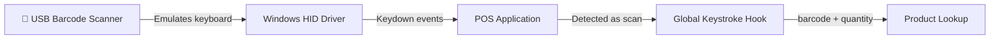
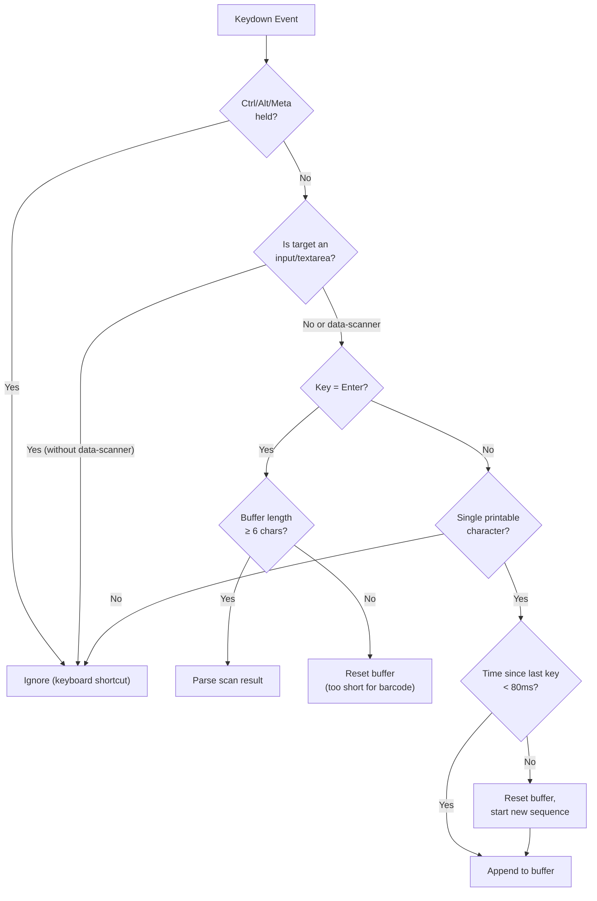
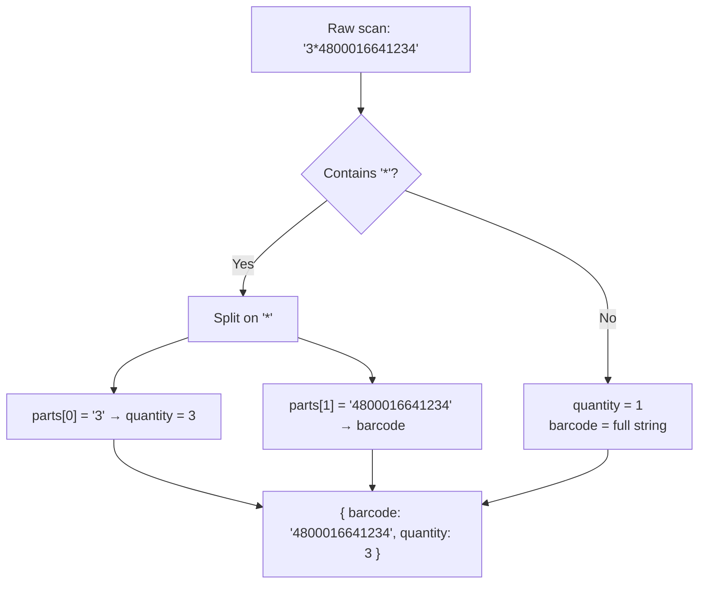
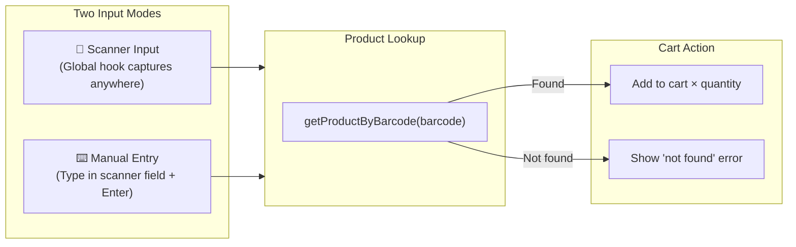

# Barcode Scanner Algorithm

## How It Works

Standard retail barcode scanners operate as **USB HID (Human Interface Device) keyboard emulators**. When a barcode is scanned, the scanner "types" the barcode digits as keyboard keystrokes at superhuman speed, followed by an Enter key press.

This means the scanner works with any application that accepts keyboard input — no special drivers or APIs are needed.



---

## Global Keystroke Hook

The system uses a **global keystroke hook** — a JavaScript event listener on the `window` that intercepts all keypress events. This means the cashier doesn't need to click on any specific input field before scanning. The barcode is captured **regardless of where the focus is** on the screen.

This creates a "magical" experience: the cashier can be doing anything in the app, scan a barcode, and the product appears in the cart.

---

## Detection Algorithm

The hook distinguishes between **human typing** and **scanner input** based on speed:



### Timing Parameters

| Parameter | Value | Purpose |
|-----------|-------|---------|
| **Max character interval** | 80ms | Maximum time between keystrokes to be considered scanner input |
| **Minimum barcode length** | 6 characters | Minimum characters for a valid barcode |
| **Terminator** | Enter key | Signals end of barcode scan |

### Why These Values

- **80ms interval:** A barcode scanner outputs characters in 5–20ms intervals. Even the fastest human typist rarely sustains less than 100ms between keystrokes. 80ms provides a safe threshold.
- **6 character minimum:** Common barcode formats (EAN-8, EAN-13, UPC-A) are at least 8 digits. 6 provides some buffer for shorter custom codes while filtering out accidental rapid keypresses.

---

## Multiplier Syntax

The system supports a **quantity multiplier** syntax for scanning multiple units of the same item:

```
{quantity}*{barcode}
```

**Example:** Typing `3*4800016641234` and pressing Enter adds **3 units** of the product with barcode `4800016641234`.



### Validation Rules

- Quantity must be a positive integer
- If parsing fails (e.g., `abc*123`), it falls back to treating the entire string as the barcode with quantity 1
- The scanner input field in the POS UI also accepts this syntax via manual keyboard entry

---

## Input Field Behavior

The POS interface has a **dedicated scanner input field** at the top of the product catalog. This field:

1. Has the `data-scanner` attribute — tells the hook to allow capture even when this field is focused
2. Accepts both scanned barcodes and manual keyboard entry (including multiplier syntax)
3. Automatically clears after each scan
4. Grabs focus when the user presses **Space** (keyboard shortcut)



---

## Focus-Free Operation

The hook is designed so the cashier **never needs to click** on the scanner input field. Key behaviors:

| Scenario | Hook Behavior |
|----------|---------------|
| Focus on product grid | Scanner input captured globally |
| Focus on cart item | Scanner input captured globally |
| Payment dialog open | Scanner input captured globally |
| Typing in a search field | Scanner input **not** captured (input without `data-scanner`) |
| No focus / clicked on background | Scanner input captured globally |

### Excluded Inputs

To prevent false positives, the hook **ignores** keystrokes when the user is typing in:
- Regular `<input>` elements (e.g., search bars, payment amount fields)
- `<textarea>` elements
- Content-editable elements

Only elements with the `data-scanner` attribute are exempted from this exclusion.

---

## Pause and Resume

The hook can be **paused** and **resumed** programmatically. This is used during certain UI states where global key capture should be temporarily disabled:

| State | Hook Status |
|-------|-------------|
| Normal POS operation | **Active** |
| Payment dialog (amount input) | **Paused** (resumed after payment) |
| Settings dialog open | **Paused** |

---

## Edge Cases

| Edge Case | Handling |
|-----------|---------|
| Cashier types fast in search field | Ignored — search inputs don't have `data-scanner` |
| Damaged barcode (partial scan) | Buffer resets if < 6 chars when Enter is pressed |
| Scanner sends no Enter at end | Buffer eventually resets due to 80ms timeout between keystrokes |
| Multiple rapid scans | Each Enter terminates a scan — sequential scans are processed individually |
| Barcode not in database | Error toast displayed — product not added to cart |
| USB scanner disconnected | No effect — app continues normally, scanner input just stops working |
