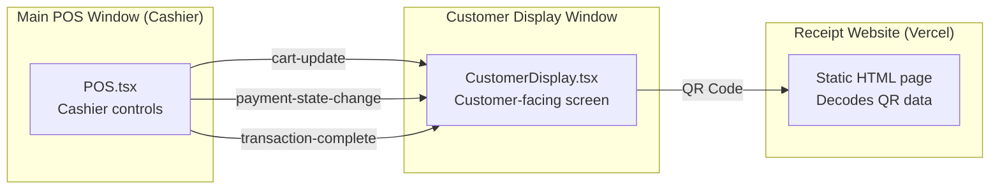
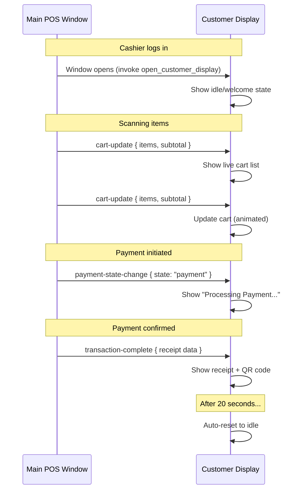
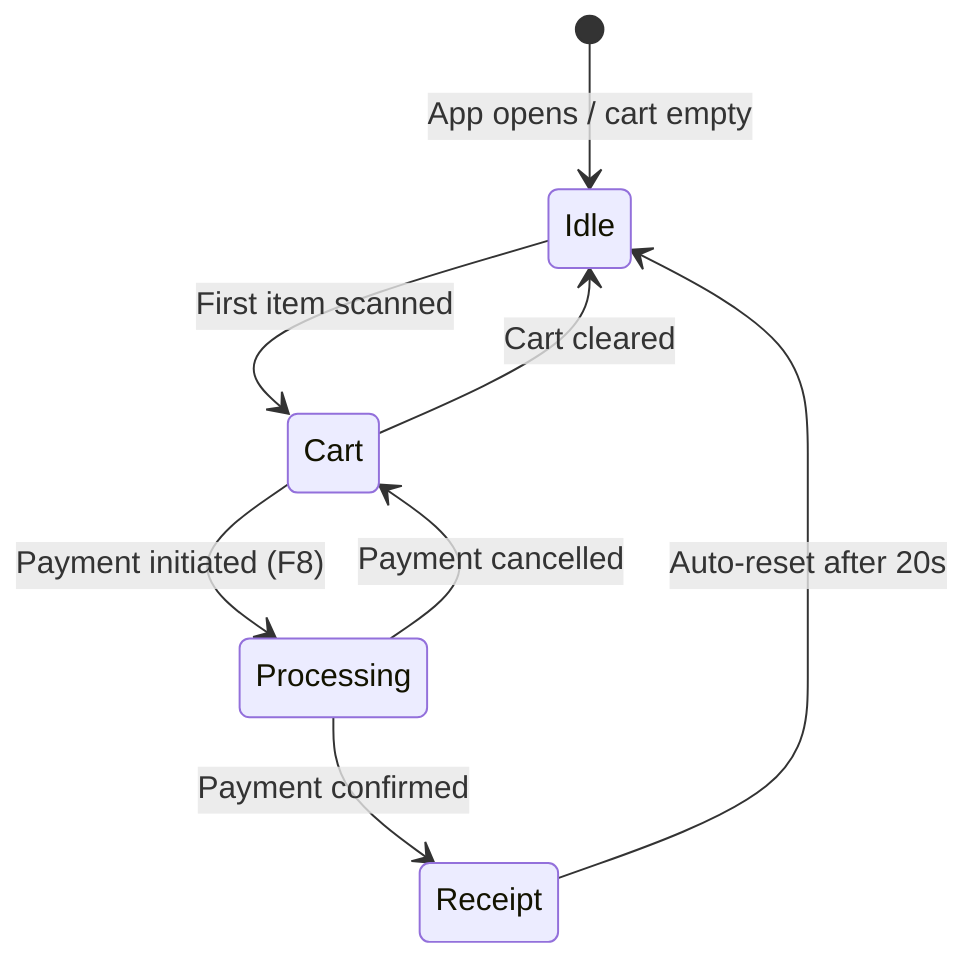
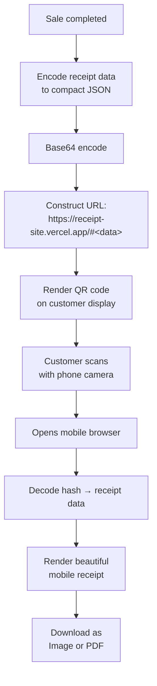
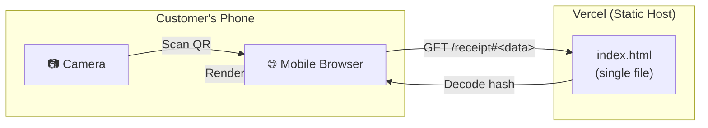
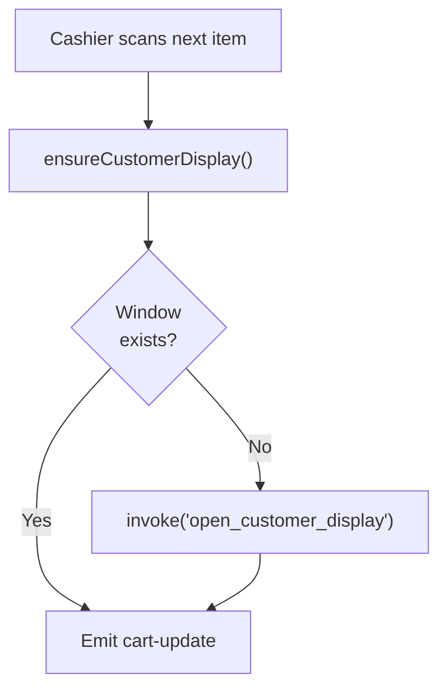

# Customer Display & Digital Receipts

## Overview

After a cashier logs in, a **second Tauri window** opens on the customer-facing screen. This window displays:

1. A **welcome/idle** state with store branding
2. **Live cart updates** as the cashier scans items
3. **Payment status** during checkout
4. A **receipt summary + QR code** after payment — the customer scans the QR to view/download their receipt on their phone

---

## Multi-Window Architecture

The two windows communicate via **Tauri's `emitTo` API** — a one-way event broadcasting system from the main POS window to the customer display.

---

## Event Flow

### Events

| Event | Payload | Direction | Trigger |
|-------|---------|-----------|---------|
| `cart-update` | `{ items: CartItem[], subtotal: number }` | Main → Display | Item added/removed/updated |
| `payment-state-change` | `{ state: "cart" \| "payment" \| "success" }` | Main → Display | Payment screen opened/closed |
| `transaction-complete` | Full receipt data (items, totals, cashier, etc.) | Main → Display | Payment confirmed |

---

## Display States

### State Details

| State | Display Content |
|-------|-----------------|
| **Idle** | Store name, logo, "Welcome" message, current date/time |
| **Cart** | Live item list with quantities, prices, running total (large, readable text) |
| **Processing** | "Processing Payment..." with animated dots, amount due |
| **Receipt** | Transaction summary, line items, totals, payment info, QR code |

---

## QR Code Digital Receipt

Instead of printing paper receipts, the system generates a **QR code** that the customer scans with their phone. The QR code encodes the entire receipt data into the URL hash.

### Data Encoding

Receipt data is encoded using **compact JSON keys** to minimize QR code size:

| Full Key | Compact Key | Type |
|----------|-------------|------|
| `storeName` | `s` | string |
| `items` | `i` | array |
| `items[].name` | `n` | string |
| `items[].quantity` | `q` | number |
| `items[].price` | `p` | number |
| `subtotal` | `st` | number |
| `paymentMethod` | `pm` | string |
| `amountPaid` | `ap` | number |
| `change` | `c` | number |
| `cashier` | `ca` | string |
| `transactionId` | `id` | string |
| `date` | `d` | ISO 8601 |
| `referenceNumber` | `r` | string or null |

### QR Data Budget

QR codes (Version 25, error correction L) can hold ~2,953 bytes of binary data.

| Content | Estimated Size |
|---------|---------------|
| Store name (20 chars) | ~25 bytes |
| 10 items (name + qty + price each) | ~500 bytes |
| Totals, payment, metadata | ~150 bytes |
| JSON overhead | ~100 bytes |
| **Raw JSON total** | **~775 bytes** |
| **After base64 (+33%)** | **~1,030 bytes** |
| **URL prefix** | ~50 bytes |
| **Grand total** | **~1,080 bytes** |

Even a receipt with 30 items (~2,400 bytes) fits comfortably within QR capacity.

---

## Receipt Website

The QR code points to a **standalone static website** hosted on Vercel. It requires no backend — all data is decoded from the URL hash.

### Receipt Website Features

- **Mobile-first design** with clean receipt layout
- Same font (Poppins) and color palette as the POS app
- **Download as Image** button (captures receipt as PNG)
- **Download as PDF** button (uses browser print dialog)
- **Error state** if hash is missing or invalid (shows store branding with "No receipt found")
- Completely static — no server-side logic, no database, no API calls

---

## Auto-Reopen Logic

If the customer display window is accidentally closed:

The `ensureCustomerDisplay()` function is called before every cart update emission. If the window was closed, it silently reopens it. The POS never crashes or errors because of a missing customer display window.

---

## Theme Enforcement

The customer display is **always in light mode** regardless of the cashier's theme preference. This is enforced at three levels:

| Level | Method |
|-------|--------|
| **Rust** | Window background color set to `#F2F5F8` (light) |
| **JavaScript injection** | `window.__DEVICE_THEME__ = 'light'` injected on window creation |
| **React** | `useEffect` removes `dark` class and adds `light` class on mount |

---

## Window Configuration

| Property | Value |
|----------|-------|
| **Window label** | `customer-display` |
| **Title** | "Customer Display" |
| **Default size** | 900 × 700 px |
| **Resizable** | Yes |
| **Decorations** | No (borderless — for kiosk-like display) |
| **Always on top** | No |
| **Route** | `#/customer-display` (outside protected route — no auth required) |
