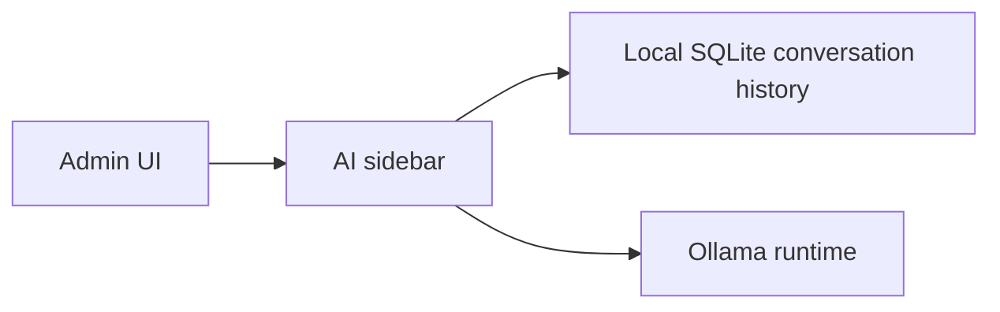
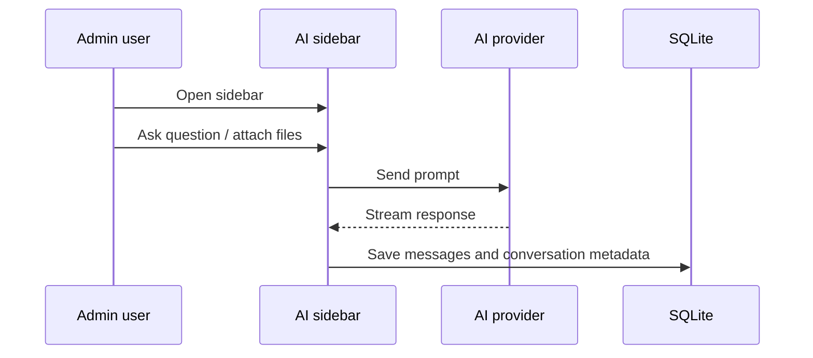

# AI Agent

## Overview

The Admin app includes a built-in AI sidebar that can answer questions about store operations, verify admin how-to guidance from curated local docs, analyze attached files, and help the operator explore sales and inventory data.

This feature is available only in **Admin IMS**.

---

## Provider Architecture

The system sends AI requests to the app-managed Ollama runtime. In practice that runtime still lives on the Admin machine, but the selected model can be a local Ollama model or an Ollama-hosted cloud-capable model exposed through the same runtime.

---

## Supported Provider

Only Ollama is supported. The app does not expose separate third-party AI provider keys or provider switching beyond Ollama, but the managed Ollama runtime can expose either local models or cloud-capable models after the operator completes Ollama sign-in.

Default model:

- `gpt-oss:20b-cloud`

---

## Local Configuration Storage

AI configuration is stored in the local SQLite `settings` table using local-only setting keys.

Current keys:

- `ai_provider` (Fixed to local)
- `ollama_model` / `ai_model`

Behavior:

- AI provider settings are persisted in local SQLite.
- These settings are intentionally local-only and should not be overwritten by cloud sync.

---

## Main Features

### 1. Model Switching

The sidebar and settings screen can:

- Seamlessly interact with the local Ollama daemon
- Fetch available installed models
- Persist the chosen model locally

### 1.1 Guided Ollama Setup

The Admin Settings flow handles Ollama management locally:

- check whether Ollama is already available using process checks and PID file handling
- offer a managed lightweight install when Ollama is missing
- open the required sign-in step when a cloud-capable Ollama model is needed
- re-check service availability after install startup
- provide one-click uninstall functionality with smooth status refresh logic

Managed install behavior on Windows:

- installs into the app's local data directory instead of requiring a full desktop app install
- utilizes PID file tracking to safely manage background Ollama instances
- starts `ollama serve` in the background after extraction
- writes install progress and failure details into a managed log file

Current managed install paths:

- install directory: `%APPDATA%\com.pos.admin\tools\ollama-cli`
- install log: `%APPDATA%\com.pos.admin\tools\ollama-cli\install.log`

The progress UI is stage-aware. It reflects installer log milestones such as:

- launching installer
- downloading standalone zip
- extracting zip
- starting Ollama service

### 2. Persistent conversation history

Conversation history is stored in:

- `ai_conversations`
- `ai_messages`

This lets the Admin:

- Continue old chats
- Delete old conversations
- Reopen prior analysis sessions after restart

The app also auto-generates a short conversation title after enough assistant turns exist.

### 3. File attachments

Users can attach files to a message.

| Limit | Value |
|-------|-------|
| Max files per message | 5 |
| Max file size | 25 MB per file |
| Max extracted text per file | 12,000 chars |
| Max total extracted text | 24,000 chars |

Attachment behavior:

- Text-based files are read locally and inserted into the model prompt.
- Supported spreadsheets are parsed into structured rows for the model.
- Supported document formats can be locally extracted into prompt-ready text.
- Spreadsheet imports keep their exact parsed rows available for import preview and confirmed import flows.

### 4. Verified admin help

The assistant uses a curated local admin-help knowledge base for:

- how-to questions
- troubleshooting
- feature boundaries
- setup guidance

If the current docs do not confirm a workflow, the assistant should treat that workflow as unconfirmed instead of inventing behavior.

### 5. Fullscreen and history modes

The sidebar supports:

- Standard floating panel mode
- Fullscreen mode
- Conversation history panel

### 6. Retry and regenerate

Current resilience features:

- One automatic retry for empty failed responses
- Retry delay of 900 ms
- Manual "Regenerate" for the latest assistant response

### 7. Spreadsheet import and export assistance

The current assistant can also help with:

- previewing uploaded spreadsheet product imports before anything is written
- asking for confirmation before inventory-changing spreadsheet imports
- building supported Excel report exports
- returning exported workbooks as chat file attachments instead of relying on a desktop save dialog inside the AI flow

---

## Interaction Flow

---

## Practical Use Cases

Typical uses include:

- Asking for top sellers in a date range
- Reviewing product and category performance
- Interpreting exported CSV, spreadsheet, text, or document files
- Exploring slow movers or low-stock items
- Summarizing operational patterns for the store owner
- Previewing uploaded product spreadsheets before import
- Generating supported report workbooks from the assistant

---

## Operational Boundaries

The assistant is advisory, not autonomous.

It does not automatically:

- Change prices
- Complete checkout actions
- Place supplier orders
- Modify store settings without explicit UI actions elsewhere

For inventory-changing import flows, the assistant should ask for a clear confirmation before proceeding.

---

## Security Notes

| Concern | Current behavior |
|---------|------------------|
| Conversation history | Stored locally in SQLite |
| Setup and Runtime | Runs through the local app-managed Ollama runtime; no separate third-party API keys are exposed in the app |

The exclusive use of Ollama keeps provider handling constrained to one managed runtime. If the operator signs in and selects a cloud-capable Ollama model, inference may use Ollama-hosted services, but that still happens through the same app-managed integration rather than arbitrary external provider keys.
