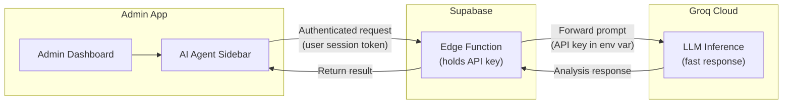
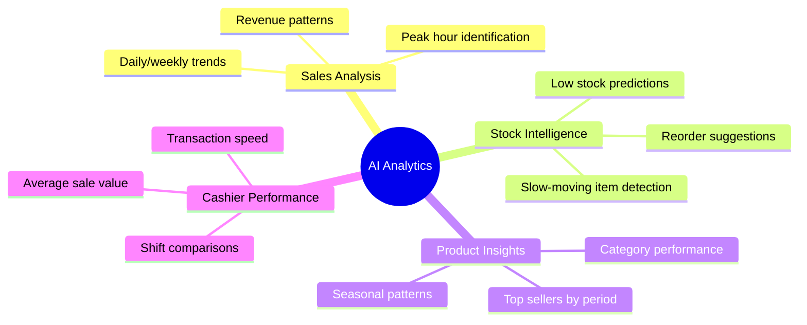
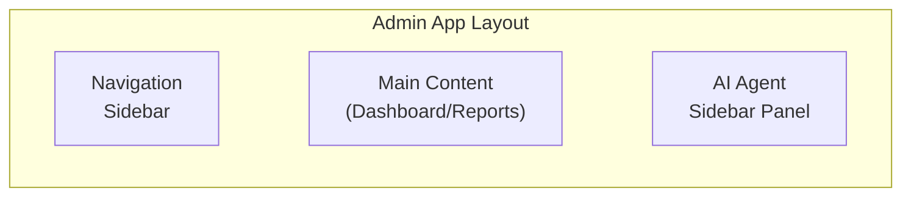

# AI-Powered Analytics

## Overview

The Admin dashboard integrates **Groq Cloud** — an ultra-fast LLM inference engine — to provide AI-powered analytics for the store owner. The AI acts as an **advisory assistant** that analyzes sales data, identifies trends, and provides actionable insights.

> **Important:** The AI operates in a strictly **advisory and analytical** capacity. It never makes automated decisions to alter prices, apply discounts, or place orders without explicit human approval.

---

## Architecture

### Security Model

The Groq API key is **never stored in the desktop application**. Instead:

1. The Admin app sends the prompt to a **Supabase Edge Function**
2. The Edge Function authenticates the request using the user's Supabase session token
3. The Edge Function holds the Groq API key as a **server-side environment variable**
4. The Edge Function forwards the prompt to Groq and returns the result

This prevents API key extraction from the desktop application binary.

---

## Use Cases

### Specific Capabilities

| Capability | Description |
|------------|-------------|
| **Sales Trend Analysis** | Identifies upward/downward trends in daily, weekly, and monthly revenue |
| **Peak Hour Detection** | Determines busiest hours for staffing optimization |
| **Stock Predictions** | Estimates when products will run out based on sales velocity |
| **Reorder Suggestions** | Recommends reorder quantities based on historical demand |
| **Product Recommendations** | Identifies products that are frequently purchased together |
| **Slow Mover Detection** | Flags products with declining sales or excess stock |
| **Cashier Insights** | Compares cashier performance metrics (speed, accuracy, revenue) |

---

## AI Constraints

The AI follows strict operational boundaries:

| Constraint | Detail |
|------------|--------|
| **No automated price changes** | AI cannot alter product prices without admin approval |
| **No automated discounts** | AI cannot apply discounts or promotions automatically |
| **No automated ordering** | AI cannot place vendor orders |
| **No cashier interference** | AI must not interact with or interrupt active checkout sessions |
| **Advisory only** | All AI outputs are suggestions — the admin decides what to act on |
| **Admin-only access** | AI features are not available in the Cashier app |

---

## User Interface

The AI assistant appears as a **sidebar panel** in the Admin dashboard:

### Interaction Flow

1. Admin clicks the AI icon in the dashboard
2. AI sidebar slides in from the right
3. Admin types a question or selects a preset query
4. AI processes the request using local transaction/inventory data
5. Response appears in the sidebar with formatted insights

### Preset Queries

The sidebar offers quick-action buttons for common analyses:
- "How are sales trending this week?"
- "Which products are running low?"
- "What are my top sellers this month?"
- "When are my peak hours?"
- "Which cashier had the highest sales today?"

---

## Data Privacy

| Concern | Mitigation |
|---------|------------|
| **Sensitive data sent to LLM** | Only aggregated/anonymized data is sent — no customer personal information |
| **API key exposure** | Key stored server-side in Supabase Edge Function, never in the client app |
| **Data retention by Groq** | Subject to Groq's data processing terms — no PII is included in prompts |
| **Network dependency** | AI features gracefully degrade to "unavailable" when offline |
