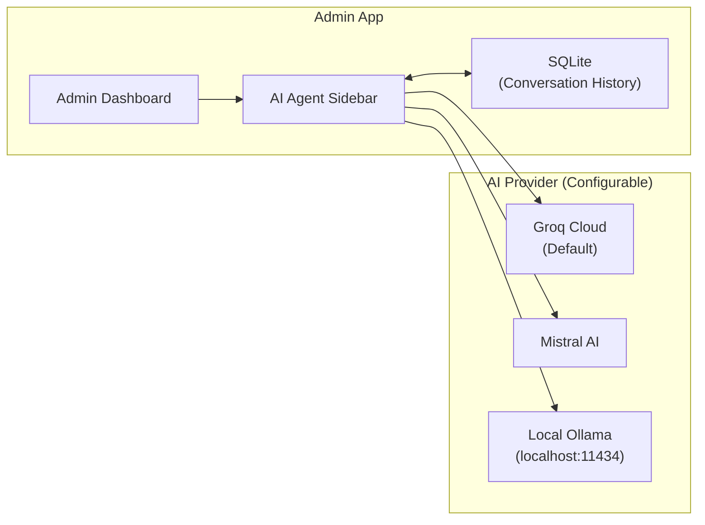
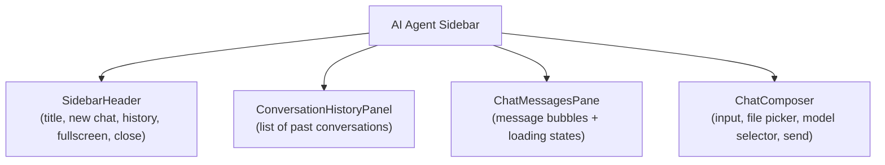
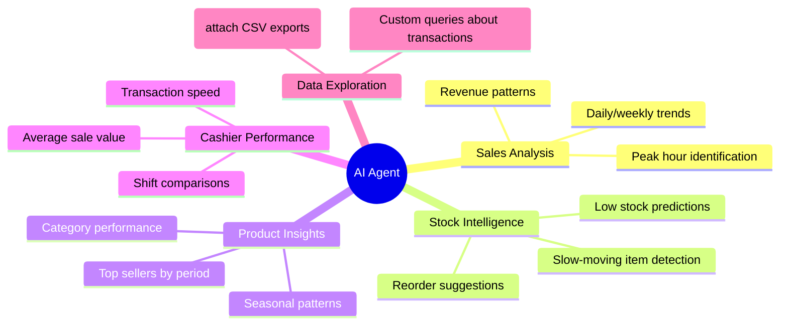

# AI-Powered Analytics (AI Agent)

## Overview

The Admin dashboard includes a full-featured **AI Agent Sidebar** — a built-in chat assistant that analyzes store data, answers questions, and provides actionable recommendations for the store owner. The agent supports multiple AI providers and persists conversation history locally in the SQLite database.

> **Important:** The AI operates in a strictly **advisory and analytical** capacity. It never makes automated decisions to alter prices, apply discounts, or place orders without explicit human approval.

---

## Architecture

### Provider Options

| Provider | Description | Key Required |
|----------|-------------|-------------|
| **Groq** | Default — ultra-fast LLM inference via Groq Cloud | Groq API Key |
| **Mistral AI** | European LLM provider — Mistral models | Mistral API Key |
| **Local (Ollama)** | Runs models locally on the same machine | None (Ollama must be running on `localhost:11434`) |

API keys are stored encrypted (AES-256-GCM) in the local SQLite database — never in plaintext.

---

## Key Features

### Multi-Provider Support

The Admin can switch AI providers in Settings. The sidebar dynamically fetches the available models for the selected provider:

- **Groq** — fetches from `api.groq.com/openai/v1/models`, filters out non-chat models (whisper, TTS, guard, etc.)
- **Mistral** — fetches from `api.mistral.ai/v1/models`, curates a list of recommended models (`mistral-large`, `mistral-small`, `pixtral-large`, `codestral`, etc.)
- **Local / Ollama** — fetches from `localhost:11434/v1/models`, lists all locally installed Ollama models

The default model is `llama-3.3-70b-versatile` (Groq).

---

### Persistent Conversation History

Conversations are stored permanently in the local SQLite database (`ai_conversations` and `ai_messages` tables), so the store owner can:

- Pick up any previous conversation from the **Conversation History Panel**
- Load past sessions and continue where they left off
- Delete individual conversations they no longer need
- All data stays entirely local — no conversations are uploaded to any server

**Auto-generated conversation titles:** After the third assistant reply in a conversation, the AI automatically generates a short title (max 6 words) to label the conversation in the history list.

---

### File Attachments

Users can attach files to any message:

| Constraint | Limit |
|------------|-------|
| Max files per message | 5 |
| Max file size per file | 300 KB |
| Max total text per message | 24,000 characters |
| Max text per file | 12,000 characters |

**Supported attachment methods:**
- Click the paperclip button to open the file picker
- Paste files directly from clipboard

Text files (`.txt`, `.csv`, `.json`, `.md`, etc.) are read and injected into the model prompt as structured `[ATTACHMENT_FILE]` blocks. Binary files (images, PDFs, etc.) are referenced by name with content omitted — the AI knows a file was attached but cannot read binary content.

---

### Fullscreen Mode

The AI sidebar can be toggled between:
- **Floating panel** — fixed 388px width alongside the main content
- **Fullscreen** — expands to fill the remaining width of the dashboard

The fullscreen toggle is in the sidebar header. The sidebar auto-exits fullscreen when closed.

---

### Auto-Retry on Error

If the AI returns an empty response due to a transient error, the sidebar automatically retries the request once after a 900ms delay. This handles brief rate limits or network blips without requiring manual user intervention. The retry count is displayed in the UI.

---

### Response Regeneration

Users can regenerate the last AI response by clicking the **Regenerate** button. This:
1. Removes the last assistant turn from the DB
2. Resends the same request to the model
3. Streams a fresh response

---

## Sidebar UI Components

| Component | Purpose |
|-----------|---------|
| **SidebarHeader** | Toolbar: new conversation, history toggle, fullscreen toggle, close button |
| **ConversationHistoryPanel** | Lists all saved conversations; click to load, trash icon to delete |
| **ChatMessagesPane** | Renders all messages with markdown formatting; shows loading/thinking indicators |
| **ChatComposer** | Multi-line textarea (max 6 visible lines), attachment row, model selector dropdown, send/stop button |

---

## Interaction Flow

1. Admin clicks the AI icon in the dashboard header
2. Sidebar slides in from the right (388px wide)
3. Admin optionally selects a model from the dropdown in the composer
4. Admin types a question, optionally attaches files
5. Press `Enter` (or click Send) to submit; `Shift+Enter` for newline
6. Response streams in real time with phase indicators (thinking → generating)
7. On streaming completion, the message is saved to the local SQLite DB
8. Admin can continue the conversation, regenerate, or start a new chat

---

## Use Cases

---

## AI Constraints

| Constraint | Detail |
|------------|--------|
| **No automated price changes** | AI cannot alter product prices without admin approval |
| **No automated discounts** | AI cannot apply discounts or promotions automatically |
| **No automated ordering** | AI cannot place vendor orders |
| **No cashier interference** | AI must not interact with or interrupt active checkout sessions |
| **Advisory only** | All AI outputs are suggestions — the admin decides what to act on |
| **Admin-only access** | AI features are not available in the Cashier app |

---

## Security Model

| Concern | Mitigation |
|---------|------------|
| **API key storage** | Keys are encrypted with AES-256-GCM via Tauri's `encrypt_value` command before being written to SQLite |
| **Conversation data** | All conversations stored locally in SQLite — no cloud upload |
| **Local Ollama** | No API key required; model runs entirely on-device |
| **Network dependency** | AI features degrade gracefully to "not configured" when offline or provider is unreachable |

---

## Settings & Configuration

AI provider settings are found in **Admin Settings → AI**:

| Setting | Description |
|---------|-------------|
| **Provider** | Groq / Mistral / Local |
| **API Key** | Groq or Mistral API key (encrypted at rest) |
| **Model** | Selected from dynamically fetched model list |

Configuration is persisted in the `settings` table in the local SQLite database and survives app restarts.
