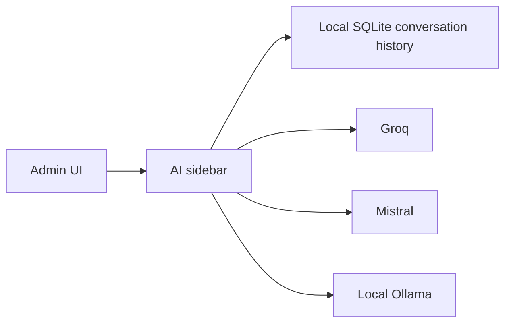
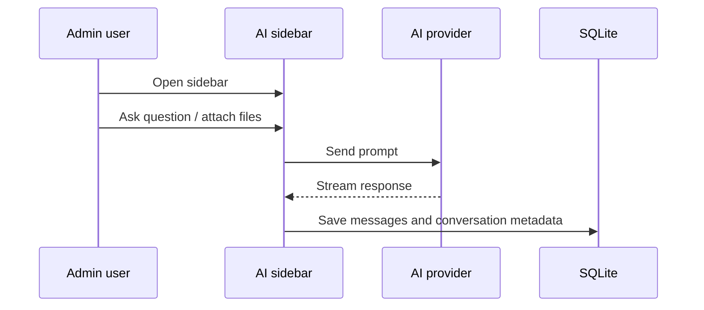

# AI-Powered Analytics

## Overview

The Admin app includes a built-in AI sidebar that can answer questions about store operations, verify admin how-to guidance from curated local docs, analyze attached files, and help the operator explore sales and inventory data.

This feature is available only in **Admin IMS**.

---

## Provider Architecture

The current implementation sends provider requests directly from the Admin app. There is no server-side edge proxy in front of Groq or Mistral.

---

## Supported Providers

| Provider | Notes |
|----------|-------|
| **Groq** | Default hosted provider |
| **Mistral** | Hosted provider with its own model list |
| **Local Ollama** | Runs on `localhost:11434`, no hosted API key required |

Default model:

- `llama-3.3-70b-versatile`

---

## Local Configuration Storage

AI configuration is stored in the local SQLite `settings` table using local-only setting keys.

Current keys:

- `ai_provider`
- `ai_api_key_enc`
- `ai_mistral_key_enc`
- `groq_model`

Behavior:

- Hosted provider keys are encrypted with the app's AES-256-GCM helper before storage.
- These settings are written with local-only sync behavior so cloud pull does not overwrite them.

---

## Main Features

### 1. Provider and model switching

The sidebar and settings screen can:

- Switch between Groq, Mistral, and local Ollama
- Fetch available models from the active provider
- Persist the chosen model locally

### 2. Persistent conversation history

Conversation history is stored in:

- `ai_conversations`
- `ai_messages`

This lets the Admin:

- Continue old chats
- Delete old conversations
- Reopen prior analysis sessions after restart

The app also auto-generates a short conversation title after enough assistant turns exist.

### 3. File attachments

Users can attach files to a message.

| Limit | Value |
|-------|-------|
| Max files per message | 5 |
| Max file size | 25 MB per file |
| Max extracted text per file | 12,000 chars |
| Max total extracted text | 24,000 chars |

Attachment behavior:

- Text-based files are read locally and inserted into the model prompt.
- Supported spreadsheets are parsed into structured rows for the model.
- Supported document formats can be locally extracted into prompt-ready text.
- Spreadsheet imports keep their exact parsed rows available for import preview and confirmed import flows.

### 4. Verified admin help

The assistant uses a curated local admin-help knowledge base for:

- how-to questions
- troubleshooting
- feature boundaries
- setup guidance

If the current docs do not confirm a workflow, the assistant should treat that workflow as unconfirmed instead of inventing behavior.

### 5. Fullscreen and history modes

The sidebar supports:

- Standard floating panel mode
- Fullscreen mode
- Conversation history panel

### 6. Retry and regenerate

Current resilience features:

- One automatic retry for empty failed responses
- Retry delay of 900 ms
- Manual "Regenerate" for the latest assistant response

### 7. Spreadsheet import and export assistance

The current assistant can also help with:

- previewing uploaded spreadsheet product imports before anything is written
- asking for confirmation before inventory-changing spreadsheet imports
- building supported Excel report exports
- returning exported workbooks as chat file attachments instead of relying on a desktop save dialog inside the AI flow

---

## Interaction Flow

---

## Practical Use Cases

Typical uses include:

- Asking for top sellers in a date range
- Reviewing product and category performance
- Interpreting exported CSV, spreadsheet, text, or document files
- Exploring slow movers or low-stock items
- Summarizing operational patterns for the store owner
- Previewing uploaded product spreadsheets before import
- Generating supported report workbooks from the assistant

---

## Operational Boundaries

The assistant is advisory, not autonomous.

It does not automatically:

- Change prices
- Complete checkout actions
- Place supplier orders
- Modify store settings without explicit UI actions elsewhere

For inventory-changing import flows, the assistant should ask for a clear confirmation before proceeding.

---

## Security Notes

| Concern | Current behavior |
|---------|------------------|
| Hosted API keys | Encrypted before local storage |
| Conversation history | Stored locally in SQLite |
| Local Ollama | Runs on-device without hosted API keys |
| Hosted provider privacy | Prompt content is sent to the selected hosted provider when Groq or Mistral is used |

If the operator wants no hosted provider exposure, local Ollama is the on-device option.
