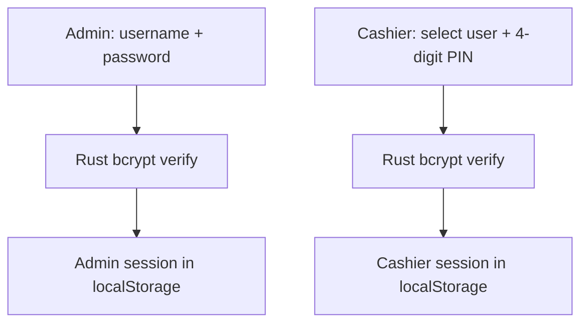
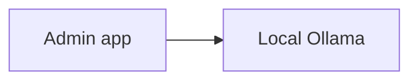

# Security

## Overview

The current security model is pragmatic and store-oriented:

- Passwords and PINs are hashed in Rust
- Sensitive local settings can be encrypted before storage
- Cloud traffic uses HTTPS
- LAN traffic is plaintext and assumes a trusted local network

This is a strong operational fit for a small single-store deployment, but it is important to understand the actual trust boundaries.

---

## Authentication Model

| Role | Access |
|------|--------|
| **Admin** | Inventory, reports, settings, users, AI assistant |
| **Cashier** | POS flow and customer display only |

---

## Password and PIN Storage

Passwords and cashier PINs are hashed in the Rust backend using bcrypt.

Important facts from the current code:

- Hashing is done through Tauri commands, not in browser JavaScript alone.
- Verification also happens in Rust.
- The code uses `bcrypt::DEFAULT_COST` rather than a hard-coded custom cost value.

Nothing stores plaintext passwords or plaintext cashier PINs in SQLite.

---

## Session Behavior

Admin and cashier sessions are stored in `localStorage`, but the apps intentionally clear stale sessions on startup.

Operational effect:

- Force-close or crash does not preserve the last authenticated session across restart.
- Cashier terminals also auto-logout after 15 minutes of inactivity.

---

## Local Secret Handling

Some secrets are encrypted before storage using AES-256-GCM.

Current encrypted-at-rest examples:

| Committed Supabase anon key | Tauri store `.settings.dat` |

The encryption key is an **app-level compiled key** in the Rust codebase.

What that means in practice:

- It protects against casual local file inspection.
- It is not equivalent to hardware-backed secret storage.
- A determined attacker with local machine access and reverse-engineering ability should still be treated as in-scope risk.

---

## Pending Cashier Cloud Credentials

There is one important special case:

- When the Admin pushes cloud credentials to a cashier over LAN, the cashier stores them first as pending auto credentials.
- Those pending values exist so the cashier UI can later promote them into committed cloud config.

This is convenient for operations, but it is not the same as a dedicated secret-distribution system.

---

## Cloud Security Model

Supabase credentials are configured at runtime, not baked into the binary.

Current model:

- `supabaseUrl` and anon key are handled securely via the Vercel OAuth Broker integration with Admin Settings
- The automated database provisioner sets permissive anon-role RLS policies to allow frictionless deployment
- Each deployment uses its own isolated Supabase project

Operational implication:

- Protection depends heavily on controlling the store's Supabase project and anon key
- The automated configuration is convenience-oriented, not a high-isolation multi-tenant design

---

## AI Provider Boundary

All AI requests are handled offline securely by the Local Ollama instance. There is no external exposure of store analytics.

Important implications:
- Complete on-device data privacy is retained.
- Prompts, internal documentation, and analytics output never leave the local environment unless cloud-specific opt-in models are deliberately downloaded by the user.

---

## Network Security

### Cloud traffic

| Path | Protection |
|------|------------|
| App <-> Supabase | HTTPS / TLS |

### LAN traffic

| Path | Protection |
|------|------------|
| Cashier <-> Admin WebSocket | Plaintext on trusted LAN |
| UDP discovery beacon | Plaintext broadcast on trusted LAN |

There is currently:

- No TLS on LAN sync
- No mutual certificate authentication on LAN sync
- No extra peer identity layer beyond the local network model

Use LAN sync only on trusted in-store networks.

---

## Data Protection Summary

| Data | Current protection |
|------|--------------------|
| User passwords and PINs | bcrypt hashes |
| Local SQLite files | Windows account and filesystem protection |
| Committed cloud anon key | AES-encrypted before Tauri store write |
| Cloud data in transit | TLS |
| LAN sync data in transit | Plaintext LAN transport |

---

## Query Safety

The app avoids raw string-built SQL in pages and uses DAL plus `sqlx`-backed parameterized patterns for database interaction.

This reduces common injection risk compared with ad-hoc query concatenation.

---

## Threat Summary

| Threat | Current mitigation |
|--------|--------------------|
| Brute-force login attempts | bcrypt hashing |
| Walk-away cashier session | Fixed 15-minute auto logout |
| Casual local inspection of stored keys | AES-encrypted stored secrets |
| Internet eavesdropping | HTTPS/TLS |
| Duplicate cloud transaction pushes | LAN/cloud flow separation plus sync state rules |
| LAN snooping on an untrusted network | Not mitigated by TLS in current design |

The biggest practical caveat is the LAN assumption: the current system is designed for trusted in-store networks, not hostile shared networks.
