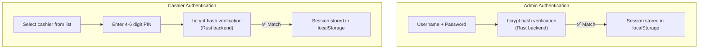
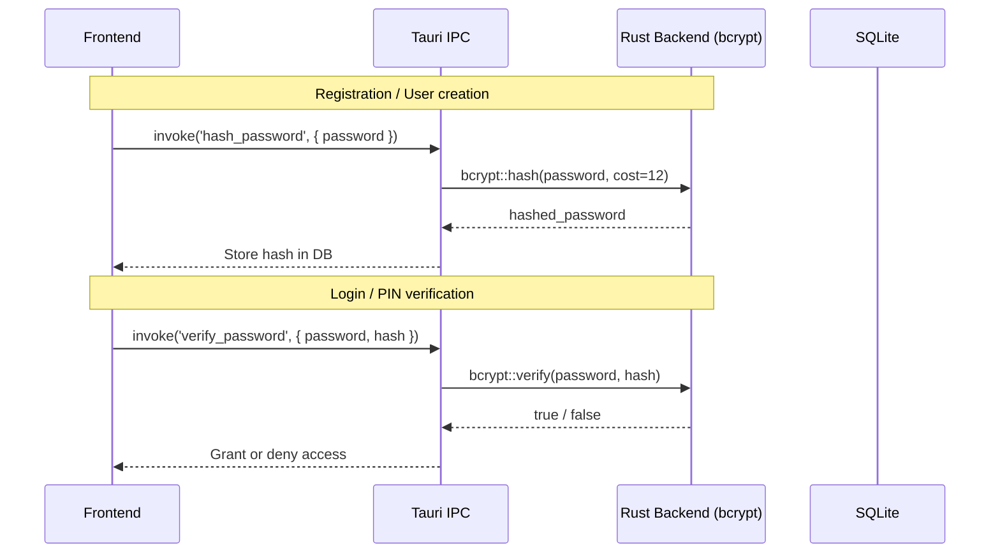
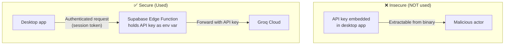
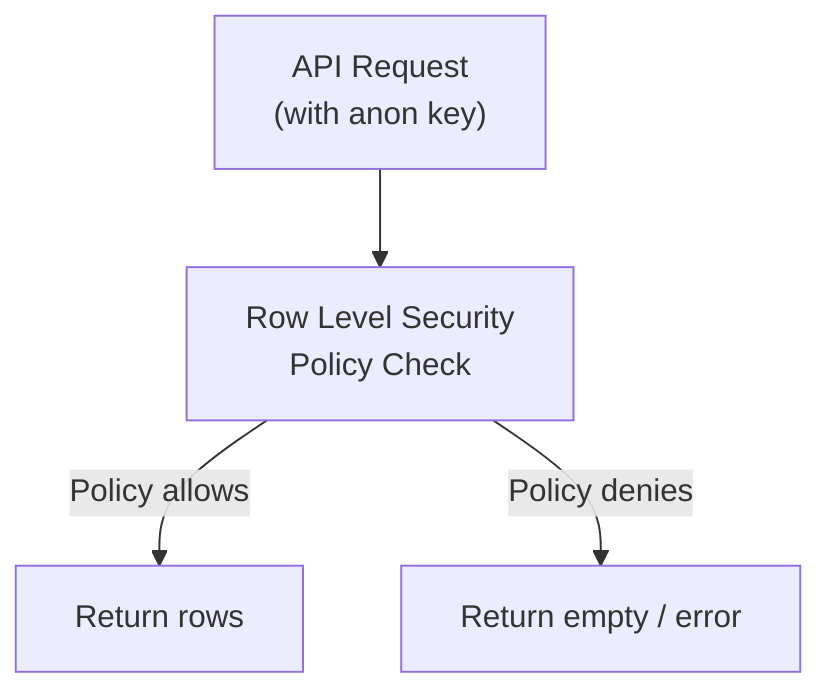
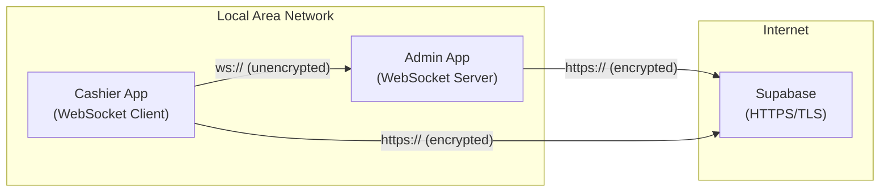
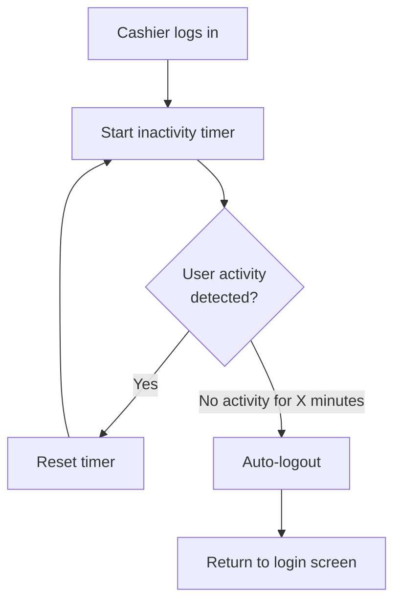

# Security

## Overview

The system implements multiple layers of security to protect store data, prevent unauthorized access, and ensure safe communication between terminals and the cloud.

---

## Authentication Model

### Role-Based Access Control (RBAC)

| Role | Access | Capabilities |
|------|--------|-------------|
| **Admin** | Full system access | Manage inventory, view reports, configure settings, manage users, AI analytics |
| **Cashier** | POS terminal only | Process sales, scan barcodes, view customer display |

---

## Password & PIN Hashing

All passwords and PINs are hashed using **bcrypt** — a proven, slow-by-design hashing algorithm that resists brute-force attacks.

### Key Points

- Hashing is done **in the Rust backend**, not in JavaScript — this prevents timing attacks and leverages native performance
- bcrypt cost factor of **12** provides strong resistance against GPU-accelerated brute-force
- PIN hashing uses the same bcrypt flow as password hashing — even though PINs are short, bcrypt's slow hashing makes brute-force impractical
- **No plaintext passwords or PINs are ever stored** in the database or transmitted over the network

---

## API Key Security

### Supabase Keys

| Key Type | Storage | Purpose |
|----------|---------|---------|
| **Supabase anon key** | Tauri Store (`.settings.dat`) — configured at runtime via Settings UI | Public key for Supabase client — safe to store locally (RLS protects data) |
| **Supabase URL** | Tauri Store (`.settings.dat`) — configured at runtime via Settings UI | Each store owner's own Supabase project URL |
| **Supabase service key** | Never in client | Server-side only — used in Edge Functions |
| **Groq API key** | Supabase Edge Function env var | Never touches the client application |

> **Note:** Supabase credentials are **not compiled into the binary**. There is no `.env` file or `env!()` macro embedding. Each store owner configures their own isolated Supabase project through the Settings UI, and credentials are stored in the Tauri Store (`.settings.dat` JSON file in the app data directory). If no credentials are set, the app runs in fully offline mode.

The Supabase `anon` key is intentionally public — all data access is controlled by **Row Level Security (RLS)** policies on the database. Since each store owner runs their own isolated Supabase project, RLS policies use `USING (true)` for simplicity — the anon key is scoped to their project only.

---

## Supabase Row Level Security (RLS)

RLS policies on the Supabase Postgres database ensure that even if someone obtains the `anon` key, they can only access data they're authorized to see.

### Policy Examples

| Table | Policy | Effect |
|-------|--------|--------|
| `products` | SELECT for authenticated users | Only logged-in users can read products |
| `transactions` | INSERT for authenticated users | Only logged-in users can create transactions |
| `users` | SELECT for authenticated, restricted fields | Users can only see non-sensitive fields |

---

## Local Network Security

### LAN Communication

| Aspect | Detail |
|--------|--------|
| **Protocol** | `ws://` (WebSocket, unencrypted) |
| **Encryption** | None — plaintext on LAN |
| **Justification** | Closed LAN environment in a single store; TLS would require local certificate management |
| **Mitigation** | Admin rejects connections from outside the local subnet |
| **Ports** | TCP 3080 (WebSocket), UDP 3081 (discovery beacon) |

### Cloud Communication

| Aspect | Detail |
|--------|--------|
| **Protocol** | `https://` (TLS encrypted) |
| **Authentication** | Supabase session tokens + RLS |
| **Data in transit** | Fully encrypted |

---

## Session Management

### Cashier Auto-Logout

The Cashier app implements an **auto-logout timer** to prevent unauthorized access when a cashier walks away:

### Session Storage

| Data | Storage Location | Lifetime |
|------|-----------------|----------|
| Cashier session | `localStorage` | Until logout or auto-logout |
| Admin session | `localStorage` | Until logout |
| Theme preference | Tauri Store (`.settings.dat`) | Persistent across sessions |

---

## Data Protection

### At Rest

| Data | Protection |
|------|-----------|
| **Local SQLite** | Stored in `%APPDATA%` — protected by Windows user account |
| **Passwords/PINs** | bcrypt hashed — irreversible |
| **Cloud Postgres** | Supabase managed encryption at rest |
| **Backup** | Cloud sync provides automatic backup |

### In Transit

| Path | Protection |
|------|-----------|
| **App ↔ Supabase** | TLS (HTTPS) |
| **App ↔ App (LAN)** | Unencrypted WebSocket (closed network) |
| **App ↔ Groq** | Via Edge Function (TLS) — app never connects directly |

---

## Threat Model Summary

| Threat | Mitigation |
|--------|-----------|
| **Brute-force PIN/password** | bcrypt with cost 12 — each attempt takes ~250ms |
| **API key theft** | Keys stored server-side in Edge Functions, not in client binary |
| **Unauthorized LAN access** | Admin restricts connections to local subnet |
| **Data loss (hardware failure)** | Cloud sync provides automatic backup to Supabase |
| **Unauthorized access (walkaway)** | Auto-logout timer on cashier terminals |
| **SQL injection** | Parameterized queries via sqlx — no string concatenation |
| **XSS** | React's default escaping + no `dangerouslySetInnerHTML` usage |
