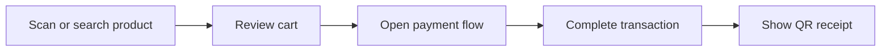

# User Guide

## Table of Contents

- Installation
- System Requirements
- First Launch
- Cashier Guide
- Admin Guide
- Network Setup
- Troubleshooting

---

## Installation

1. Download the installer from the [Releases](https://github.com/BootlegYouki/at-iba-pa-pos/releases) page.
2. Install **Admin IMS** on the manager workstation and **Cashier POS** on cashier terminals as needed.
3. Launch the app from the desktop shortcut.

Data locations:

| Item | Location |
|------|----------|
| Admin database | `%APPDATA%\com.pos.admin\pos-admin.db` |
| Cashier database | `%APPDATA%\com.pos.cashier\pos-cashier.db` |
| Tauri settings store | `%APPDATA%\com.pos.{app}\.settings.dat` |

---

## System Requirements

| Requirement | Minimum |
|-------------|---------|
| OS | Windows 10 64-bit or later |
| RAM | 2 GB |
| Storage | 200 MB free |
| Display | 1280 x 720 |
| Network | LAN for multi-terminal use |
| Internet | Optional for cloud sync and hosted AI |
| Scanner | USB HID barcode scanner |

---

## First Launch

On a fresh local database, the app:

1. Creates the SQLite database
2. Seeds default categories
3. Seeds default store settings
4. Creates a default Admin account if no Admin exists

Default Admin credentials:

- Username: `admin`
- Password: `admin123`

The app does **not** currently preload sample products or sample transaction history.

---

## Cashier Guide

### Before a cashier can log in

Cashier accounts are created from **Admin Settings**. Only active cashier accounts appear on the Cashier login screen.

### Logging in

1. Launch **Cashier POS**
2. Select your cashier name
3. Enter your **4-digit PIN**
4. The POS screen opens
5. The customer display window opens automatically if it is enabled

### Core cashier flow

### Adding products

You can add items by:

- Scanning a barcode
- Typing a barcode manually and pressing Enter
- Searching by product name
- Clicking a product card

Multiplier syntax is supported:

- Example: `3*4800016641234`

That adds three units of the scanned barcode.

### Cart controls

| Action | Method |
|--------|--------|
| Add item | Scan, search, or click product |
| Change quantity | Use the `+` or `-` cart buttons |
| Remove item | Use the trash/remove button |
| Clear cart | `F4` from cart state |

### Payment flow

Supported payment methods:

- Cash
- Card
- GCash
- Maya

Quick cash buttons currently include:

- `20`
- `50`
- `100`
- `200`
- `500`
- `1000`
- Exact Amount

For Card, GCash, and Maya:

- The reference number field is shown
- The tendered amount is treated as the exact total

### Verified keyboard shortcuts

| Shortcut | Action |
|----------|--------|
| `Space` | Focus scanner input |
| `F8` | Open payment flow, or confirm payment when ready |
| `F4` | Clear cart or finish/cancel the current payment state |
| `Esc` | Return from payment screen to cart |

### Customer display

The customer-facing screen can show:

- Idle welcome screen
- Live cart contents
- Payment processing state
- Final receipt QR code

### Logout and inactivity

- Cashiers can log out from the settings dialog
- Cashier auto-logout is currently fixed at **15 minutes** of inactivity

---

## Admin Guide

### Logging in

1. Launch **Admin IMS**
2. Enter your username and password
3. Open the dashboard

### Main Admin areas

| Area | Purpose |
|------|---------|
| Dashboard | Revenue, top products, recent activity, low-stock visibility |
| Inventory | Product catalog management and stock thresholds |
| Transactions | Searchable transaction history |
| Reports | Charts, date ranges, and export entry point |
| Settings | Users, store config, cloud config, AI config, backup/reset tools |

### Inventory workflow

From **Inventory**, Admin users can:

- Add products
- Edit product details
- Archive or hide products
- Search and filter by category
- Set low-stock thresholds

### Transactions and reports

Admin users can:

- Browse transactions by date range
- Inspect transaction line items
- Review charts for sales, payment methods, and product performance
- Open the export workflow from the Reports page

### Export reports

The export screen supports:

- Separate-sheet or combined-sheet workbook layout
- Per-section enable/disable and reordering
- Date-range overrides for report sections
- Inventory-oriented filters for stock exports

### AI assistant

Admin-only AI features include:

- Groq, Mistral, or local Ollama provider selection
- Saved conversation history
- File attachments
- Fullscreen sidebar mode

### Settings

Key settings areas:

| Setting area | Purpose |
|--------------|---------|
| Store settings | Store name and related display values |
| Theme | Light, dark, or system behavior |
| User management | Admin and cashier accounts |
| Cloud sync | Supabase connection and setup SQL |
| Backup / reset | Local data export, restore, and reset tools |
| AI | Provider, key, and model selection |

---

## Network Setup

### Single-terminal setup

If only one machine will be used:

- Install Admin IMS
- No LAN setup is required

### Multi-terminal setup

1. Connect all devices to the same local network
2. Start **Admin IMS** first
3. Start **Cashier POS** terminals
4. Let cashiers auto-discover the Admin, or connect manually by IP if needed

Required Admin firewall ports:

| Port | Protocol | Purpose |
|------|----------|---------|
| `3080` | TCP | LAN WebSocket sync |
| `3081` | UDP | Admin discovery beacon |

### Cloud configuration in a LAN setup

Cloud sync is configured from the Admin side first.

Cashier behavior after Admin shares cloud credentials:

- Cashier receives pending credentials automatically over LAN
- Cashier Settings shows a **Ready** cloud state
- Cashier can activate that cloud configuration from the settings dialog

---

## Troubleshooting

### Cashier cannot connect to Admin

| Check | What to do |
|-------|------------|
| Same LAN? | Ensure both machines are on the same local network |
| Admin running? | Start Admin IMS first |
| Firewall open? | Allow TCP 3080 and UDP 3081 on the Admin PC |
| Broadcast blocked? | Use manual IP entry from Cashier Settings |
| Manually disconnected earlier? | Reconnect manually or restart the cashier app |

### No cashier accounts appear

Possible causes:

- Admin has not created cashier users yet
- Cashier has not synced with Admin or cloud yet
- Cashier accounts are inactive

### Cloud sync does not activate on cashier

Check the cashier cloud panel:

- **Ready** means the Admin sent pending credentials
- **Connected** means the cashier has activated them

If it only shows Ready, connect it from Cashier Settings.

### Products are missing on cashier

| Check | What to do |
|-------|------------|
| LAN connected? | Verify cashier is connected to Admin |
| Initial sync completed? | Wait a moment or reconnect |
| Product active? | Archived products are not part of the normal active cashier catalog |

### Resetting local data

The Admin Settings page includes reset and restore actions for local data management. Use those tools instead of deleting files manually when possible.
