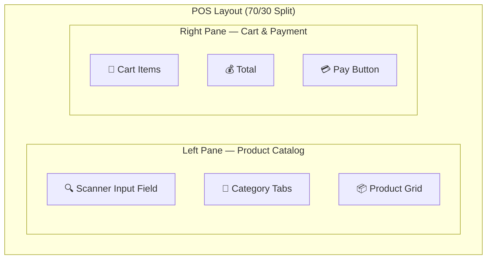
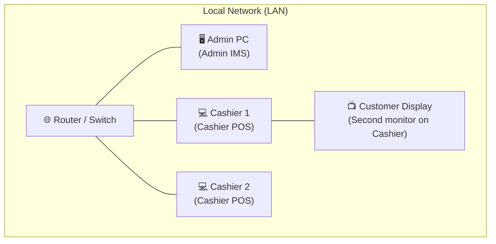

# User Guide

## Table of Contents

- [Installation](#installation)
- [System Requirements](#system-requirements)
- [First Launch](#first-launch)
- [Cashier Guide](#cashier-guide)
- [Admin Guide](#admin-guide)
- [Network Setup](#network-setup)
- [Troubleshooting](#troubleshooting)

---

## Installation

### Downloading the Installers

1. Go to the [Releases](https://github.com/BootlegYouki/at-iba-pa-pos/releases) page
2. Download the appropriate installer:
   - **Admin IMS Setup.exe** — for the manager's PC
   - **Cashier POS Setup.exe** — for each checkout terminal
3. Run the installer and follow the setup wizard
4. Launch the app from the desktop shortcut

### Where Data is Stored

| Item | Location |
|------|----------|
| **Admin database** | `%APPDATA%\com.pos.admin\pos-admin.db` |
| **Cashier database** | `%APPDATA%\com.pos.cashier\pos-cashier.db` |
| **App settings** | `%APPDATA%\com.pos.{app}\.settings.dat` |
| **Logs** | `%APPDATA%\com.pos.{app}\logs\` |

---

## System Requirements

| Requirement | Minimum |
|-------------|---------|
| **Operating System** | Windows 10 (64-bit) or later |
| **RAM** | 2 GB |
| **Storage** | 200 MB free space |
| **Display** | 1280 × 720 resolution |
| **Network** | LAN (for multi-terminal sync) |
| **Internet** | Optional (for cloud sync & AI) |
| **Barcode Scanner** | Any USB HID scanner |
| **Customer Display** | Optional second monitor |

---

## First Launch

On the very first launch, the app automatically:

1. Creates the local database
2. Loads sample products (29 items with barcodes)
3. Loads sample transaction history
4. Displays the login screen

This sample data helps you explore the system immediately. You can delete it and add your own products through the Admin Inventory page.

---

## Cashier Guide

### Logging In

1. Launch the **Cashier POS** app
2. Select your name from the cashier list
3. Enter your **PIN** (4–6 digits)
4. The POS interface loads and the **customer display window** opens automatically

### The POS Interface

### Scanning Items

**Using a barcode scanner:**
- Simply scan the barcode — the product is added to the cart automatically
- No need to click or focus on any field
- Scanner works regardless of where you are in the app

**Multiple units:**
- Type `3*` then scan (or type `3*4800016641234` + Enter) to add 3 units

**Manual selection:**
- Click on a product card in the grid
- Or type the product name in the search field

### Cart Operations

| Action | Method |
|--------|--------|
| **Add item** | Scan barcode, click product card, or search |
| **Change quantity** | Click `+` / `-` buttons on cart item, or use `+` / `-` keys |
| **Remove item** | Click the trash icon, or press `Delete` / `Backspace` |
| **Clear cart** | Press `F4` or click "Cancel Transaction" |

### Processing Payments

1. Press **F8** or click **"Pay"** to open the payment dialog
2. The cart sidebar transitions into the payment view:
   - **Amount Due** is displayed prominently
   - **Quick Cash Buttons** (₱50, ₱100, ₱500, ₱1000, Exact) for fast entry
   - **Custom Amount** input for exact change
3. Select payment method: **Cash**, **Card**, **GCash**, or **Maya**
   - For Card, GCash, or Maya: enter the reference number
   - For non-Cash methods, the tendered amount is automatically set to the exact total
4. Click **"Confirm Payment"** (or press Enter)
5. **Change due** is displayed
6. The **customer display** shows the receipt with a QR code
7. The cart resets for the next customer

### Keyboard Shortcuts

| Key | Action |
|-----|--------|
| **F8** | Open payment dialog |
| **F4** or **Esc** | Cancel transaction / close dialog |
| **Space** | Focus the scanner input field |
| **Enter** | Confirm payment (when in payment dialog) |
| **+** / **-** | Increase / decrease selected item quantity |
| **Delete** / **Backspace** | Remove selected item from cart |

### Customer Display

The customer-facing screen shows:
- **Welcome screen** when idle (store branding + time)
- **Live cart** as items are scanned (updated in real time)
- **Payment processing** animation
- **Receipt + QR code** after each sale (auto-resets after 20 seconds)

Customers scan the QR code with their phone camera to view and download their receipt.

### Logging Out

- Click the **gear icon** → **Log Out**
- Or wait for the **auto-logout timer** (if enabled)
- The customer display window closes automatically

---

## Admin Guide

### Logging In

1. Launch the **Admin IMS** app
2. Enter your **username and password**
3. The dashboard loads with today's summary

### Dashboard

The dashboard provides an at-a-glance overview:

| Widget | Shows |
|--------|-------|
| **Revenue Summary** | Today's / this week's / this month's total revenue |
| **Revenue Chart** | Line chart of daily revenue (last 30 days) |
| **Top Products** | Best-selling items by quantity |
| **Recent Activity** | Latest transactions |
| **Low Stock Alerts** | Products below their threshold |

### Managing Inventory

Navigate to **Inventory** from the sidebar.

**Adding a product:**
1. Click **"Add Product"**
2. Scan or type the barcode
   - If the barcode is recognized (OpenFoodFacts), product details are auto-filled
3. Fill in: name, price, stock quantity, category
4. Click **"Save"**

**Editing a product:**
1. Find the product in the list (search or filter by category)
2. Click the **edit icon**
3. Update fields as needed
4. Click **"Save"**

**Stock management:**
- Stock is **automatically deducted** when sales are made
- Low stock products are highlighted with a warning badge
- Set the **low stock threshold** per product (default: 10 units)

### Viewing Transactions

Navigate to **Transactions** from the sidebar.

| Feature | Description |
|---------|-------------|
| **Search** | Search by cashier name, transaction ID, or payment method |
| **Date filter** | Filter transactions by date range |
| **Detail view** | Click a transaction to see its line items |
| **Pagination** | Browse through large transaction histories |
| **CSV/XLSX Export** | Download filtered transactions as a spreadsheet |

### Reports & Analytics

Navigate to **Reports** from the sidebar.

| Report | Chart Type | Shows |
|--------|-----------|-------|
| **Sales Trend** | Line chart | Revenue per day over selected range |
| **Payment Methods** | Pie/donut chart | Breakdown by payment method (Cash, Card, GCash, Maya) |
| **Peak Hours** | Bar chart | Transaction count by hour |
| **Top Products** | Horizontal bar chart | Revenue by product |

**Date range:** Use the date picker at the top to select Today, This Week, This Month, or a custom range.

**Exports:**
- **CSV** — Download chart data as a CSV file
- **XLSX** — Download as an Excel spreadsheet
- **Print (Z-Report)** — Print a formatted sales summary

### AI Agent

Click the **AI icon** in the sidebar to open the AI analytics panel:

1. Type a question (e.g., "Which products are selling the fastest?")
2. Or use a **preset query** button
3. The AI analyzes your data and returns insights
4. All suggestions are advisory — you decide what to act on

> AI features require an internet connection.

### System Settings

Navigate to **Settings** from the sidebar.

| Setting | Description |
|---------|-------------|
| **Store Name** | Displayed on receipts and customer display |
| **Theme** | Light, Dark, or System (OS-based) |
| **User Management** | Add/edit/deactivate cashier accounts and PINs |
| **Cloud Sync** | View sync status and configure Supabase connection |

---

## Network Setup

### Single Terminal Setup

If you're using only one computer:
- Install **Admin IMS** (it includes all features)
- No network configuration needed

### Multi-Terminal Setup

**Steps:**

1. Connect all PCs to the same **local network** (LAN)
2. Install **Admin IMS** on the manager's PC
3. Install **Cashier POS** on each checkout terminal
4. Launch the **Admin app first** — it starts the sync server automatically
5. Launch the **Cashier apps** — they will **auto-discover** the Admin and connect

### Auto-Discovery

The Admin broadcasts a UDP beacon every 3 seconds. Cashier apps listen for this beacon and connect automatically — no IP address configuration needed.

If auto-discovery doesn't work (e.g., on a VLAN), you can manually set the Admin IP:

1. On the **Cashier app**, click the **gear icon**
2. Enter the **Admin PC's IP address** in the "Admin Local IP" field
3. The cashier will connect directly

### Firewall Configuration

On the **Admin PC**, allow these ports through Windows Firewall:

| Port | Protocol | Purpose |
|------|----------|---------|
| **3080** | TCP (Inbound) | WebSocket server for cashier sync |
| **3081** | UDP (Broadcast) | Auto-discovery beacon |

**How to allow ports in Windows Firewall:**

1. Open **Windows Defender Firewall with Advanced Security**
2. Click **Inbound Rules** → **New Rule**
3. Select **Port** → **TCP** → Enter **3080** → **Allow** → Name it "POS Sync"
4. Repeat for **UDP** port **3081** → Name it "POS Discovery"

---

## Troubleshooting

### Cashier can't connect to Admin

| Check | Solution |
|-------|----------|
| Both on same network? | Ensure same router/switch, no VLAN separation |
| Admin app running? | Start Admin IMS before Cashier POS |
| Firewall blocking? | Allow ports 3080 (TCP) and 3081 (UDP) on Admin PC |
| Auto-discovery failing? | Enter Admin IP manually in Cashier settings |

### Sync indicator shows "Offline"

| Status | Meaning | Action |
|--------|---------|--------|
| 🔴 Offline | No internet and no LAN connection | Check network cables, start Admin app |
| 🟡 Local Network | No internet, but connected to Admin via LAN | Normal — sales will sync to cloud when internet returns |
| 🟢 Online | Cloud sync active | Everything is working |

### Products not showing on Cashier

- Ensure the Cashier is **connected to Admin** (check sync indicator)
- Products sync from Admin/Cloud to Cashier on initial connection
- Try restarting the Cashier app to trigger a fresh sync

### Database reset

To start fresh:
1. Close the app
2. Navigate to `%APPDATA%\com.pos.{admin or cashier}\`
3. Delete the `pos-{mode}.db` file
4. Relaunch — a fresh database with sample data will be created

### Customer display not opening

- The display opens automatically when a cashier **logs in**
- If closed accidentally, it **reopens automatically** on the next scan
- Ensure the second monitor is connected and extended (not mirrored)
