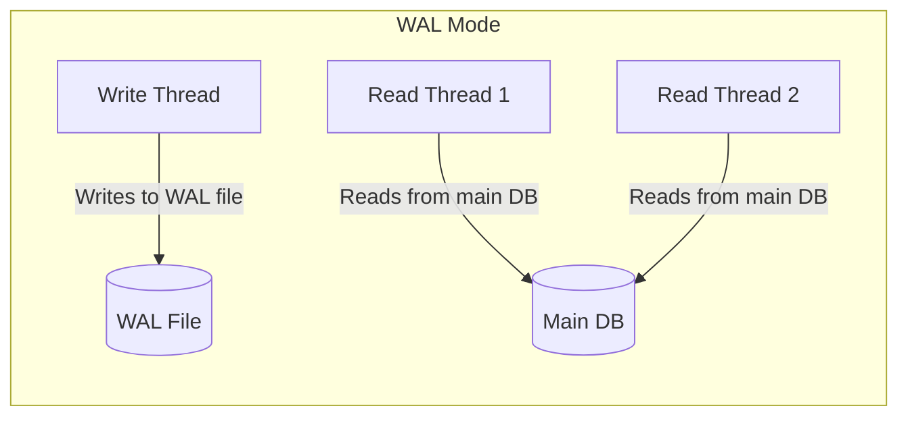
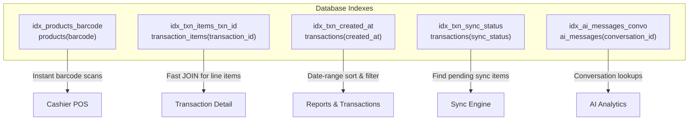
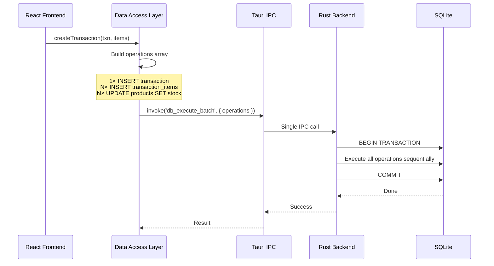
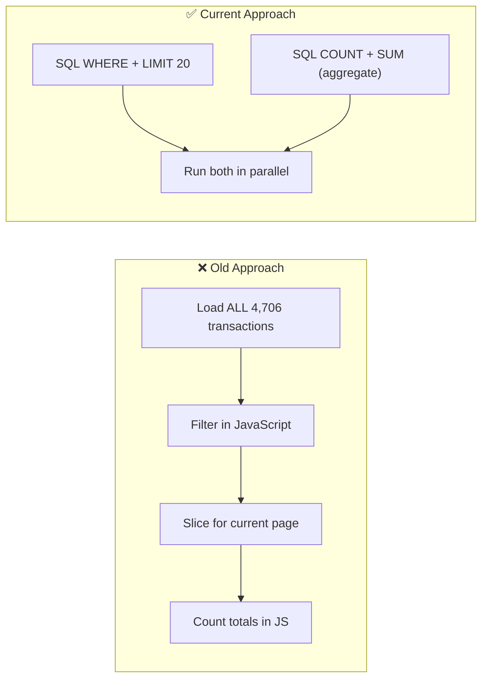
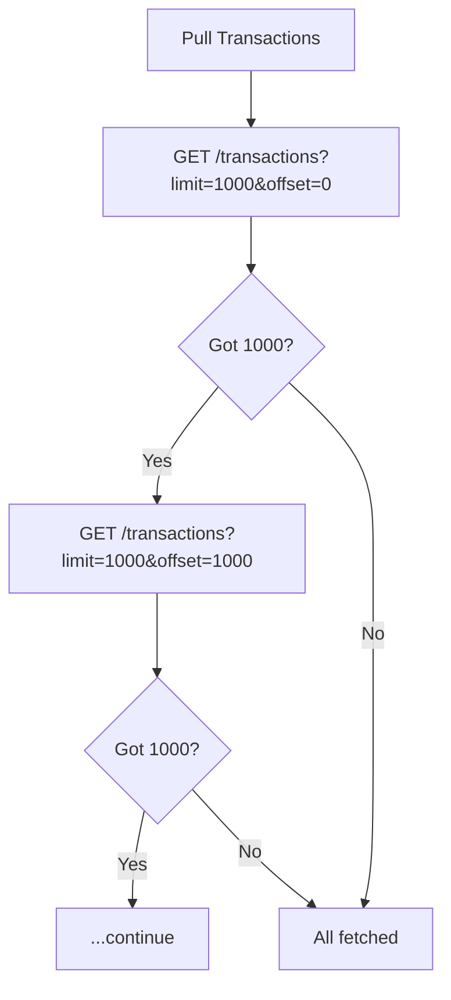
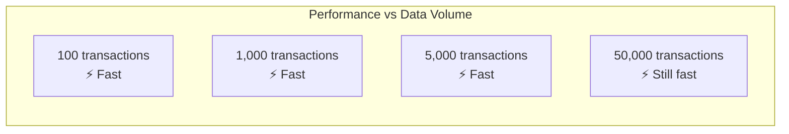

# Performance Optimizations

## Overview

The system is designed to remain fast even with thousands of transactions. At 4,700+ transactions the app still responds instantly — barcode scans, page loads, and report generation all complete in milliseconds. This document describes every optimization that makes that possible.

---

## Database Engine Configuration

### WAL Mode (Write-Ahead Logging)

SQLite is configured with **WAL journal mode** at connection time:

```rust
SqliteConnectOptions::new()
    .journal_mode(SqliteJournalMode::Wal)
```



WAL mode allows **concurrent readers and writers** — reads never block writes and vice versa. This is critical because the POS UI must remain responsive while transactions are being saved and sync operations are running in the background.

### Connection Pool

```rust
SqlitePoolOptions::new()
    .max_connections(10)
    .acquire_timeout(Duration::from_secs(10))
```

A pool of up to **10 connections** eliminates the overhead of opening/closing connections per query. Combined with WAL mode, this enables true concurrent database access across the UI thread, sync engine, and LAN server.

### Foreign Key Enforcement

```sql
PRAGMA foreign_keys = ON
```

Foreign keys are explicitly enabled to ensure referential integrity (e.g., deleting a transaction cascades to its items).

---

## Strategic Indexes

Five indexes cover the critical hot paths:



| Index | Table(Column) | Purpose |
|-------|---------------|---------|
| `idx_products_barcode` | `products(barcode)` | Instant barcode lookup during scanning |
| `idx_txn_items_txn_id` | `transaction_items(transaction_id)` | Fast JOIN when loading transaction line items |
| `idx_txn_created_at` | `transactions(created_at)` | Date-range queries for reports and sorting |
| `idx_txn_sync_status` | `transactions(sync_status)` | Finding pending items for cloud/LAN sync |
| `idx_ai_messages_convo` | `ai_messages(conversation_id)` | AI conversation history lookups |

Without these indexes, every query would require a **full table scan** — performance would degrade linearly as data grows. With indexes, lookups remain O(log n) regardless of table size.

---

## Batch Operations (Single SQL Transaction)

The most important write optimization. When a sale is completed, the system bundles **all operations into a single atomic SQL transaction**:



For a typical 5-item sale, this collapses **~11 separate database operations** (1 transaction INSERT + 5 item INSERTs + 5 stock UPDATEs) into a **single IPC round-trip** with one SQL transaction. The Rust backend wraps everything in `BEGIN` / `COMMIT`:

```rust
let mut tx = pool.begin().await?;
for (query, args) in operations {
    sqlx::query(&query).execute(&mut *tx).await?;
}
tx.commit().await?;
```

**Why this matters:** Each Tauri IPC round-trip has overhead (serialization, async bridge, deserialization). Batching eliminates N+1 round-trips and also gives SQLite a single fsync instead of N fsyncs.

---

## Query Optimizations

### Single JOIN Instead of N+1

Loading transactions with their line items uses a **single JOIN query** instead of two separate queries:

```sql
-- ✅ What we do: Single JOIN
SELECT t.*, ti.*
FROM transactions t
LEFT JOIN transaction_items ti ON ti.transaction_id = t.id
WHERE t.created_at BETWEEN ? AND ?
ORDER BY t.created_at DESC

-- ❌ What we avoid: N+1 pattern
-- Query 1: SELECT * FROM transactions
-- Query 2: SELECT * FROM transaction_items  ← grows with EVERY sale
```

The old approach would fetch **all** transaction items (across all transactions) and filter in JavaScript. The JOIN pushes filtering to SQLite and only returns items for transactions that match the date range.

### Server-Side Pagination

The Transactions and Inventory pages use `LIMIT/OFFSET` with SQL-level filtering:

```sql
-- Transactions page: only load the current page
SELECT * FROM transactions
WHERE created_at BETWEEN ? AND ?
  AND (cashier LIKE ? OR id LIKE ?)
ORDER BY created_at DESC
LIMIT 20 OFFSET 0

-- Aggregate stats computed in SQL, not JavaScript
SELECT COUNT(*) as total,
       COALESCE(SUM(total), 0) as totalRevenue,
       COALESCE(SUM(item_count), 0) as totalItemCount
FROM transactions
WHERE created_at BETWEEN ? AND ?
```



The aggregate query and page data query are run **in parallel** via `Promise.all`, further reducing wall-clock time.

### Lazy-Loaded Line Items

Transaction rows are loaded **without line items** initially:

```typescript
// Transaction list shows summary only
{ id, total, cashier, payment_method, created_at, lineItems: [] }
```

Line items are only fetched when the user **clicks a specific row** to view its details:

```typescript
const handleRowClick = async (txn) => {
    const full = await getTransactionWithItems(txn.id);
    setSelectedTransaction(full);
};
```

This avoids loading thousands of line items that the user will never look at.

---

## Sync Engine Optimizations

### Paginated Cloud Fetch

Transactions are pulled from Supabase in pages of **1,000 records** to avoid PostgREST statement timeouts:



| Mode | Max Pages | Max Records |
|------|-----------|-------------|
| Admin | 50 | 50,000 |
| Cashier | 5 | 5,000 |

### Flat Queries (No Embedded Resources)

Transactions and their items are fetched as **two separate flat queries** instead of using PostgREST's embedded resource syntax (`?select=*,transaction_items(*)`). The embedded approach forces PostgREST to perform slow JSON aggregation server-side.

### Batched Push with LIMIT

Pending items are pushed to the cloud in batches of **50 per sync cycle** to avoid overwhelming the network:

```sql
SELECT * FROM transactions WHERE sync_status = 'pending' LIMIT 50
SELECT * FROM products WHERE sync_status = 'pending' LIMIT 50
```

### Bulk Upserts in SQL Transactions

All pulled data is upserted inside a single SQL transaction:

```rust
let mut tx = pool.begin().await?;
for product in cloud_products {
    sqlx::query("INSERT OR REPLACE INTO products ...")
        .execute(&mut *tx).await?;
}
tx.commit().await?;
```

This avoids N separate fsyncs for N records.

### Smart Conflict Avoidance

```sql
INSERT INTO products (...) VALUES (...)
ON CONFLICT(id) DO UPDATE SET ...
WHERE sync_status != 'pending'
```

Cloud data never overwrites local pending changes, preventing write contention.

### LAN Zero-Latency Push

After a sale completes (`db_execute_batch`), the LAN send task is woken **immediately** via a `tokio::sync::Notify`:

```rust
// After batch execution
state.lan_send_notify.notify_one();
```

This eliminates polling delay — the other terminal receives the transaction within milliseconds.

### Selective Entity Sync

The sync engine accepts an optional `entity` parameter (`products`, `transactions`, `users`, `settings`) so it can sync only what's needed instead of cycling through all entities:

```rust
pub async fn run_sync_cycle(
    ...,
    entity: Option<String>,  // None = sync everything
) -> Result<()> {
    if entity.is_none() || entity.as_deref() == Some("products") {
        push_products(...).await?;
    }
    // ...
}
```

### Exponential Backoff

Failed sync attempts back off from 5 seconds up to 30 seconds, reducing futile network traffic:

```
Delay = min(5 × (failures + 1), 30) seconds
```

---

## Frontend Optimizations

### Debounced Sync Refresh

Sync-complete events trigger data refreshes, but they're **debounced at 800ms** to prevent rapid consecutive re-fetches:

```typescript
// Multiple sync events within 800ms → single data refresh
const debouncedRefresh = useMemo(
    () => debounce(fetchData, 800),
    [fetchData]
);
```

### Shallow Equality Checks

State updates compare previous and next values to **skip unnecessary React re-renders**:

```typescript
setProducts(prev => {
    const next = JSON.stringify(newProducts);
    return JSON.stringify(prev) === next ? prev : newProducts;
});
```

### Memoization

Both Transactions and Inventory pages use `useMemo` and `useCallback` extensively to prevent expensive re-computations on every render. Report components use `React.memo()` for stat cards.

### VACUUM After Factory Reset

After a factory reset wipes all data, `VACUUM` is run to reclaim freed pages so the database file shrinks to its actual data size:

```rust
sqlx::query("VACUUM").execute(&pool).await;
```

### Accurate DB Size Reporting

Database size in Settings is calculated using **actual used pages** (excluding the freelist) for accurate reporting:

```sql
SELECT (page_count - freelist_count) * page_size as size
FROM pragma_page_count(), pragma_page_size(), pragma_freelist_count();
```

---

## Performance Scaling

These optimizations ensure performance remains **flat** regardless of data volume:



| Operation | Scaling Behavior | Why |
|-----------|-----------------|-----|
| Barcode scan | O(log n) | Index on `barcode` column |
| Transaction list | O(1) per page | LIMIT/OFFSET pagination |
| Report aggregation | O(n) in SQL | Computed server-side, not in JS |
| Sale completion | O(k) where k = items | Batch write, independent of total rows |
| Sync push | O(min(pending, 50)) | Batched with LIMIT 50 per cycle |
| Line item load | O(1) per click | Lazy-loaded on demand |

The combination of WAL mode, connection pooling, strategic indexes, batch operations, server-side pagination, and lazy loading means that **4,706 transactions or 47,060 — performance stays the same**.
