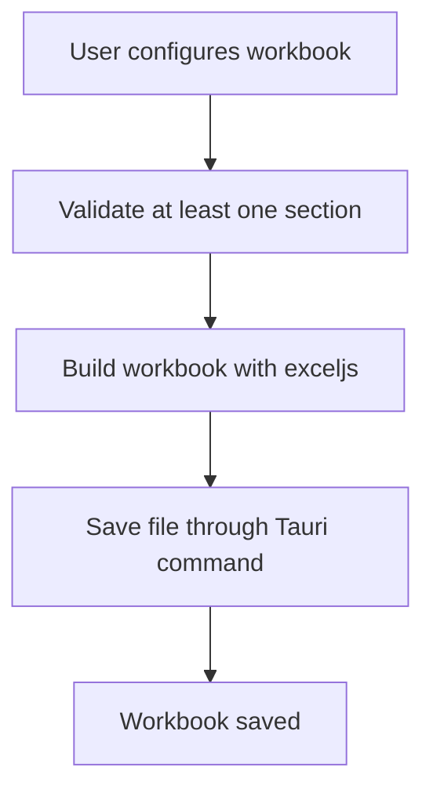

# Export Reports

## Overview

The Admin app includes a dedicated export workflow for building Excel workbooks from sales and inventory data.

Access path:

- Open **Reports**
- Click **Export**
- Configure the workbook on `/reports/export`

Export configuration is saved in `localStorage`, so the screen restores the last-used layout and section settings.

---

## Workbook Options

The export screen currently supports two workbook layouts:

| Layout | Behavior |
|--------|----------|
| **Separate Sheets** | Each enabled section becomes its own worksheet |
| **Combined Sheet** | All enabled sections are rendered into one worksheet |

Global settings:

- Global date range
- Workbook layout
- Auto-generated file name based on the selected date range

Default file naming pattern:

- `reports-YYYY-MM-DD-to-YYYY-MM-DD.xlsx`

---

## Available Sections

The current export engine supports ten section types:

| Section ID | Display name |
|------------|--------------|
| `sales_summary` | Sales Summary |
| `transactions` | Transactions |
| `product_sales` | Product Sales |
| `top_products` | Top Products |
| `bottom_products` | Bottom Products |
| `cashier_totals` | Cashier Totals |
| `payment_methods` | Payment Methods |
| `category_sales` | Category Sales |
| `inventory_snapshot` | Inventory Snapshot |
| `low_stock` | Low Stock |

Some are enabled by default, while others start disabled but can be turned on from the export screen.

---

## Configuration Controls

### 1. Section ordering

Enabled and disabled sections appear in a draggable list.

You can:

- Reorder sections
- Enable or disable sections
- Control final workbook order

### 2. Date ranges

Most sales-oriented sections support:

- Global date range
- Per-section override date range

Inventory-oriented sections do not use a date override because they export current state snapshots.

### 3. Sorting

Depending on the section, you can sort by:

- Revenue
- Units
- Ascending or descending order

### 4. Filters

Current filter support includes:

| Filter | Used by |
|--------|---------|
| Cashier filter | Cashier Totals |
| Category filter | Inventory Snapshot, Low Stock |
| Search filter | Inventory Snapshot |
| Stock filter (`all`, `low`, `ok`) | Inventory Snapshot |

### 5. Visible columns

Table-like sections let the user choose visible columns.

Examples:

- Transactions can include transaction ID, timestamp, cashier, item count, payment method, amount paid, total, and reference number.
- Inventory Snapshot can include product details, stock, threshold, value, and stock status.

Ranking sections such as Top Products and Bottom Products are more presentation-driven and do not expose the same column picker.

---

## Export Flow

What happens when the user exports:

1. The app validates the configuration.
2. The export engine resolves enabled sections in final order.
3. Data is pulled from the local DAL.
4. `exceljs` builds the workbook.
5. Tauri writes the file to disk.

---

## File Output Behavior

On desktop builds, export uses the Rust `save_export_file` command.

Current output behavior:

- Save to the system Downloads directory when available
- Fall back to Documents, then Desktop if needed
- Auto-append a numeric suffix if a file name already exists

That means export does not depend on a manual save-as dialog in the current implementation.

---

## Persistence

The export UI stores the last configuration in `localStorage` under:

- `reports_export_config_v1`

This includes:

- Enabled sections
- Section order
- Filters
- Chosen columns
- Layout
- Date ranges

---

## Practical Uses

Typical workbook combinations:

- Sales Summary + Transactions for daily reconciliation
- Product Sales + Top Products + Category Sales for management review
- Inventory Snapshot + Low Stock for replenishment planning
- Cashier Totals + Payment Methods for shift analysis
