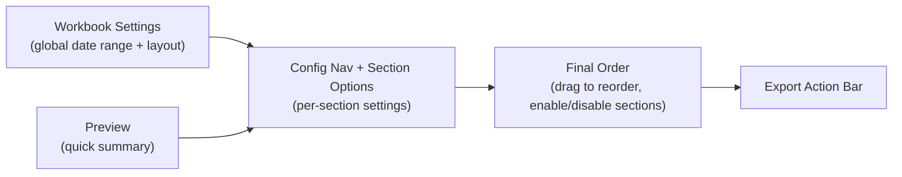

# Export Reports

## Overview

The **Export Reports** feature allows the Admin to generate a customized Excel (`.xlsx`) workbook from store data. It is accessed from the Reports page via the **Export** button, which navigates to a dedicated configuration screen (`/reports/export`).

All export settings (date ranges, section toggles, sort options, column visibility, etc.) are automatically saved to `localStorage` and restored on next visit, so the Admin's preferences persist across sessions.

---

## Export Configuration Screen

The export screen is divided into four main cards:

---

## Workbook Settings

| Setting | Options | Description |
|---------|---------|-------------|
| **Global Date Range** | Custom date picker | Shared date range applied to all sections by default |
| **Workbook Layout** | Separate Sheets / Combined Sheet | Whether each report section gets its own Excel sheet or all appear on one sheet |

The **Current Range** is shown below the date picker — this reflects the date range from the Reports page that launched the export. A **Use Current Range** button resets the global range back to this value.

---

## Report Sections

Each section can be independently enabled, reordered, and configured. The full list of sections:

| # | Section | Description |
|---|---------|-------------|
| 1 | **Sales Summary** | Total revenue, transactions, and averages over the selected range |
| 2 | **Transactions** | Individual transaction records |
| 3 | **Top Products** | Products ranked by revenue or units sold |
| 4 | **Inventory** | Full product catalog with current stock levels |
| 5 | **Hourly Sales** | Sales volume broken down by hour of day |

---

## Section Configuration

When a section is enabled, it can be configured via the **Config Nav** panel. Options vary by section:

### Date Range Override

Sections that support it can override the global date range with a section-specific date range. Toggle **"Use Global"** off to reveal the section date picker.

### Sort Options

| Option | Values |
|--------|--------|
| **Sort Metric** | Revenue / Units |
| **Sort Order** | Descending / Ascending |

### Filters

| Filter | Description |
|--------|-------------|
| **Cashier** | Filter records to a specific cashier (populated from DB) |
| **Category** | Filter products by category |
| **Search** | Text search on product name, barcode, or SKU |
| **Stock Filter** | All Products / Low Stock Only / OK Stock Only |

### Visible Columns

Each section defines a list of column options that can be individually shown or hidden. Active columns are highlighted. At least one column must remain selected.

---

## Final Order (Drag & Drop)

The **Final Order** card shows all available sections in a draggable list. Use the drag handle to rearrange sections — the order here determines the sheet/column order in the exported workbook.

Each item shows:
- Position badge (1, 2, 3…)
- Drag handle
- Enable/disable toggle
- Section name

Disabled sections appear in the list but are excluded from the export.

---

## Export Action

The **Export Excel** button kicks off the export process:

1. Config is validated (at least one section must be enabled)
2. Status message shows `"Preparing workbook…"` while generating
3. The workbook is built using `@/lib/reportExport` and saved automatically via Tauri's dialog
4. On success, the file name is shown in the status bar
5. On failure, an error message is displayed

---

## Technical Notes

- Export configuration type: `ExportJobConfig` defined in `src/lib/reportExport.ts`
- Config is persisted to `localStorage` under the key `REPORT_EXPORT_STORAGE_KEY`
- Config is restored via `restoreExportConfig()` on page mount
- The layout adapts responsively: stacked layout below 1100px container width, wide layout above
- Section definitions (title, description, column options, allowed filters) are centralized in `getExportSectionDefinition()` via `src/lib/reportExport.ts`
- Draggable list component: `DraggableList` under `src/components/components/lists/draggable-list`
